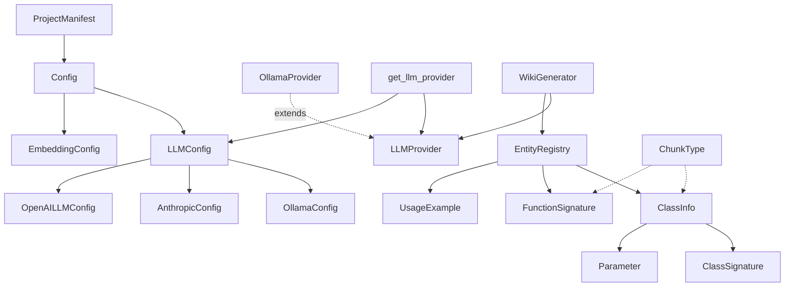
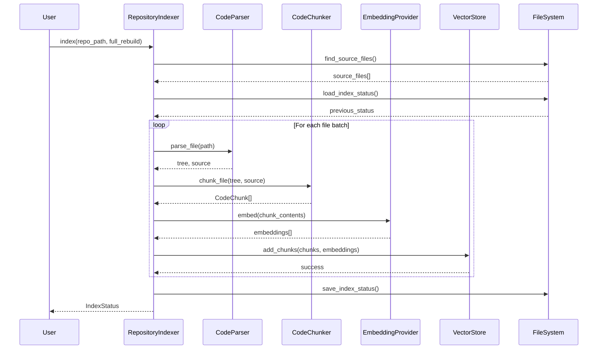

# Architecture Documentation

## System Overview

Local DeepWiki is a documentation generation system that analyzes codebases and generates comprehensive wiki-style documentation. The system uses multiple LLM providers (Ollama, Anthropic, OpenAI) and embedding models to understand code structure and generate human-readable documentation with architectural insights.

The system operates through a pipeline that indexes code, extracts structural information, and generates various types of documentation including architecture overviews, API documentation, and cross-referenced content.

## Key Components

### Configuration Management
The **[Config](files/src/local_deepwiki/config.md)** class serves as the central configuration hub, managing settings for all system components. It works alongside specialized configuration classes:

- **[LLMConfig](files/src/local_deepwiki/config.md)** manages language model provider settings, supporting three providers: Ollama, Anthropic, and OpenAI
- **[OllamaConfig](files/src/local_deepwiki/config.md)**, **[AnthropicConfig](files/src/local_deepwiki/config.md)**, and **[OpenAILLMConfig](files/src/local_deepwiki/config.md)** contain provider-specific settings like model names and API endpoints
- **[EmbeddingConfig](files/src/local_deepwiki/config.md)** handles embedding provider configuration with support for local and OpenAI embeddings

### LLM Provider System
The system implements a provider pattern for language models:

- **LLMProvider** serves as the abstract base class defining the interface for all LLM providers
- **OllamaProvider** implements local Ollama model integration with health checking and streaming capabilities
- The **get_llm_provider** function acts as a factory, returning the appropriate provider based on configuration

### Documentation Generation
**[WikiGenerator](files/src/local_deepwiki/generators/wiki.md)** is the core documentation generator that creates architecture documentation by:
- Searching vector stores for relevant code components
- Gathering context about core components, architectural patterns, and data flows
- Generating comprehensive documentation with diagrams and grounded facts

### Code Analysis and Structure
Several classes handle code structure analysis:

- **[ChunkType](files/src/local_deepwiki/models.md)** defines the types of code elements that can be analyzed (functions, classes, methods, modules, imports, comments)
- **[ClassInfo](files/src/local_deepwiki/generators/diagrams.md)**, **ClassSignature**, **FunctionSignature**, and **Parameter** represent extracted code structure information
- **[EntityRegistry](files/src/local_deepwiki/generators/crosslinks.md)** manages the collection of discovered code entities
- **UsageExample** stores examples of how code components are used

### Project Analysis
**[ProjectManifest](files/src/local_deepwiki/generators/manifest.md)** analyzes project structure and dependencies, providing:
- Technology stack summaries
- Dependency categorization and listing
- Entry point identification

### Error Handling
**ResearchCancelledError** provides specific error handling for interrupted research operations.

## Data Flow

1. **Configuration Loading**: The system starts by loading configuration through the [Config](files/src/local_deepwiki/config.md) class, which determines LLM providers, embedding settings, and other operational parameters.

2. **Provider Initialization**: Based on configuration, the get_llm_provider function instantiates the appropriate LLM provider (OllamaProvider, AnthropicProvider, or OpenAIProvider).

3. **Code Analysis**: The system analyzes the codebase, extracting structural information into [ClassInfo](files/src/local_deepwiki/generators/diagrams.md), FunctionSignature, and other structural classes, categorizing elements by [ChunkType](files/src/local_deepwiki/models.md).

4. **Documentation Generation**: [WikiGenerator](files/src/local_deepwiki/generators/wiki.md) orchestrates the documentation creation process by:
   - Searching vector stores for relevant code components
   - Gathering architectural context from multiple perspectives
   - Generating structured documentation with the configured LLM provider

5. **Output Generation**: The system produces various documentation artifacts stored in the html-export directory structure.

## Component Diagram

## Key Design Decisions

### Provider Pattern Implementation
The system uses a clean provider pattern for LLM integration, allowing easy switching between different language model services. The abstract LLMProvider class ensures consistent interfaces while concrete implementations handle provider-specific details.

### Configuration-Driven Architecture
All major system components are configurable through Pydantic models, enabling type-safe configuration management with clear defaults and validation. The configuration system supports context-aware settings that can be modified at runtime.

### Modular Documentation Generation
The [WikiGenerator](files/src/local_deepwiki/generators/wiki.md) class implements a search-based approach to documentation generation, using vector stores to [find](files/src/local_deepwiki/generators/manifest.md) relevant code components and gathering context from multiple perspectives (core components, patterns, data flows) before generating comprehensive documentation.

### Structured Code Representation
The system uses strongly-typed classes ([ClassInfo](files/src/local_deepwiki/generators/diagrams.md), FunctionSignature, Parameter) to represent code structure, ensuring consistent handling of extracted code information across different analysis and generation phases.

### Error-Specific Exception Handling
Custom exceptions like ResearchCancelledError provide specific error handling for different operational scenarios, enabling more precise error recovery and user feedback.

## Workflow Sequences

The following diagrams show how data flows through key operations:

### Indexing Pipeline

### Wiki Generation Pipeline

```mermaid
sequenceDiagram
    participant U as User
    participant W as WikiGenerator
    participant V as VectorStore
    participant L as LLMProvider
    participant F as FileSystem

    U->>W: generate_wiki(index_status)

    rect rgb(40, 40, 60)
        note right of W: Generate Overview
        W->>V: search("main entry point")
        V-->>W: context_chunks
        W->>L: generate(overview_prompt)
        L-->>W: overview_markdown
        W->>F: write(index.md)
    end

    rect rgb(40, 40, 60)
        note right of W: Generate Architecture
        par Parallel searches
            W->>V: search("core components")
            W->>V: search("patterns")
            W->>V: search("data flow")
        end
        V-->>W: combined_context
        W->>L: generate(architecture_prompt)
        L-->>W: architecture_markdown
        W->>F: write(architecture.md)
    end

    rect rgb(40, 40, 60)
        note right of W: Generate Module Docs
        loop For each module
            W->>V: search(module_query)
            V-->>W: module_chunks
            W->>L: generate(module_prompt)
            L-->>W: module_markdown
            W->>F: write(modules/{name}.md)
        end
    end

    W->>W: add_cross_links()
    W->>W: add_see_also_sections()
    W->>F: write(search.json, toc.json)
    W-->>U: WikiStructure
```

### Deep Research Pipeline

```mermaid
sequenceDiagram
    participant U as User
    participant D as DeepResearchPipeline
    participant L as LLMProvider
    participant V as VectorStore

    U->>D: research(question)

    rect rgb(50, 40, 40)
        note right of D: Step 1: Decomposition
        D->>L: decompose_question(question)
        L-->>D: SubQuestion[]
    end

    rect rgb(40, 50, 40)
        note right of D: Step 2: Parallel Retrieval
        par For each sub-question
            D->>V: search(sub_q1)
            D->>V: search(sub_q2)
            D->>V: search(sub_q3)
        end
        V-->>D: SearchResult[][]
    end

    rect rgb(40, 40, 50)
        note right of D: Step 3: Gap Analysis
        D->>L: analyze_gaps(context)
        L-->>D: follow_up_queries[]
    end

    rect rgb(50, 50, 40)
        note right of D: Step 4: Follow-up Retrieval
        par For each follow-up
            D->>V: search(follow_up)
        end
        V-->>D: additional_results[]
    end

    rect rgb(50, 40, 50)
        note right of D: Step 5: Synthesis
        D->>L: synthesize(all_context)
        L-->>D: comprehensive_answer
    end

    D-->>U: DeepResearchResult
```

## Relevant Source Files

The following source files were used to generate this documentation:

- [`tests/test_parser.py:24-123`](files/tests/test_parser.md)
- [`tests/test_retry.py:8-144`](files/tests/test_retry.md)
- `tests/test_ollama_health.py:16-19`
- `tests/test_server_handlers.py:15-69`
- `tests/test_chunker.py:11-182`
- `tests/test_changelog.py:18-96`
- [`tests/test_vectorstore.py:9-28`](files/tests/test_vectorstore.md)
- [`tests/test_pdf_export.py:21-80`](files/tests/test_pdf_export.md)
- `tests/test_search.py:20-53`
- `tests/test_toc.py:17-43`

*Showing 10 of 74 source files.*
