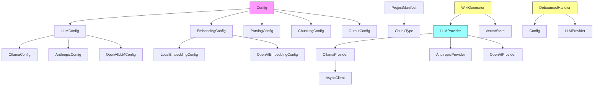

# System Architecture Documentation

## System Overview

The system is a local documentation generator that creates architecture documentation using code analysis, vector search, and LLM-based generation. It processes source code repositories to extract information about classes, functions, and modules, then uses vector databases for semantic search and LLMs for generating human-readable documentation. The system supports multiple LLM providers (Ollama, Anthropic, OpenAI) and embedding providers (local, OpenAI), making it flexible for different deployment scenarios.

## Key Components

### Config
The [Config](files/src/local_deepwiki/config.md) class serves as the [main](files/src/local_deepwiki/export/html.md) configuration manager for the entire system. It holds all configuration settings including embedding provider settings, LLM provider settings, parsing configurations, chunking configurations, and output configurations. It provides a method to load configuration from files or use defaults, making the system configurable via external files.

### LLMConfig
The [LLMConfig](files/src/local_deepwiki/config.md) class manages configuration for different LLM providers. It supports three providers: Ollama, Anthropic, and OpenAI, each with their own specific configuration settings. This allows the system to work with different LLM backends without code changes.

### OllamaConfig
The [OllamaConfig](files/src/local_deepwiki/config.md) class holds configuration specific to the Ollama LLM provider, including the model name and base URL for the Ollama API. It enables local LLM usage with customizable parameters.

### AnthropicConfig
The [AnthropicConfig](files/src/local_deepwiki/config.md) class holds configuration for the Anthropic LLM provider, specifically the model name to use for API calls.

### OpenAILLMConfig
The [OpenAILLMConfig](files/src/local_deepwiki/config.md) class holds configuration for the OpenAI LLM provider, including the model name for API calls.

### EmbeddingConfig
The [EmbeddingConfig](files/src/local_deepwiki/config.md) class manages configuration for embedding providers, supporting both local and OpenAI embedding providers. This enables the system to create vector representations of code for semantic search.

### ProjectManifest
The [ProjectManifest](files/src/local_deepwiki/generators/manifest.md) class processes project information to extract technical stack details, categorize dependencies, and summarize entry points. It provides insights into the project's architecture and dependencies.

### ChunkType
The ChunkType class defines enumeration values for different types of code chunks that can be processed, including functions, classes, methods, modules, imports, comments, and other code elements.

### WikiGenerator
The [WikiGenerator](files/src/local_deepwiki/generators/wiki.md) class is responsible for generating architecture documentation. It uses vector search to gather context about core components, architectural patterns, and data flows, then leverages LLMs to create grounded documentation with diagrams.

### DebouncedHandler
The [DebouncedHandler](files/src/local_deepwiki/watcher.md) class manages file system change events with debouncing to avoid excessive processing. It delays reindexing operations until a quiet period has passed, improving efficiency when multiple files change rapidly.

### LLMProvider and OllamaProvider
The LLMProvider base class defines the interface for LLM providers, while OllamaProvider implements this interface for local Ollama-based LLM usage. This design allows for pluggable LLM backends.

## Data Flow

1. **Configuration Loading**: The system starts by loading configuration from files or defaults using the [Config](files/src/local_deepwiki/config.md) class.
2. **Code Analysis**: Source code is parsed and chunked into different code elements (functions, classes, etc.) using the ChunkType enumeration.
3. **Embedding Generation**: Code chunks are converted into vector embeddings using the configured embedding provider.
4. **Vector Storage**: Embeddings are stored in a vector database for semantic search.
5. **Architecture Generation**: The [WikiGenerator](files/src/local_deepwiki/generators/wiki.md) class searches the vector database for core components, architectural patterns, and data flows, then uses an LLM provider to generate comprehensive architecture documentation.
6. **Change Handling**: The [DebouncedHandler](files/src/local_deepwiki/watcher.md) monitors file system changes and triggers reindexing operations with debouncing to prevent excessive processing.

## Component Diagram

## Key Design Decisions

1. **Modular Configuration**: The system uses a modular configuration approach with separate configuration classes for different subsystems (LLM, embedding, parsing, etc.). This provides clear separation of concerns and makes the system easily configurable.

2. **Plugin Architecture for LLM Providers**: The system implements a plugin-style architecture for LLM providers using a base LLMProvider class and specific implementations. This allows easy addition of new LLM backends without modifying core logic.

3. **Debouncing for File Changes**: The system uses debouncing for file system monitoring to prevent excessive reprocessing when multiple files change rapidly, improving performance and reducing resource usage.

4. **Vector Database Integration**: The system leverages vector databases for semantic search capabilities, enabling intelligent retrieval of relevant code information for documentation generation.

5. **Separation of Concerns**: Different components have clearly defined responsibilities - configuration management, code analysis, embedding generation, documentation generation, and change handling - promoting maintainability and testability.

## Relevant Source Files

The following source files were used to generate this documentation:

- `tests/test_parser.py:12-111`
- `tests/test_chunker.py:11-182`
- `tests/test_search.py:20-53`
- `tests/test_toc.py:16-44`
- [`tests/test_incremental_wiki.py:20-47`](files/tests/test_incremental_wiki.md)
- `tests/test_web.py:39-103`
- `tests/__init__.py`
- `tests/test_manifest.py:14-56`
- [`tests/test_api_docs.py:31-53`](files/tests/test_api_docs.md)
- `tests/test_see_also.py:16-177`

*Showing 10 of 52 source files.*
