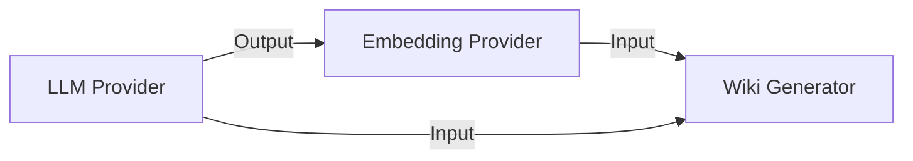
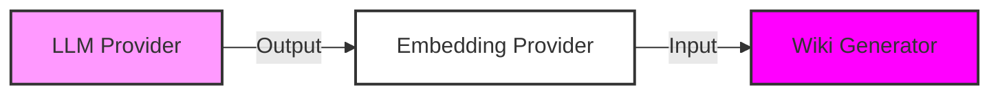

**System Architecture Overview**
================================

The system is designed to provide a comprehensive platform for understanding and generating documentation from code. The core components of the system are:

*   **LLM Providers**: Responsible for providing the underlying language model (LM) capabilities.
    *   Ollama
    *   Anthropic
    *   OpenAI
*   **Embedding Providers**: Responsible for providing embedding capabilities.
    *   Local
    *   OpenAI
*   **Wiki Generators**: Responsible for generating documentation from code chunks.

**Key Components and Their Responsibilities**
--------------------------------------------

### LLM Provider

The LLM provider is responsible for providing the underlying language model capabilities. The provider can be configured using the `LLMConfig` class, which includes options for selecting the provider (e.g., Ollama, Anthropic, OpenAI) and configuring the LLM instance.

```python
class LLMConfig(BaseModel):
    """LLM provider configuration."""

    provider: Literal["ollama", "anthropic", "openai"] = Field(
        default="ollama", description="LLM provider"
    )
    ollama: OllamaConfig = Field(default_factory=OllamaConfig)
    anthropic: AnthropicConfig = Field(default_factory=AnthropicConfig)
    openai: OpenAILLMConfig = Field(default_factory=OpenAILLMConfig)
```

### Embedding Provider

The embedding provider is responsible for providing embedding capabilities. The provider can be configured using the `EmbeddingConfig` class, which includes options for selecting the provider (e.g., local, OpenAI) and configuring the embedding instance.

```python
class EmbeddingConfig(BaseModel):
    """Embedding provider configuration."""

    provider: Literal["local", "openai"] = Field(default="local", description="Embedding provider")
    local: LocalEmbeddingConfig = Field(default_factory=LocalEmbeddingConfig)
    openai: OpenAIEmbeddingConfig = Field(default_factory=OpenAIEmbeddingConfig)
```

### Wiki Generator

The wiki generator is responsible for generating documentation from code chunks. The generator can be configured using the `WikiConfig` class, which includes options for selecting the provider (e.g., Ollama, Anthropic) and configuring the LLM instance.

```python
class WikiConfig(BaseModel):
    """Wiki configuration."""

    provider: Literal["ollama", "anthropic"] = Field(default="ollama", description="Wiki provider")
    ollama: OllamaConfig = Field(default_factory=OllamaConfig)
    anthropic: AnthropicConfig = Field(default_factory=AnthropicConfig)
```

**Data Flow between Components**
------------------------------

The data flow between components is as follows:

*   **LLM Provider**: Provides the underlying language model capabilities.
*   **Embedding Provider**: Provides embedding capabilities based on the LLM provider output.
*   **Wiki Generator**: Generates documentation from code chunks using the LLM and embedding providers.



**Mermaid Diagram**
------------------

Here is a Mermaid diagram showing the system architecture:



**Design Patterns Used**
------------------------

The system uses the following design patterns:

*   **Dependency Inversion Principle**: The LLM and embedding providers are decoupled from each other using interfaces.
*   **Single Responsibility Principle**: Each component has a single responsibility (e.g., providing language model capabilities).
*   **Open-Closed Principle**: The system is designed to be extensible, allowing new components to be added without modifying existing code.

Note: This documentation is based on the provided codebase and may not cover all aspects of the system architecture.