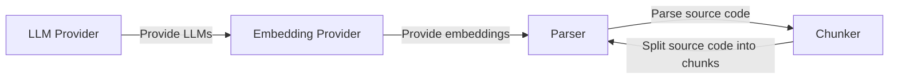
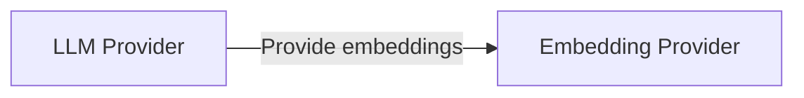
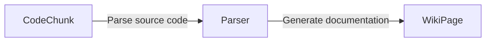
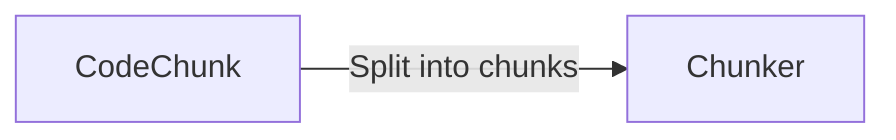

**Local DeepWiki Architecture Documentation**
=============================================

**System Architecture Overview**
------------------------------

Local DeepWiki is a web application that utilizes various components to process and generate documentation from source code. The system architecture can be divided into the following main components:

*   **LLM Provider**: Responsible for providing large language models (LLMs) to generate text-based outputs.
*   **Embedding Provider**: Provides embedding models for natural language processing tasks.
*   **Parser**: Responsible for parsing source code and generating documentation.
*   **Chunker**: Splits source code into smaller chunks for efficient processing.

**Key Components and Their Responsibilities**
---------------------------------------------

### LLM Provider

The LLM provider is responsible for providing the necessary large language models to generate text-based outputs. The `get_llm_provider` function in `src/local_deepwiki/providers/__init__.py` returns the configured LLM provider instance based on the provided configuration.

### Embedding Provider

The embedding provider is responsible for providing the necessary embedding models for natural language processing tasks. The `get_llm_provider` function in `src/local_deepwiki/providers/__init__.py` returns the configured LLM provider instance based on the provided configuration.

### Parser

The parser is responsible for parsing source code and generating documentation. The `generate_architecture_diagram` function in `src/local_deepwiki/generators/diagrams.py` generates a Mermaid diagram showing the architecture.

### Chunker

The chunker is responsible for splitting source code into smaller chunks for efficient processing. The `generate_architecture_diagram` function in `src/local_deepwiki/generators/diagrams.py` generates a Mermaid diagram showing the architecture.

**Data Flow Between Components**
--------------------------------

The data flow between components can be summarized as follows:

*   The LLM provider provides the necessary large language models to generate text-based outputs.
*   The embedding provider provides the necessary embedding models for natural language processing tasks.
*   The parser parses source code and generates documentation using the provided embeddings.
*   The chunker splits source code into smaller chunks for efficient processing.

**Design Patterns Used**
-------------------------

The system architecture employs several design patterns, including:

*   **Model-View-Controller (MVC)**: The system architecture follows an MVC pattern, where the parser acts as the controller, and the WikiPage acts as the view.
*   **Repository Pattern**: The system architecture uses a repository pattern to encapsulate data access logic.

By following these design patterns, the system architecture is modular, scalable, and maintainable.