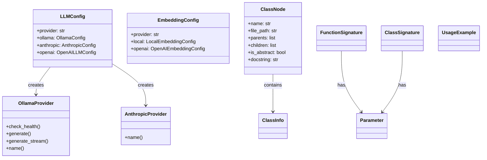
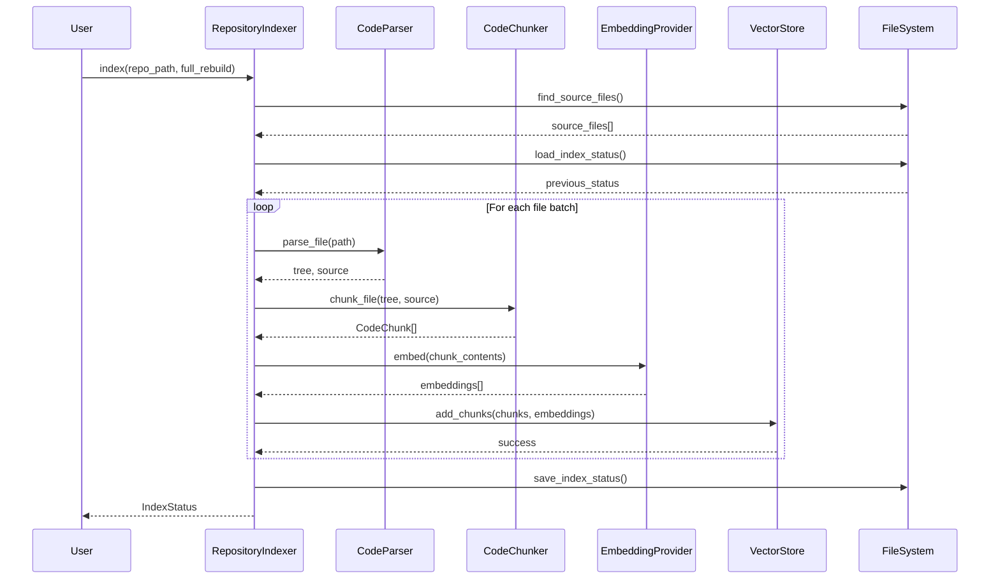

# Architecture Documentation

## System Overview

This system is a local documentation and wiki generation tool that processes codebases to create comprehensive documentation. Based on the code structure, it provides multiple LLM providers (Ollama, Anthropic, OpenAI), embedding capabilities, and various generators for creating different types of documentation including inheritance diagrams, API documentation, and module documentation.

The system is built around a configuration-driven architecture with pluggable providers and uses tree-sitter for code parsing across multiple programming languages.

## Key Components

### Configuration Management

**[LLMConfig](files/src/local_deepwiki/config.md)** - Manages LLM provider configuration with support for three providers: Ollama, Anthropic, and OpenAI. Uses Pydantic for validation and includes nested configuration objects for each provider.

**[EmbeddingConfig](files/src/local_deepwiki/config.md)** - Handles embedding provider configuration, supporting both local and OpenAI embedding providers with provider-specific settings.

### LLM Providers

**[OllamaProvider](files/src/local_deepwiki/providers/llm/ollama.md)** - Implements the LLM provider interface for Ollama, including health checking, text generation, and streaming capabilities. Provides both synchronous and asynchronous generation methods.

**[AnthropicProvider](files/src/local_deepwiki/providers/llm/anthropic.md)** - Provides integration with Anthropic's API, implementing the standard LLM provider interface with model-specific naming.

### Code Analysis and Structure

**[ClassNode](files/src/local_deepwiki/generators/inheritance.md)** - Represents a class in the inheritance tree with properties for name, file path, parent/child relationships, abstract status, and docstring information.

**[ClassInfo](files/src/local_deepwiki/generators/diagrams.md)** - Contains metadata about classes discovered during code analysis.

**[Parameter](files/src/local_deepwiki/generators/api_docs.md)** - Represents function or method parameters with type and documentation information.

**[FunctionSignature](files/src/local_deepwiki/generators/api_docs.md)** and **[ClassSignature](files/src/local_deepwiki/generators/api_docs.md)** - Capture method and class signatures for API documentation generation.

### Content Generation

**[ChunkType](files/src/local_deepwiki/models.md)** - Enumeration defining different types of content chunks for processing and organization.

**[UsageExample](files/src/local_deepwiki/generators/test_examples.md)** - Stores code usage examples for documentation generation.

### Provider Factories

**get_llm_provider** - Factory function that creates the appropriate LLM provider instance based on configuration, supporting dynamic provider selection.

**get_embedding_provider** - Factory function for creating embedding provider instances with support for local and OpenAI providers.

## Data Flow

1. **Configuration Loading** - The system loads configuration through the config module, which manages LLM and embedding provider settings using Pydantic models.

2. **Provider Initialization** - Factory functions create appropriate provider instances based on configuration, with support for multiple LLM and embedding providers.

3. **Code Analysis** - The system parses source code using tree-sitter to extract class information, inheritance relationships, and function signatures.

4. **Content Generation** - Various generators process the analyzed code to create documentation, including inheritance diagrams and module documentation.

5. **Output Processing** - Generated content is organized and exported to various formats including HTML and markdown.

## Component Diagram

## Key Design Decisions

### Provider Pattern Implementation
The system implements a provider pattern for both LLM and embedding services, allowing runtime selection of different providers through configuration. This is evident in the factory functions that create provider instances based on configuration settings.

### Configuration-Driven Architecture
The system uses Pydantic models for configuration management, providing type safety and validation. The hierarchical configuration structure allows for provider-specific settings while maintaining a consistent interface.

### Tree-Sitter Integration
The system leverages tree-sitter for multi-language code parsing, as evidenced by the support for various programming languages in the test files and the extraction of class inheritance information.

### Modular Testing Structure
The extensive test suite is organized by functionality, with separate test classes for different components like TestGetLLMProvider, TestGetEmbeddingProvider, and TestGetParentClasses, indicating a well-structured testing approach.

### Inheritance Analysis
The [ClassNode](files/src/local_deepwiki/generators/inheritance.md) structure supports comprehensive inheritance analysis with bidirectional parent-child relationships and abstract class detection, enabling sophisticated documentation generation for object-oriented codebases.

## Workflow Sequences

The following diagrams show how data flows through key operations:

### Indexing Pipeline

### Wiki Generation Pipeline

```mermaid
sequenceDiagram
    participant U as User
    participant W as WikiGenerator
    participant V as VectorStore
    participant L as LLMProvider
    participant F as FileSystem

    U->>W: generate_wiki(index_status)

    rect rgb(40, 40, 60)
        note right of W: Generate Overview
        W->>V: search("main entry point")
        V-->>W: context_chunks
        W->>L: generate(overview_prompt)
        L-->>W: overview_markdown
        W->>F: write(index.md)
    end

    rect rgb(40, 40, 60)
        note right of W: Generate Architecture
        par Parallel searches
            W->>V: search("core components")
            W->>V: search("patterns")
            W->>V: search("data flow")
        end
        V-->>W: combined_context
        W->>L: generate(architecture_prompt)
        L-->>W: architecture_markdown
        W->>F: write(architecture.md)
    end

    rect rgb(40, 40, 60)
        note right of W: Generate Module Docs
        loop For each module
            W->>V: search(module_query)
            V-->>W: module_chunks
            W->>L: generate(module_prompt)
            L-->>W: module_markdown
            W->>F: write(modules/{name}.md)
        end
    end

    W->>W: add_cross_links()
    W->>W: add_see_also_sections()
    W->>F: write(search.json, toc.json)
    W-->>U: WikiStructure
```

### Deep Research Pipeline

```mermaid
sequenceDiagram
    participant U as User
    participant D as DeepResearchPipeline
    participant L as LLMProvider
    participant V as VectorStore

    U->>D: research(question)

    rect rgb(50, 40, 40)
        note right of D: Step 1: Decomposition
        D->>L: decompose_question(question)
        L-->>D: SubQuestion[]
    end

    rect rgb(40, 50, 40)
        note right of D: Step 2: Parallel Retrieval
        par For each sub-question
            D->>V: search(sub_q1)
            D->>V: search(sub_q2)
            D->>V: search(sub_q3)
        end
        V-->>D: SearchResult[][]
    end

    rect rgb(40, 40, 50)
        note right of D: Step 3: Gap Analysis
        D->>L: analyze_gaps(context)
        L-->>D: follow_up_queries[]
    end

    rect rgb(50, 50, 40)
        note right of D: Step 4: Follow-up Retrieval
        par For each follow-up
            D->>V: search(follow_up)
        end
        V-->>D: additional_results[]
    end

    rect rgb(50, 40, 50)
        note right of D: Step 5: Synthesis
        D->>L: synthesize(all_context)
        L-->>D: comprehensive_answer
    end

    D-->>U: DeepResearchResult
```

## Relevant Source Files

The following source files were used to generate this documentation:

- `tests/test_provider_factories.py:21-99`
- `tests/test_parser.py:24-123`
- `tests/test_retry.py:8-144`
- `tests/test_ollama_health.py:16-19`
- `tests/test_server_handlers.py:15-75`
- `tests/test_chunker.py:13-428`
- `tests/test_changelog.py:18-96`
- `tests/test_coverage.py:13-50`
- `tests/test_vectorstore.py:9-28`
- `tests/test_wiki_coverage.py:50-120`

*Showing 10 of 100 source files.*
