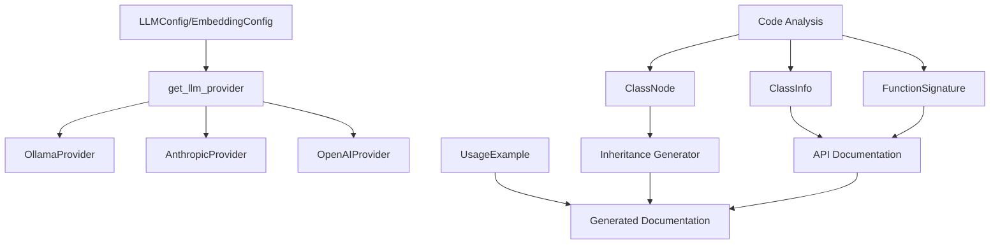
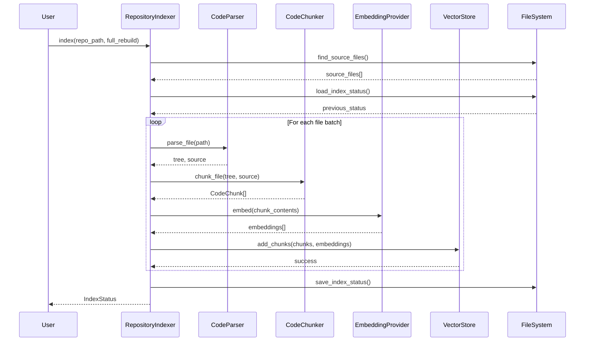

# Architecture Documentation

## System Overview

The local-deepwiki system is a code documentation and wiki generation tool that analyzes codebases to create comprehensive documentation. Based on the code structure, it provides multiple LLM provider integrations (Ollama, Anthropic, OpenAI), embedding capabilities, and various documentation generators including inheritance diagrams and API documentation.

## Key Components

### Configuration Management
The **[LLMConfig](files/src/local_deepwiki/config.md)** class manages LLM provider configuration with support for three providers: ollama, anthropic, and openai. It uses Pydantic for validation and includes nested configuration objects for each provider.

The **[EmbeddingConfig](files/src/local_deepwiki/config.md)** class handles embedding provider configuration, supporting both local and OpenAI embedding providers with their respective configuration objects.

### Provider System
The **[OllamaProvider](files/src/local_deepwiki/providers/llm/ollama.md)** class implements LLM functionality for Ollama integration, extending a base [LLMProvider](files/src/local_deepwiki/providers/base.md) interface with methods for health checking, text generation, and streaming capabilities.

The provider factory function `get_llm_provider` creates appropriate provider instances based on configuration, supporting dynamic provider selection between Ollama, Anthropic, and OpenAI providers.

### Code Analysis and Documentation
The **[ClassNode](files/src/local_deepwiki/generators/inheritance.md)** class represents classes in inheritance analysis, storing class metadata including name, file path, parent/child relationships, abstract status, and docstring information.

Various test classes indicate the system includes:
- API documentation extraction (TestAPIDocExtractor)
- Class signature analysis (TestExtractClassSignature, TestClassInfo)
- Inheritance diagram generation (TestGenerateClassDiagram)
- Module documentation generation (TestGenerateModuleDocs)

### Data Models
The **[ChunkType](files/src/local_deepwiki/models.md)** enum and related classes ([ClassInfo](files/src/local_deepwiki/generators/diagrams.md), [ClassSignature](files/src/local_deepwiki/generators/api_docs.md), [FunctionSignature](files/src/local_deepwiki/generators/api_docs.md), [Parameter](files/src/local_deepwiki/generators/api_docs.md)) provide structured representations of code elements for analysis and documentation generation.

The **[UsageExample](files/src/local_deepwiki/generators/test_examples.md)** class stores code usage examples, likely for documentation enhancement.

## Data Flow

1. **Configuration Loading**: The system loads configuration through the config module, supporting context-aware configuration management with functions like [`get_config`](files/src/local_deepwiki/config.md), [`set_config`](files/src/local_deepwiki/config.md), and [`config_context`](files/src/local_deepwiki/config.md).

2. **Provider Initialization**: Based on configuration, the factory functions create appropriate LLM and embedding providers with their specific configurations.

3. **Code Analysis**: The system parses source code to extract class information, inheritance relationships, and other structural elements, storing them in structured data models.

4. **Documentation Generation**: Various generators process the analyzed code to create different types of documentation, including inheritance diagrams and API documentation.

## Component Diagram

## Key Design Decisions

### Provider Pattern
The system implements a provider pattern for LLM and embedding services, allowing runtime selection between different AI service providers. This is evident from the factory functions and configuration-driven provider instantiation.

### Configuration-Driven Architecture
The use of Pydantic models for configuration ([LLMConfig](files/src/local_deepwiki/config.md), [EmbeddingConfig](files/src/local_deepwiki/config.md)) with nested provider-specific configurations enables type-safe, validated configuration management with clear separation of concerns.

### Structured Code Representation
The system uses well-defined data models ([ClassNode](files/src/local_deepwiki/generators/inheritance.md), [ClassInfo](files/src/local_deepwiki/generators/diagrams.md), [FunctionSignature](files/src/local_deepwiki/generators/api_docs.md)) to represent code elements, enabling consistent processing across different documentation generators.

### Test-Driven Design
The extensive test coverage visible in the test classes suggests a test-driven approach to development, with comprehensive testing of core functionality including provider factories, code analysis, and documentation generation.

### Modular Generator System
The separation of different documentation generators (inheritance diagrams, API docs, module docs) indicates a modular architecture where different types of documentation can be generated independently based on the same underlying code analysis.

## Workflow Sequences

The following diagrams show how data flows through key operations:

### Indexing Pipeline

### Wiki Generation Pipeline

```mermaid
sequenceDiagram
    participant U as User
    participant W as WikiGenerator
    participant V as VectorStore
    participant L as LLMProvider
    participant F as FileSystem

    U->>W: generate_wiki(index_status)

    rect rgb(40, 40, 60)
        note right of W: Generate Overview
        W->>V: search("main entry point")
        V-->>W: context_chunks
        W->>L: generate(overview_prompt)
        L-->>W: overview_markdown
        W->>F: write(index.md)
    end

    rect rgb(40, 40, 60)
        note right of W: Generate Architecture
        par Parallel searches
            W->>V: search("core components")
            W->>V: search("patterns")
            W->>V: search("data flow")
        end
        V-->>W: combined_context
        W->>L: generate(architecture_prompt)
        L-->>W: architecture_markdown
        W->>F: write(architecture.md)
    end

    rect rgb(40, 40, 60)
        note right of W: Generate Module Docs
        loop For each module
            W->>V: search(module_query)
            V-->>W: module_chunks
            W->>L: generate(module_prompt)
            L-->>W: module_markdown
            W->>F: write(modules/{name}.md)
        end
    end

    W->>W: add_cross_links()
    W->>W: add_see_also_sections()
    W->>F: write(search.json, toc.json)
    W-->>U: WikiStructure
```

### Deep Research Pipeline

```mermaid
sequenceDiagram
    participant U as User
    participant D as DeepResearchPipeline
    participant L as LLMProvider
    participant V as VectorStore

    U->>D: research(question)

    rect rgb(50, 40, 40)
        note right of D: Step 1: Decomposition
        D->>L: decompose_question(question)
        L-->>D: SubQuestion[]
    end

    rect rgb(40, 50, 40)
        note right of D: Step 2: Parallel Retrieval
        par For each sub-question
            D->>V: search(sub_q1)
            D->>V: search(sub_q2)
            D->>V: search(sub_q3)
        end
        V-->>D: SearchResult[][]
    end

    rect rgb(40, 40, 50)
        note right of D: Step 3: Gap Analysis
        D->>L: analyze_gaps(context)
        L-->>D: follow_up_queries[]
    end

    rect rgb(50, 50, 40)
        note right of D: Step 4: Follow-up Retrieval
        par For each follow-up
            D->>V: search(follow_up)
        end
        V-->>D: additional_results[]
    end

    rect rgb(50, 40, 50)
        note right of D: Step 5: Synthesis
        D->>L: synthesize(all_context)
        L-->>D: comprehensive_answer
    end

    D-->>U: DeepResearchResult
```

## Relevant Source Files

The following source files were used to generate this documentation:

- `tests/test_provider_factories.py:21-99`
- `tests/test_parser.py:24-123`
- `tests/test_retry.py:8-144`
- `tests/test_ollama_health.py:16-19`
- `tests/test_server_handlers.py:15-75`
- `tests/test_chunker.py:13-428`
- `tests/test_changelog.py:18-96`
- `tests/test_coverage.py:13-50`
- `tests/test_vectorstore.py:9-28`
- `tests/test_wiki_coverage.py:50-120`

*Showing 10 of 97 source files.*
