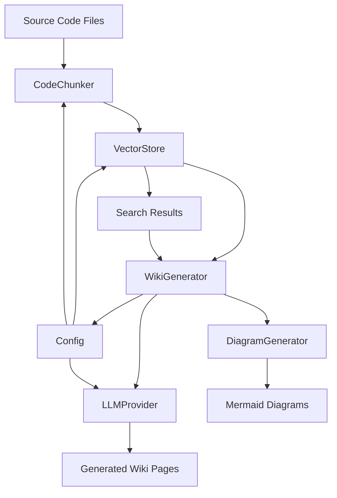

# System Architecture Documentation

## System Overview

The Local DeepWiki system is a documentation generation tool that leverages vector search and LLMs to automatically create comprehensive documentation for codebases. It works by indexing code chunks, storing them in a vector database, and then using LLMs to generate structured documentation including architecture diagrams, module overviews, and class documentation.

## Key Components and Responsibilities

### WikiGenerator
The WikiGenerator class is the core component responsible for generating all documentation. It orchestrates the entire documentation generation process by:
- Managing the index status and tracking what has been generated
- Using VectorStore to search for relevant code chunks
- Generating different types of documentation pages including architecture, modules, and class diagrams
- Rendering Mermaid diagrams for visual representation of system structure

### VectorStore
The VectorStore class handles all vector-based operations including:
- Storing code chunks with their embeddings
- Searching for relevant code chunks based on natural language queries
- Managing the similarity search for context retrieval during documentation generation

### CodeChunker
The CodeChunker class is responsible for:
- Breaking down source code into manageable chunks
- Processing code files and extracting meaningful code segments
- Creating CodeChunk objects that contain file paths, content, and metadata

### LLMProvider and EmbeddingProvider
These abstract base classes define the interface for language model and embedding providers:
- LLMProvider handles natural language generation tasks
- EmbeddingProvider handles vector embeddings for code chunks
- Concrete implementations exist for Ollama, Anthropic, and OpenAI providers

### Config
The Config class manages all system configuration:
- LLM configuration including provider selection and model settings
- Embedding configuration for different embedding providers
- Output settings for generated documentation

## Data Flow Between Components

1. **Indexing Phase**: 
   - CodeChunker processes source code files and creates CodeChunk objects
   - These chunks are stored in VectorStore with their embeddings
   - IndexStatus tracks the indexing progress

2. **Documentation Generation Phase**:
   - WikiGenerator uses IndexStatus to determine what needs to be generated
   - It queries VectorStore for relevant code chunks using natural language queries
   - Context from search results is passed to LLM providers for documentation generation
   - Mermaid diagrams are generated by DiagramGenerator classes
   - Generated pages are saved to the wiki directory structure

3. **Configuration Management**:
   - Config class loads and provides configuration to all components
   - Providers (LLMProvider, EmbeddingProvider) use configuration to initialize connections

## Architecture Diagram

## Design Patterns Used

### Strategy Pattern
The system uses the Strategy pattern through the LLMProvider and EmbeddingProvider abstract classes. Different concrete implementations (OllamaProvider, AnthropicProvider, OpenAIProvider) can be used interchangeably based on configuration.

### Factory Pattern
The system uses factory methods to create provider instances based on configuration. This allows for easy extension with new providers without modifying existing code.

### Singleton Pattern
The Config class implements a singleton pattern through get_config and set_config functions, ensuring consistent configuration access throughout the application.

### Observer Pattern
IndexStatus acts as an observer pattern implementation, tracking the state of indexing and documentation generation processes.

### Template Method Pattern
The WikiGenerator class implements a template method pattern where specific generation steps are defined in abstract methods that concrete implementations can override.

### Repository Pattern
VectorStore implements a repository pattern for code chunks, providing a clean interface for storage and retrieval operations while abstracting the underlying storage mechanism.