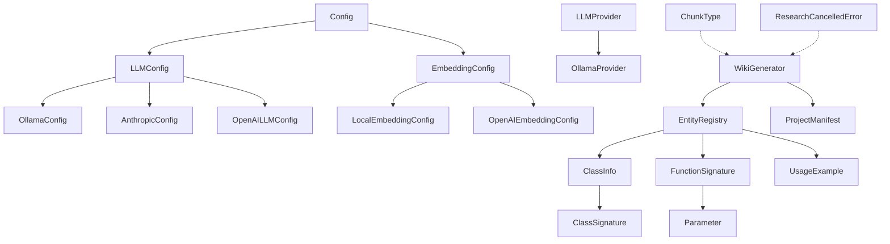
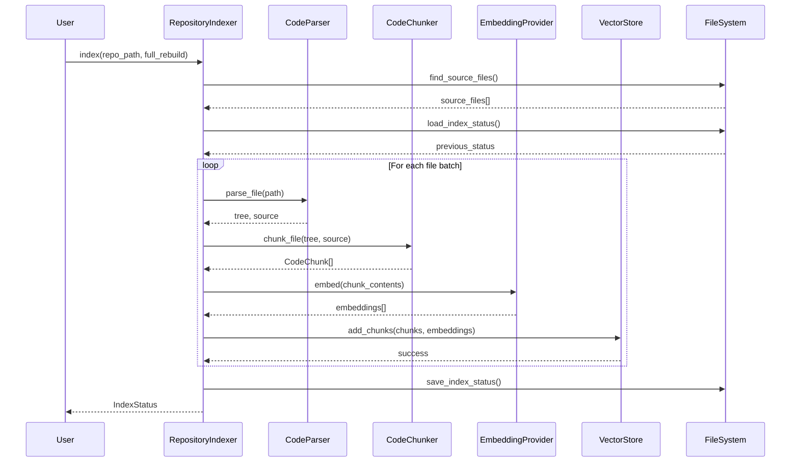

# Architecture Documentation

## System Overview

This is a documentation generation system that creates wikis from codebases using Large [Language](files/src/local_deepwiki/models.md) Models (LLMs). The system analyzes code, extracts information about classes and functions, and generates comprehensive documentation with cross-references and diagrams.

The architecture is built around configurable LLM providers (Ollama, Anthropic, OpenAI) that power the documentation generation process. The system includes components for parsing code, managing configurations, generating manifests, and exporting documentation to HTML format.

## Key Components

### Configuration Management

The **[Config](files/src/local_deepwiki/config.md)** class serves as the central configuration system, managing settings for different providers and components. The **[LLMConfig](files/src/local_deepwiki/config.md)** class specifically handles LLM provider configuration, supporting three providers: Ollama, Anthropic, and OpenAI through dedicated configuration classes:

- **[OllamaConfig](files/src/local_deepwiki/config.md)** - Configures local Ollama instances with model selection and API URL
- **[AnthropicConfig](files/src/local_deepwiki/config.md)** - Manages Anthropic Claude model configuration  
- **[OpenAILLMConfig](files/src/local_deepwiki/config.md)** - Handles OpenAI GPT model settings

The **[EmbeddingConfig](files/src/local_deepwiki/config.md)** class manages embedding providers for semantic search capabilities, supporting both local and OpenAI embedding options through **[LocalEmbeddingConfig](files/src/local_deepwiki/config.md)** and **[OpenAIEmbeddingConfig](files/src/local_deepwiki/config.md)**.

### LLM Provider Architecture

The system implements a provider pattern for LLM integration. The **[LLMProvider](files/src/local_deepwiki/providers/base.md)** base class defines the interface, with **[OllamaProvider](files/src/local_deepwiki/providers/llm/ollama.md)** as a concrete implementation. The `get_llm_provider` function acts as a factory, instantiating the appropriate provider based on configuration.

### Code Analysis and Documentation

The **[WikiGenerator](files/src/local_deepwiki/generators/wiki.md)** class appears to be the [main](files/src/local_deepwiki/export/pdf.md) orchestrator for documentation generation. The **[ChunkType](files/src/local_deepwiki/models.md)** enum defines different types of code elements that can be analyzed (functions, classes, methods, modules, imports, comments).

Code analysis components include:
- **[ClassInfo](files/src/local_deepwiki/generators/diagrams.md)** and **[ClassSignature](files/src/local_deepwiki/generators/api_docs.md)** - Extract and represent class metadata
- **[FunctionSignature](files/src/local_deepwiki/generators/api_docs.md)** and **[Parameter](files/src/local_deepwiki/generators/api_docs.md)** - Handle function analysis
- **[EntityRegistry](files/src/local_deepwiki/generators/crosslinks.md)** - Manages discovered code entities
- **[UsageExample](files/src/local_deepwiki/generators/test_examples.md)** - Represents code usage patterns

### Project Analysis

The **[ProjectManifest](files/src/local_deepwiki/generators/manifest.md)** class analyzes project structure and dependencies, providing methods to categorize dependencies and generate technology stack summaries.

### Error Handling

The **[ResearchCancelledError](files/src/local_deepwiki/core/deep_research.md)** class provides specific error handling for cancelled research operations.

## Data Flow

1. **Configuration Loading**: The system loads configuration through the [Config](files/src/local_deepwiki/config.md) class, determining which LLM provider to use
2. **Code Analysis**: Code is parsed and analyzed, with entities registered in the [EntityRegistry](files/src/local_deepwiki/generators/crosslinks.md)
3. **LLM Processing**: The configured LLM provider generates documentation content based on analyzed code
4. **Manifest Generation**: [ProjectManifest](files/src/local_deepwiki/generators/manifest.md) analyzes the project structure and dependencies
5. **Output Generation**: Documentation is generated and exported to HTML format in the `html-export/` directory

## Component Diagram

## Key Design Decisions

### Provider Pattern Implementation
The system uses a provider pattern for LLM integration, allowing easy switching between different AI providers (Ollama, Anthropic, OpenAI) through configuration. This design enables flexibility in choosing different models based on requirements or availability.

### Configuration-Driven Architecture
The extensive use of Pydantic models for configuration ([LLMConfig](files/src/local_deepwiki/config.md), [EmbeddingConfig](files/src/local_deepwiki/config.md), etc.) provides type safety and validation. The configuration system supports multiple providers and can be contextually managed through the [`config_context`](files/src/local_deepwiki/config.md) function.

### Modular Code Analysis
The separation of concerns is evident in the code analysis components - [ClassInfo](files/src/local_deepwiki/generators/diagrams.md) handles class metadata, [FunctionSignature](files/src/local_deepwiki/generators/api_docs.md) manages function details, and [ChunkType](files/src/local_deepwiki/models.md) categorizes different code elements. This modular approach allows for extensible code analysis capabilities.

### Factory Pattern for Provider Instantiation
The `get_llm_provider` function implements a factory pattern, abstracting provider instantiation details and allowing the system to create the appropriate provider instance based on configuration.

### Comprehensive Testing Strategy
The extensive test suite (visible in the `tests/` directory) indicates a focus on reliability, with dedicated test classes for different components like TestAPIDocExtractor, TestCachingLLMProvider, and configuration testing through TestProviderPrompts.

## Workflow Sequences

The following diagrams show how data flows through key operations:

### Indexing Pipeline

### Wiki Generation Pipeline

```mermaid
sequenceDiagram
    participant U as User
    participant W as WikiGenerator
    participant V as VectorStore
    participant L as LLMProvider
    participant F as FileSystem

    U->>W: generate_wiki(index_status)

    rect rgb(40, 40, 60)
        note right of W: Generate Overview
        W->>V: search("main entry point")
        V-->>W: context_chunks
        W->>L: generate(overview_prompt)
        L-->>W: overview_markdown
        W->>F: write(index.md)
    end

    rect rgb(40, 40, 60)
        note right of W: Generate Architecture
        par Parallel searches
            W->>V: search("core components")
            W->>V: search("patterns")
            W->>V: search("data flow")
        end
        V-->>W: combined_context
        W->>L: generate(architecture_prompt)
        L-->>W: architecture_markdown
        W->>F: write(architecture.md)
    end

    rect rgb(40, 40, 60)
        note right of W: Generate Module Docs
        loop For each module
            W->>V: search(module_query)
            V-->>W: module_chunks
            W->>L: generate(module_prompt)
            L-->>W: module_markdown
            W->>F: write(modules/{name}.md)
        end
    end

    W->>W: add_cross_links()
    W->>W: add_see_also_sections()
    W->>F: write(search.json, toc.json)
    W-->>U: WikiStructure
```

### Deep Research Pipeline

```mermaid
sequenceDiagram
    participant U as User
    participant D as DeepResearchPipeline
    participant L as LLMProvider
    participant V as VectorStore

    U->>D: research(question)

    rect rgb(50, 40, 40)
        note right of D: Step 1: Decomposition
        D->>L: decompose_question(question)
        L-->>D: SubQuestion[]
    end

    rect rgb(40, 50, 40)
        note right of D: Step 2: Parallel Retrieval
        par For each sub-question
            D->>V: search(sub_q1)
            D->>V: search(sub_q2)
            D->>V: search(sub_q3)
        end
        V-->>D: SearchResult[][]
    end

    rect rgb(40, 40, 50)
        note right of D: Step 3: Gap Analysis
        D->>L: analyze_gaps(context)
        L-->>D: follow_up_queries[]
    end

    rect rgb(50, 50, 40)
        note right of D: Step 4: Follow-up Retrieval
        par For each follow-up
            D->>V: search(follow_up)
        end
        V-->>D: additional_results[]
    end

    rect rgb(50, 40, 50)
        note right of D: Step 5: Synthesis
        D->>L: synthesize(all_context)
        L-->>D: comprehensive_answer
    end

    D-->>U: DeepResearchResult
```

## Relevant Source Files

The following source files were used to generate this documentation:

- `tests/test_parser.py:24-123`
- `tests/test_retry.py:8-144`
- `tests/test_ollama_health.py:16-19`
- `tests/test_server_handlers.py:15-69`
- `tests/test_chunker.py:11-182`
- `tests/test_changelog.py:18-96`
- `tests/test_vectorstore.py:9-28`
- `tests/test_pdf_export.py:21-80`
- `tests/test_search.py:20-53`
- `tests/test_toc.py:17-43`

*Showing 10 of 76 source files.*
