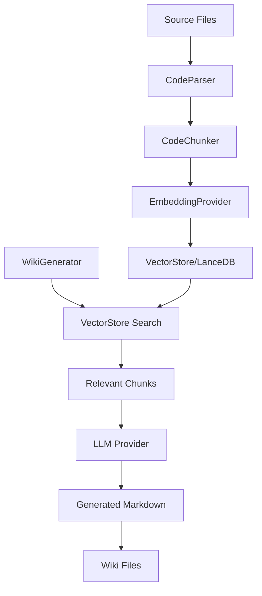
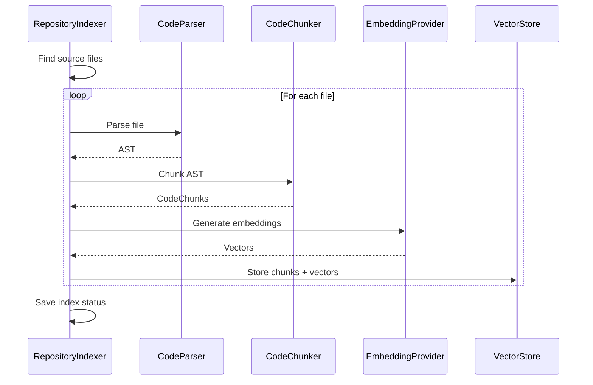
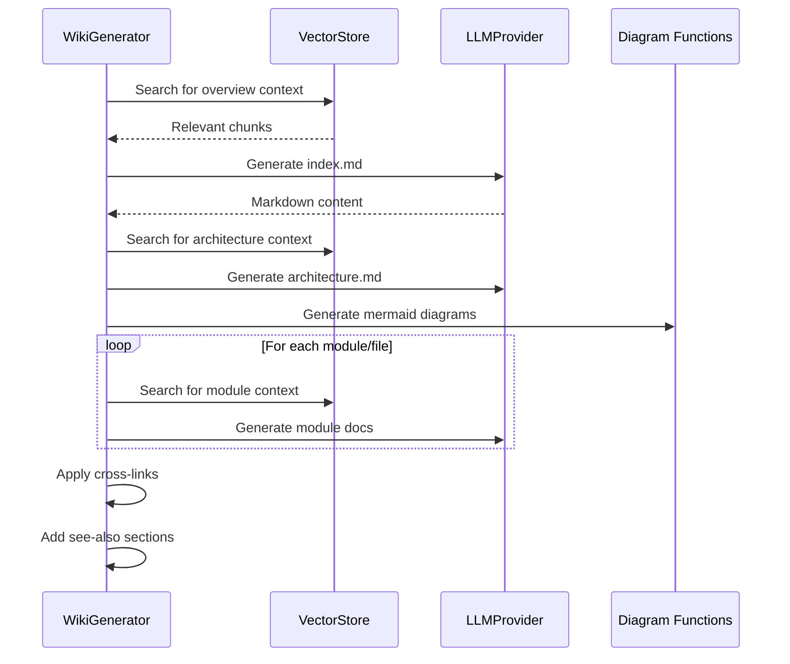
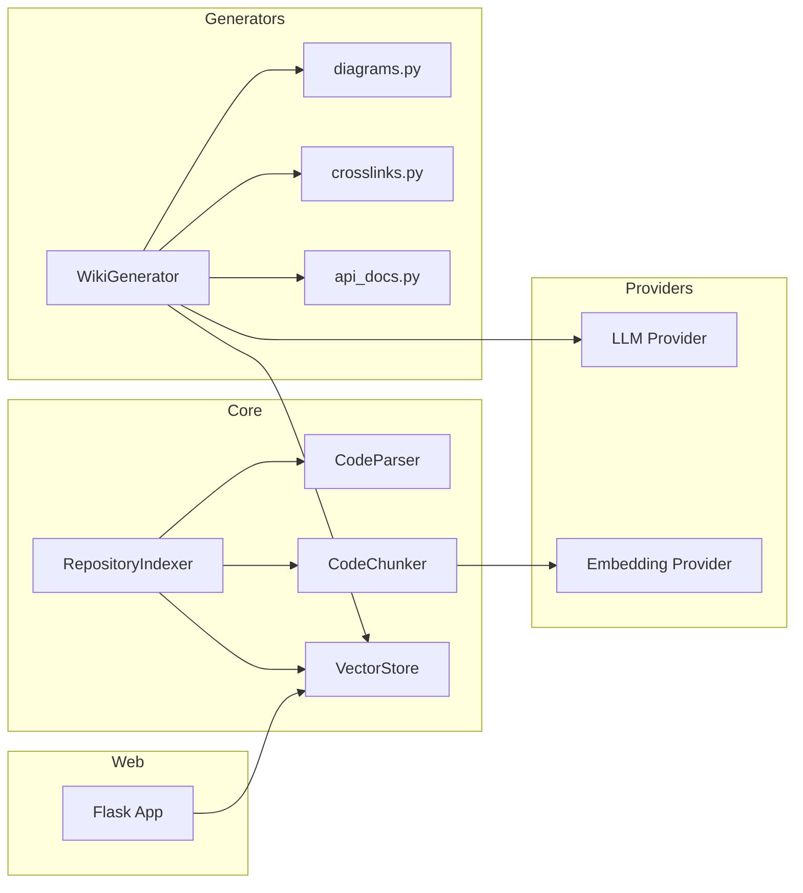

# System Architecture Documentation

## System Overview

Local DeepWiki is a documentation generation system that creates comprehensive technical documentation from codebases. It combines AST-based code parsing with vector search and LLM generation to produce wiki-style documentation automatically.

The system works in three phases:
1. **Parsing**: Tree-sitter parses source files into ASTs
2. **Indexing**: Code chunks are embedded and stored in LanceDB
3. **Generation**: LLMs generate documentation using RAG (Retrieval-Augmented Generation)

## Key Components

### RepositoryIndexer
The [RepositoryIndexer](files/src/local_deepwiki/core/indexer.md) class orchestrates the indexing pipeline. It coordinates file discovery, parsing, chunking, and vector storage. Supports incremental updates by tracking file hashes.

### CodeParser
The [CodeParser](files/src/local_deepwiki/core/parser.md) class uses tree-sitter to parse source files into ASTs. Supports Python, TypeScript, JavaScript, Go, Rust, Java, C, C++, and Swift.

### CodeChunker
The [CodeChunker](files/src/local_deepwiki/core/chunker.md) class extracts semantic chunks from parsed ASTs - classes, functions, methods with their docstrings and signatures. Maintains metadata about each chunk (file path, line numbers, language).

### VectorStore
The [VectorStore](files/src/local_deepwiki/core/vectorstore.md) class manages the LanceDB vector database. Handles embedding generation, storage, and semantic search queries.

### WikiGenerator
The [WikiGenerator](files/src/local_deepwiki/generators/wiki.md) class produces documentation pages using LLM generation. Queries the vector store for relevant code context, then prompts the LLM to generate markdown documentation.

### LLM Providers
Abstraction layer for LLM providers (Ollama, Anthropic, OpenAI). Located in `providers/llm.py`. Factory function `get_llm_provider()` returns the configured provider.

### Embedding Providers
Abstraction for embedding generation. Supports local sentence-transformers (all-MiniLM-L6-v2) and OpenAI embeddings. Located in `providers/embeddings.py`.

### Diagram Functions
Functions in `generators/diagrams.py` create Mermaid diagrams for architecture visualization, class diagrams, and dependency graphs.

### Config
The [Config](files/src/local_deepwiki/config.md) class manages configuration loaded from `~/.config/local-deepwiki/config.yaml`. Includes LLM settings, embedding settings, and parsing options.

## Data Flow

## Indexing Pipeline

## Wiki Generation Pipeline

## Component Diagram

## Key Design Decisions

### Tree-sitter for Parsing
Uses tree-sitter for language-agnostic AST parsing. Provides accurate, fast parsing across multiple languages without language-specific parsers.

### LanceDB for Vector Storage
Embedded vector database that requires no external services. Stores vectors alongside metadata for efficient retrieval.

### Incremental Updates
Tracks file hashes to detect changes. Only re-indexes modified files and regenerates affected wiki pages.

### Provider Abstraction
LLM and embedding providers are abstracted behind factory functions. Allows switching between local (Ollama) and cloud (Anthropic/OpenAI) without code changes.

### RAG for Documentation
Uses Retrieval-Augmented Generation - searches for relevant code context before prompting the LLM. Produces more accurate, grounded documentation.

## See Also

- [Source Files](files/index.md) - Individual file documentation
- [Dependencies](dependencies.md) - Dependency analysis
- [Modules](modules/index.md) - Module documentation
