# System Architecture Documentation

## System Overview

The local deepwiki system is a code documentation and knowledge management tool that generates architecture documentation using LLMs and vector databases. It provides functionality for parsing code, chunking it into meaningful segments, and generating wiki pages with diagrams and grounded facts. The system supports multiple LLM providers (Ollama, Anthropic, OpenAI) and embedding providers (local, OpenAI), making it flexible for different environments and use cases.

## Key Components

### Config
The Config class serves as the main configuration manager for the entire system. It holds all configuration settings including embedding, LLM, parsing, chunking, and output configurations. It provides methods to load configuration from files or use defaults.

### LLMConfig
The LLMConfig class manages the configuration for Large Language Model providers. It supports three providers: Ollama, Anthropic, and OpenAI, each with their own specific configuration settings.

### ProjectManifest
The ProjectManifest class is responsible for analyzing project data to provide summaries of technology stack, dependencies, and entry points. It helps in understanding the overall project structure and composition.

### WikiGenerator
The WikiGenerator class is the core component that orchestrates the generation of wiki documentation. It manages the process of gathering context from vector stores, generating architecture documentation with diagrams, and creating comprehensive wiki pages.

### CodeChunker
The CodeChunker class handles the parsing and chunking of source code into meaningful segments. It categorizes code into different chunk types like functions, classes, methods, etc., which are used for documentation generation.

### DebouncedHandler
The DebouncedHandler class implements a file system watcher that processes changes to source files with debouncing. It ensures that documentation is regenerated only after a period of inactivity, preventing excessive processing.

### EntityRegistry
The EntityRegistry class manages the registration and retrieval of code entities during parsing and documentation generation processes.

### TestAPIDocExtractor
The TestAPIDocExtractor class is used for extracting API documentation from code, specifically designed for testing purposes.

### TestExtractClassSignature
The TestExtractClassSignature class handles extraction of class signatures from code, used for testing documentation generation.

### TestGenerateCallGraphDiagram
The TestGenerateCallGraphDiagram class is responsible for generating call graph diagrams for testing purposes.

### TestNodeHelpers
The TestNodeHelpers class provides helper functions for node-based operations during testing.

## Data Flow

1. **Configuration Loading**: The system starts by loading configuration settings through the Config class, which determines which LLM and embedding providers to use.

2. **Code Parsing and Chunking**: Source code is parsed and chunked by the CodeChunker class into different types of code segments (functions, classes, methods, etc.).

3. **Documentation Generation**: The WikiGenerator class orchestrates the documentation generation process. It searches vector stores for relevant context (core components, architectural patterns, data flow) and generates architecture documentation with diagrams.

4. **LLM Interaction**: The system uses configured LLM providers (Ollama, Anthropic, OpenAI) through the LLMProvider interface to generate text and responses during documentation creation.

5. **File Watching**: The DebouncedHandler monitors file system changes and triggers reindexing and documentation regeneration when source files are modified.

## Component Diagram

```mermaid
graph TD
    A[Config] --> B[LLMConfig]
    A --> C[EmbeddingConfig]
    A --> D[ParsingConfig]
    A --> E[ChunkingConfig]
    A --> F[OutputConfig]
    
    B --> G[OllamaConfig]
    B --> H[AnthropicConfig]
    B --> I[OpenAILLMConfig]
    
    C --> J[LocalEmbeddingConfig]
    C --> K[OpenAIEmbeddingConfig]
    
    L[WikiGenerator] --> M[VectorStore]
    L --> N[CodeChunker]
    L --> O[LLMProvider]
    
    P[CodeChunker] --> Q[ChunkType]
    P --> R[Language]
    
    S[DebouncedHandler] --> T[Watcher]
    S --> U[WikiGenerator]
    
    V[EntityRegistry] --> W[CodeChunker]
    V --> X[WikiGenerator]
    
    Y[TestAPIDocExtractor] --> Z[WikiGenerator]
    Y --> AA[CodeChunker]
    
    AB[TestExtractClassSignature] --> AC[CodeChunker]
    
    AD[TestGenerateCallGraphDiagram] --> AE[WikiGenerator]
    
    AF[TestNodeHelpers] --> AG[WikiGenerator]
    
    AH[ProjectManifest] --> AI[WikiGenerator]
    
    AJ[LLMProvider] --> AK[OllamaProvider]
    AJ --> AL[AnthropicProvider]
    AJ --> AM[OpenAIProvider]
```

## Key Design Decisions

1. **Modular Configuration**: The system uses a modular configuration approach where each major component (LLM, embedding, parsing, etc.) has its own configuration class, allowing for flexible and granular control.

2. **Provider Pattern**: The system implements the provider pattern for both LLM and embedding services, making it easy to switch between different providers without changing core logic.

3. **Asynchronous Processing**: Key operations like LLM generation and vector database searches are implemented asynchronously to improve performance and responsiveness.

4. **Debounced File Watching**: The system uses debounced file watching to prevent excessive processing when multiple files change in quick succession, improving efficiency.

5. **Code Chunking Strategy**: The system categorizes code into different chunk types (function, class, method, etc.) to provide more granular and meaningful documentation.

6. **Test-Driven Design**: The codebase includes dedicated test classes for various components, indicating a test-driven approach to development and ensuring component reliability.