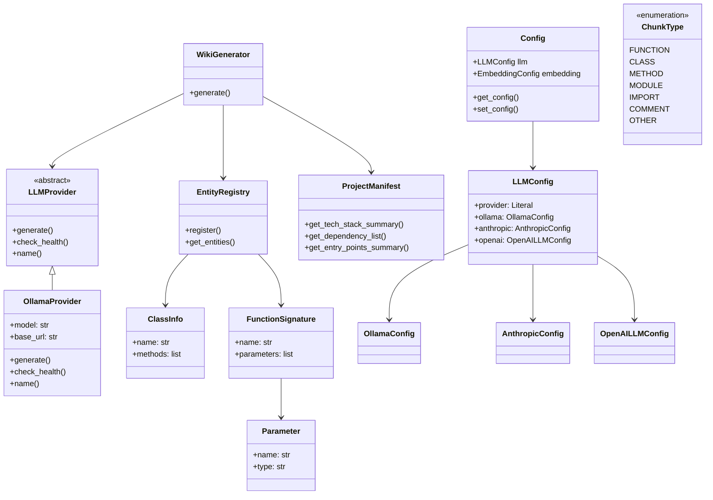
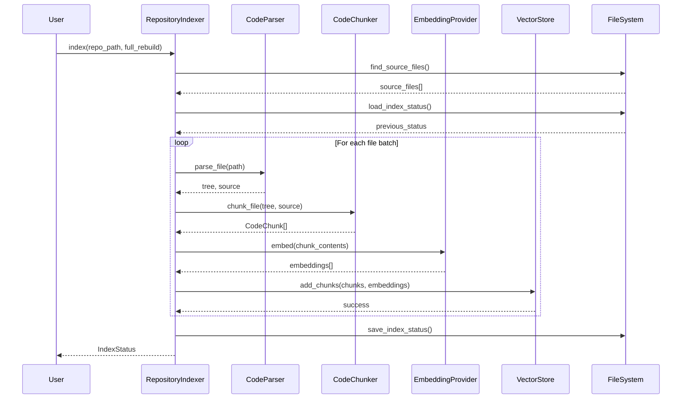

# Architecture Documentation

## System Overview

Local DeepWiki is a code analysis and documentation generation system that processes codebases to create comprehensive wiki documentation. The system uses configurable LLM providers (Ollama, Anthropic, OpenAI) and embedding models to analyze code structure and generate intelligent documentation.

The architecture follows a modular design with separate providers for different AI services, configurable processing pipelines, and support for multiple output formats including HTML export.

## Key Components

### Configuration Management
The **[Config](files/src/local_deepwiki/config.md)** class serves as the central configuration system, managing settings for LLM providers, embeddings, parsing, and output generation. The **[LLMConfig](files/src/local_deepwiki/config.md)** class specifically handles LLM provider selection and configuration, supporting three providers through dedicated config classes: **[OllamaConfig](files/src/local_deepwiki/config.md)**, **[AnthropicConfig](files/src/local_deepwiki/config.md)**, and **[OpenAILLMConfig](files/src/local_deepwiki/config.md)**.

### LLM Provider System
The **[LLMProvider](files/src/local_deepwiki/providers/base.md)** abstract base class defines the interface for AI language model integrations. The **[OllamaProvider](files/src/local_deepwiki/providers/llm/ollama.md)** class implements this interface for local Ollama models, providing health checking and generation capabilities. The provider system uses a factory pattern through the `get_llm_provider` function to instantiate the appropriate provider based on configuration.

### Code Analysis Models
The **[ChunkType](files/src/local_deepwiki/models.md)** enum defines different types of code elements that can be analyzed (functions, classes, methods, modules, imports, comments). The **[ClassInfo](files/src/local_deepwiki/generators/diagrams.md)** and **[ClassSignature](files/src/local_deepwiki/generators/api_docs.md)** classes represent extracted information about code classes, while **[FunctionSignature](files/src/local_deepwiki/generators/api_docs.md)** and **[Parameter](files/src/local_deepwiki/generators/api_docs.md)** classes handle function analysis. The **[EntityRegistry](files/src/local_deepwiki/generators/crosslinks.md)** manages collections of analyzed code entities.

### Documentation Generation
The **[WikiGenerator](files/src/local_deepwiki/generators/wiki.md)** class orchestrates the documentation generation process. The **[ProjectManifest](files/src/local_deepwiki/generators/manifest.md)** class analyzes project structure and dependencies to create technology stack summaries and entry point documentation.

### Testing Infrastructure
The system includes comprehensive test coverage with classes like **[TestAPIDocExtractor](files/tests/test_api_docs.md)**, **[TestCachingLLMProvider](files/tests/test_llm_cache.md)**, **[TestClassInfo](files/tests/test_diagrams.md)**, and **[TestProviderPrompts](files/tests/test_config.md)** that validate different aspects of the documentation generation pipeline.

### Error Handling
The **[ResearchCancelledError](files/src/local_deepwiki/core/deep_research.md)** class provides specific error handling for interrupted research operations.

## Data Flow

1. **Configuration Loading**: The [Config](files/src/local_deepwiki/config.md) system loads settings for LLM providers, embedding models, and processing parameters
2. **Provider Initialization**: Based on configuration, the appropriate LLM provider (Ollama, Anthropic, or OpenAI) is instantiated
3. **Code Analysis**: The system processes source code to extract entities like classes, functions, and modules, storing them in the [EntityRegistry](files/src/local_deepwiki/generators/crosslinks.md)
4. **Documentation Generation**: The [WikiGenerator](files/src/local_deepwiki/generators/wiki.md) coordinates with LLM providers to generate documentation content
5. **Output Export**: Generated documentation is exported to various formats, including HTML files organized in the html-export directory structure

## Component Diagram

## Key Design Decisions

### Provider Abstraction Pattern
The system uses an abstract base class pattern for LLM providers, allowing easy swapping between different AI services. The `get_llm_provider` factory function encapsulates provider instantiation logic based on configuration.

### Configuration-Driven Architecture
All major system components are configured through Pydantic models, providing type safety and validation. The configuration system supports context-aware settings through the [`config_context`](files/src/local_deepwiki/config.md) function.

### Modular Package Structure
The codebase is organized into logical modules under `src/local_deepwiki/`, with separate packages for providers, generators, and web components. This structure supports maintainability and testing.

### Comprehensive Testing Strategy
The system includes extensive test coverage with dedicated test classes for each major component, ensuring reliability across different provider configurations and use cases.

### Error Handling Specialization
Custom exception classes like [ResearchCancelledError](files/src/local_deepwiki/core/deep_research.md) provide specific error handling for different operational scenarios, improving error diagnosis and recovery.

## Workflow Sequences

The following diagrams show how data flows through key operations:

### Indexing Pipeline

### Wiki Generation Pipeline

```mermaid
sequenceDiagram
    participant U as User
    participant W as WikiGenerator
    participant V as VectorStore
    participant L as LLMProvider
    participant F as FileSystem

    U->>W: generate_wiki(index_status)

    rect rgb(40, 40, 60)
        note right of W: Generate Overview
        W->>V: search("main entry point")
        V-->>W: context_chunks
        W->>L: generate(overview_prompt)
        L-->>W: overview_markdown
        W->>F: write(index.md)
    end

    rect rgb(40, 40, 60)
        note right of W: Generate Architecture
        par Parallel searches
            W->>V: search("core components")
            W->>V: search("patterns")
            W->>V: search("data flow")
        end
        V-->>W: combined_context
        W->>L: generate(architecture_prompt)
        L-->>W: architecture_markdown
        W->>F: write(architecture.md)
    end

    rect rgb(40, 40, 60)
        note right of W: Generate Module Docs
        loop For each module
            W->>V: search(module_query)
            V-->>W: module_chunks
            W->>L: generate(module_prompt)
            L-->>W: module_markdown
            W->>F: write(modules/{name}.md)
        end
    end

    W->>W: add_cross_links()
    W->>W: add_see_also_sections()
    W->>F: write(search.json, toc.json)
    W-->>U: WikiStructure
```

### Deep Research Pipeline

```mermaid
sequenceDiagram
    participant U as User
    participant D as DeepResearchPipeline
    participant L as LLMProvider
    participant V as VectorStore

    U->>D: research(question)

    rect rgb(50, 40, 40)
        note right of D: Step 1: Decomposition
        D->>L: decompose_question(question)
        L-->>D: SubQuestion[]
    end

    rect rgb(40, 50, 40)
        note right of D: Step 2: Parallel Retrieval
        par For each sub-question
            D->>V: search(sub_q1)
            D->>V: search(sub_q2)
            D->>V: search(sub_q3)
        end
        V-->>D: SearchResult[][]
    end

    rect rgb(40, 40, 50)
        note right of D: Step 3: Gap Analysis
        D->>L: analyze_gaps(context)
        L-->>D: follow_up_queries[]
    end

    rect rgb(50, 50, 40)
        note right of D: Step 4: Follow-up Retrieval
        par For each follow-up
            D->>V: search(follow_up)
        end
        V-->>D: additional_results[]
    end

    rect rgb(50, 40, 50)
        note right of D: Step 5: Synthesis
        D->>L: synthesize(all_context)
        L-->>D: comprehensive_answer
    end

    D-->>U: DeepResearchResult
```

## Relevant Source Files

The following source files were used to generate this documentation:

- [`src/local_deepwiki/config.py:14-19`](files/src/local_deepwiki/config.md)
- [`tests/test_parser.py:24-123`](files/tests/test_parser.md)
- [`tests/test_retry.py:8-144`](files/tests/test_retry.md)
- [`tests/test_ollama_health.py:16-19`](files/tests/test_ollama_health.md)
- [`tests/test_server_handlers.py:15-69`](files/tests/test_server_handlers.md)
- [`tests/test_chunker.py:11-182`](files/tests/test_chunker.md)
- [`tests/test_changelog.py:18-96`](files/tests/test_changelog.md)
- [`tests/test_vectorstore.py:9-28`](files/tests/test_vectorstore.md)
- [`tests/test_pdf_export.py:21-80`](files/tests/test_pdf_export.md)
- [`tests/test_search.py:20-53`](files/tests/test_search.md)

*Showing 10 of 74 source files.*
