# System Overview

The system is a local documentation generator that creates architecture documentation from code repositories. It uses LLMs for generating content and vector databases for semantic search and indexing. The system supports multiple LLM providers (Ollama, Anthropic, OpenAI) and can be configured for different embedding providers and parsing settings.

# Key Components

## Config
The [Config](files/src/local_deepwiki/config.md) class serves as the [main](files/src/local_deepwiki/export/html.md) configuration holder for the entire system. It aggregates various configuration settings including embedding, LLM, parsing, chunking, and output configurations. It provides a method to load configuration from files or use defaults.

## LLMConfig
The [LLMConfig](files/src/local_deepwiki/config.md) class manages configuration for Large Language Model providers. It supports three providers: Ollama, Anthropic, and OpenAI, each with their own specific configurations.

## OllamaConfig
The [OllamaConfig](files/src/local_deepwiki/config.md) class holds configuration specific to the Ollama LLM provider, including the model name and base URL for the Ollama API.

## AnthropicConfig
The [AnthropicConfig](files/src/local_deepwiki/config.md) class holds configuration specific to the Anthropic LLM provider, including the model name.

## OpenAILLMConfig
The [OpenAILLMConfig](files/src/local_deepwiki/config.md) class holds configuration specific to the OpenAI LLM provider, including the model name.

## EmbeddingConfig
The [EmbeddingConfig](files/src/local_deepwiki/config.md) class manages configuration for embedding providers, supporting both local and OpenAI embedding providers.

## ProjectManifest
The [ProjectManifest](files/src/local_deepwiki/generators/manifest.md) class processes project data to generate summaries including technology stack, dependencies, and entry points. It categorizes dependencies and provides methods to retrieve various project information.

## ChunkType
The ChunkType class defines the types of code chunks that can be processed, including functions, classes, methods, modules, imports, comments, and other code elements.

## Language
The Language class defines the supported programming languages for the system, including Python, JavaScript, TypeScript, Go, Rust, Java, C, C++, Swift, Ruby, PHP, and Kotlin.

## CodeChunker
The [CodeChunker](files/src/local_deepwiki/core/chunker.md) class is responsible for splitting code into semantic chunks for processing and indexing. It handles different chunk types and supports various programming languages.

## DebouncedHandler
The [DebouncedHandler](files/src/local_deepwiki/watcher.md) class manages file system changes with debouncing to avoid excessive processing. It accumulates file changes and processes them after a specified delay.

## EntityRegistry
The [EntityRegistry](files/src/local_deepwiki/generators/crosslinks.md) class maintains a registry of entities (classes, functions, etc.) found in the codebase, providing methods to access and manage these entities.

## TestAPIDocExtractor
The [TestAPIDocExtractor](files/tests/test_api_docs.md) class is used for testing API documentation extraction functionality.

## TestExtractClassAttributes
The [TestExtractClassAttributes](files/tests/test_diagrams.md) class tests the extraction of class attributes from code.

## TestExtractClassSignature
The [TestExtractClassSignature](files/tests/test_api_docs.md) class tests the extraction of class signatures from code.

## TestGenerateClassDiagram
The [TestGenerateClassDiagram](files/tests/test_diagrams.md) class tests the generation of class diagrams.

## TestNodeHelpers
The TestNodeHelpers class tests helper functions for node processing.

## TestPathToModule
The [TestPathToModule](files/tests/test_diagrams.md) class tests the conversion of file paths to module names.

## TestClassInfo
The [TestClassInfo](files/tests/test_diagrams.md) class tests class information extraction.

## WikiGenerator
The [WikiGenerator](files/src/local_deepwiki/generators/wiki.md) class is responsible for generating wiki pages including architecture documentation with diagrams and grounded facts.

# Data Flow

1. The system starts by loading configuration from files or defaults using the [Config](files/src/local_deepwiki/config.md) class
2. File system changes are monitored by the [DebouncedHandler](files/src/local_deepwiki/watcher.md), which accumulates changes and processes them after a debounce period
3. When processing occurs, the [CodeChunker](files/src/local_deepwiki/core/chunker.md) splits code into semantic chunks based on ChunkType
4. The [EntityRegistry](files/src/local_deepwiki/generators/crosslinks.md) maintains information about classes, functions, and other entities found in the codebase
5. The [ProjectManifest](files/src/local_deepwiki/generators/manifest.md) processes project data to generate summaries and dependency information
6. LLM providers (Ollama, Anthropic, OpenAI) are selected based on configuration and used for generating content
7. The [WikiGenerator](files/src/local_deepwiki/generators/wiki.md) class creates architecture documentation using semantic search and LLMs to generate grounded facts
8. Generated documentation is exported to HTML files in the html-export directory

# Component Diagram

```mermaid
graph TD
    A[Config] --> B[LLMConfig]
    A --> C[EmbeddingConfig]
    A --> D[ParsingConfig]
    A --> E[ChunkingConfig]
    A --> F[OutputConfig]
    
    B --> G[OllamaConfig]
    B --> H[AnthropicConfig]
    B --> I[OpenAILLMConfig]
    
    C --> J[LocalEmbeddingConfig]
    C --> K[OpenAIEmbeddingConfig]
    
    L[DebouncedHandler] --> M[CodeChunker]
    L --> N[EntityRegistry]
    L --> O[WikiGenerator]
    
    P[WikiGenerator] --> Q[ProjectManifest]
    P --> R[LLMProvider]
    
    S[CodeChunker] --> T[ChunkType]
    S --> U[Language]
    
    V[LLMProvider] --> W[OllamaProvider]
    V --> X[AnthropicProvider]
    V --> Y[OpenAIProvider]
    
    Z[ProjectManifest] --> AA[DependencyList]
    Z --> AB[TechStackSummary]
    Z --> AC[EntryPointsSummary]
    
    classDef component fill:#f9f,stroke:#333;
    class A,B,C,D,E,F,G,H,I,J,K,L,M,N,O,P,Q,R,S,T,U,V,W,X,Y,Z,AA,AB,AC component;
```

# Key Design Decisions

1. **Modular Configuration**: The system uses a layered configuration approach where the [main](files/src/local_deepwiki/export/html.md) [Config](files/src/local_deepwiki/config.md) class aggregates specific configuration classes for different subsystems (LLM, embedding, parsing, etc.)

2. **Plugin Architecture for LLM Providers**: The system uses a factory function get_llm_provider to dynamically select and instantiate LLM providers based on configuration, supporting multiple providers without tight coupling

3. **Debounced File Watching**: The [DebouncedHandler](files/src/local_deepwiki/watcher.md) uses a timer-based approach to batch file system changes, preventing excessive processing during rapid changes

4. **Semantic Chunking**: The [CodeChunker](files/src/local_deepwiki/core/chunker.md) breaks code into semantic chunks defined by ChunkType, enabling more precise indexing and processing

5. **Separation of Concerns**: Different classes handle distinct responsibilities - configuration, file watching, chunking, entity registry, documentation generation, and testing

6. **Extensible Language Support**: The Language class defines supported languages, making it easy to add new language support

7. **Test Coverage**: Multiple test classes are included for different components, ensuring reliability of core functionality

## Relevant Source Files

The following source files were used to generate this documentation:

- `tests/test_parser.py:12-111`
- `tests/test_chunker.py:11-182`
- `tests/test_search.py:20-53`
- `tests/test_toc.py:16-44`
- [`tests/test_incremental_wiki.py:20-47`](files/tests/test_incremental_wiki.md)
- `tests/test_web.py:39-103`
- `tests/__init__.py`
- `tests/test_manifest.py:14-56`
- [`tests/test_api_docs.py:31-53`](files/tests/test_api_docs.md)
- `tests/test_see_also.py:16-177`

*Showing 10 of 52 source files.*
