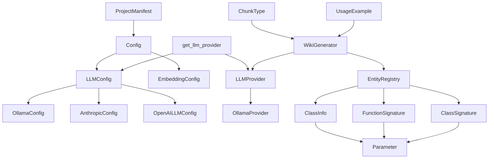

# Architecture Documentation

## System Overview

The local-deepwiki system is a documentation generation platform that analyzes codebases and creates comprehensive wiki-style documentation. The system is built around a modular architecture with pluggable providers for LLM services and embeddings, configuration management, and specialized generators for different types of documentation.

The core workflow involves indexing source code, generating embeddings for semantic search, and using LLM providers to create structured documentation including architecture overviews, API documentation, and code analysis.

## Key Components

### Configuration System
The **[Config](files/src/local_deepwiki/config.md)** class serves as the central configuration hub, managing settings for all system components. It coordinates with specialized configuration classes:

- **[LLMConfig](files/src/local_deepwiki/config.md)** manages LLM provider settings, supporting Ollama, Anthropic, and OpenAI providers
- **[OllamaConfig](files/src/local_deepwiki/config.md)**, **[AnthropicConfig](files/src/local_deepwiki/config.md)**, and **[OpenAILLMConfig](files/src/local_deepwiki/config.md)** provide provider-specific configurations
- **[EmbeddingConfig](files/src/local_deepwiki/config.md)** handles embedding provider configuration with local and OpenAI options

### LLM Provider Architecture
The system implements a provider pattern for LLM services:

- **LLMProvider** serves as the abstract base class defining the interface for language model interactions
- **OllamaProvider** implements local Ollama integration with health checking and streaming capabilities
- The `get_llm_provider` function acts as a factory, instantiating the appropriate provider based on configuration

### Documentation Generation
The **[WikiGenerator](files/src/local_deepwiki/generators/wiki.md)** class is the primary documentation generator, responsible for creating architecture documentation and other wiki content. It integrates with vector stores for semantic search and uses LLM providers to generate comprehensive documentation.

### Code Analysis and Modeling
Several classes handle code structure analysis:

- **[ChunkType](files/src/local_deepwiki/models.md)** enumerates different types of code elements (functions, classes, methods, modules, imports, comments)
- **[ClassInfo](files/src/local_deepwiki/generators/diagrams.md)**, **ClassSignature**, **FunctionSignature**, and **Parameter** model code structure for analysis
- **[EntityRegistry](files/src/local_deepwiki/generators/crosslinks.md)** manages code entities and their relationships
- **[ProjectManifest](files/src/local_deepwiki/generators/manifest.md)** analyzes project dependencies and provides technology stack summaries

### Utility Components
- **UsageExample** represents code usage examples
- **ResearchCancelledError** handles cancellation scenarios in research operations

## Data Flow

1. **Configuration Loading**: The system starts by loading configuration through the [Config](files/src/local_deepwiki/config.md) class, which determines LLM and embedding providers
2. **Provider Initialization**: Based on configuration, appropriate providers are instantiated via factory functions
3. **Code Analysis**: Source code is parsed and analyzed, with entities registered in the [EntityRegistry](files/src/local_deepwiki/generators/crosslinks.md)
4. **Documentation Generation**: The [WikiGenerator](files/src/local_deepwiki/generators/wiki.md) coordinates with LLM providers to create documentation, using vector search for context gathering
5. **Output Generation**: Generated documentation is structured and exported, with HTML export capabilities available

## Component Diagram

## Key Design Decisions

### Provider Pattern Implementation
The system uses a provider pattern for LLM services, allowing runtime selection between different AI providers (Ollama, Anthropic, OpenAI). This design enables flexibility in deployment scenarios and easy switching between local and cloud-based models.

### Configuration-Driven Architecture
All major components are configured through a centralized configuration system using Pydantic models. This approach provides type safety, validation, and clear separation of configuration from implementation.

### Modular Code Analysis
Code structure is modeled through specialized classes ([ClassInfo](files/src/local_deepwiki/generators/diagrams.md), FunctionSignature, etc.) that capture different aspects of source code. The [ChunkType](files/src/local_deepwiki/models.md) enumeration provides a taxonomy for different code elements, enabling targeted analysis and documentation generation.

### Factory Pattern for Provider Instantiation
The `get_llm_provider` function implements a factory pattern, abstracting provider instantiation and allowing the system to create appropriate provider instances based on configuration without tight coupling.

### Health Monitoring
The OllamaProvider includes health checking capabilities, indicating the system's focus on reliability and operational monitoring, particularly important for local LLM deployments.

## Relevant Source Files

The following source files were used to generate this documentation:

- [`tests/test_parser.py:24-123`](files/tests/test_parser.md)
- [`tests/test_retry.py:8-144`](files/tests/test_retry.md)
- `tests/test_ollama_health.py:16-19`
- `tests/test_server_handlers.py:15-69`
- `tests/test_chunker.py:11-182`
- `tests/test_changelog.py:18-96`
- [`tests/test_vectorstore.py:9-28`](files/tests/test_vectorstore.md)
- [`tests/test_pdf_export.py:21-80`](files/tests/test_pdf_export.md)
- `tests/test_search.py:20-53`
- `tests/test_toc.py:17-43`

*Showing 10 of 74 source files.*
