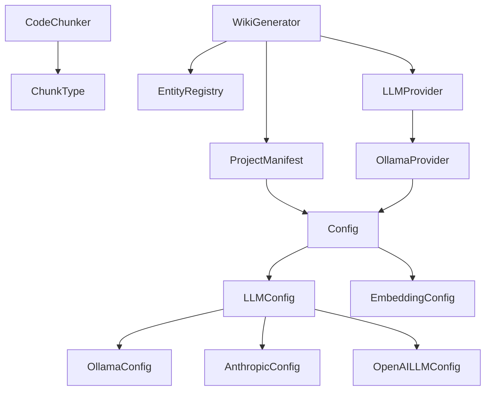

# Architecture Documentation

## System Overview

Local DeepWiki is a documentation generation system that processes codebases to create comprehensive wiki-style documentation. The system is built around a modular architecture with configurable providers for language models and embeddings, supporting multiple AI providers including Ollama, Anthropic, and OpenAI.

The core workflow involves parsing code into chunks, generating embeddings for semantic search, and using large language models to create structured documentation with architecture diagrams and cross-references.

## Key Components

### Configuration Management

The **[Config](files/src/local_deepwiki/config.md)** class serves as the central configuration hub, managing settings for all system components. It coordinates with specialized configuration classes:

- **[LLMConfig](files/src/local_deepwiki/config.md)** manages language model provider selection and settings
- **[EmbeddingConfig](files/src/local_deepwiki/config.md)** handles embedding provider configuration  
- **[OllamaConfig](files/src/local_deepwiki/config.md)**, **[AnthropicConfig](files/src/local_deepwiki/config.md)**, and **[OpenAILLMConfig](files/src/local_deepwiki/config.md)** provide provider-specific settings

The configuration system supports context-aware overrides through the [`config_context`](files/src/local_deepwiki/config.md) function and maintains thread-safe global state.

### Code Processing

**CodeChunker** breaks down source code into semantic units represented by **ChunkType** enumeration values (function, class, method, module, import, comment, other). This chunking enables fine-grained analysis and documentation generation.

**[ProjectManifest](files/src/local_deepwiki/generators/manifest.md)** analyzes project structure and dependencies, providing technology stack summaries and entry point identification for architectural documentation.

### LLM Provider System

The system implements a provider pattern for language model integration:

- **LLMProvider** defines the abstract interface for language model operations
- **OllamaProvider** implements local Ollama model integration with health checking
- The `get_llm_provider` factory function creates appropriate provider instances based on configuration

### Documentation Generation

**[WikiGenerator](files/src/local_deepwiki/generators/wiki.md)** orchestrates the documentation creation process, including architecture documentation generation through the `_generate_architecture` method. It coordinates with vector stores for semantic search and uses configured LLM providers to generate comprehensive documentation.

**[EntityRegistry](files/src/local_deepwiki/generators/crosslinks.md)** manages code entities and their relationships for cross-referencing and navigation.

### Utility Components

**[DebouncedHandler](files/src/local_deepwiki/watcher.md)** provides rate-limiting capabilities for operations that may be triggered frequently.

The **with_retry** decorator implements retry logic for operations that may fail transiently, particularly useful for network-based provider operations.

## Data Flow

1. **Configuration Loading**: The system loads configuration through [Config](files/src/local_deepwiki/config.md) and its specialized sub-configurations
2. **Code Parsing**: CodeChunker processes source files into semantic chunks categorized by ChunkType
3. **Project Analysis**: [ProjectManifest](files/src/local_deepwiki/generators/manifest.md) analyzes the codebase structure and dependencies
4. **Entity Registration**: [EntityRegistry](files/src/local_deepwiki/generators/crosslinks.md) catalogs discovered code entities and their relationships
5. **Vector Storage**: Code chunks are embedded and stored for semantic search capabilities
6. **Documentation Generation**: [WikiGenerator](files/src/local_deepwiki/generators/wiki.md) uses LLM providers to create documentation, leveraging vector search for context gathering
7. **Architecture Analysis**: The `_generate_architecture` method performs multiple semantic searches to gather comprehensive architectural context

## Component Diagram

## Key Design Decisions

### Provider Pattern Implementation
The system uses a provider pattern for LLM integration, allowing seamless switching between different AI services (Ollama, Anthropic, OpenAI) through configuration. The `get_llm_provider` factory function centralizes provider instantiation logic.

### Configuration Context Management
The configuration system supports both global and context-specific settings through the [`config_context`](files/src/local_deepwiki/config.md) context manager, enabling different configurations for different operations without affecting global state.

### Semantic Code Chunking
Code is processed into semantic chunks categorized by ChunkType enumeration, enabling more intelligent documentation generation by preserving code structure and meaning rather than arbitrary text splitting.

### Health Checking for External Services
The OllamaProvider implements health checking through the `check_health` and `_ensure_healthy` methods, ensuring robust operation when working with external services that may be unavailable.

### Multi-Modal Search Strategy
The `_generate_architecture` method demonstrates a sophisticated approach to gathering architectural context by performing multiple targeted searches (core components, architectural patterns, data flow) rather than a single broad search.

### Retry Mechanism
The `with_retry` decorator provides configurable retry logic for operations that may fail due to network issues or temporary service unavailability, improving system reliability.

## Relevant Source Files

The following source files were used to generate this documentation:

- [`tests/test_parser.py:24-123`](files/tests/test_parser.md)
- [`tests/test_retry.py:8-144`](files/tests/test_retry.md)
- `tests/test_ollama_health.py:13-32`
- `tests/test_server_handlers.py:15-69`
- `tests/test_chunker.py:11-182`
- [`tests/test_vectorstore.py:9-28`](files/tests/test_vectorstore.md)
- [`tests/test_pdf_export.py:21-80`](files/tests/test_pdf_export.md)
- `tests/test_search.py:20-53`
- `tests/test_toc.py:17-43`
- `tests/test_incremental_wiki.py:20-47`

*Showing 10 of 63 source files.*
