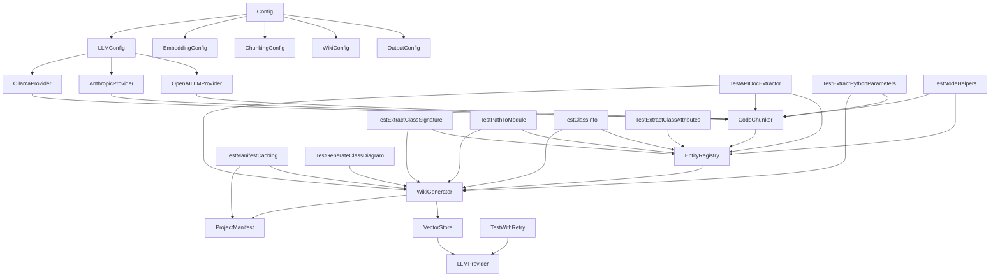

# System Architecture Documentation

## System Overview

The local-deepwiki-mcp system is a documentation generation tool that creates architecture documentation and wikis for codebases. It leverages LLMs for content generation and vector databases for semantic search. The system supports multiple LLM providers (Ollama, Anthropic, OpenAI) and embedding providers (local, OpenAI). It processes code chunks, generates documentation, and maintains a project manifest for tracking dependencies and entry points.

## Key Components

### LLMConfig
The [LLMConfig](files/src/local_deepwiki/config.md) class manages configuration for different LLM providers. It supports three providers: Ollama, Anthropic, and OpenAI, each with their own specific configuration parameters. This class acts as a central configuration point for language model interactions.

### OllamaProvider
The OllamaProvider class implements the LLMProvider interface for Ollama-based LLMs. It handles initialization with model name and base URL, health checking, and LLM generation capabilities with streaming support.

### ProjectManifest
The [ProjectManifest](files/src/local_deepwiki/generators/manifest.md) class tracks project metadata including technology stack summary, dependency categorization, and entry points. It provides methods to analyze project dependencies and generate summaries for documentation purposes.

### Config
The [Config](files/src/local_deepwiki/config.md) class serves as the [main](files/src/local_deepwiki/watcher.md) configuration container, aggregating various configuration components including LLM, embedding, parsing, chunking, wiki output, and other settings. It manages global configuration state and provides context managers for temporary configuration overrides.

### WikiGenerator
The [WikiGenerator](files/src/local_deepwiki/generators/wiki.md) class orchestrates the documentation generation process. It handles architecture generation with diagrams, manages vector stores for semantic search, and coordinates the overall documentation pipeline.

### ChunkType
The ChunkType class defines the enumeration of code chunk types used for parsing and documentation generation. It includes types for functions, classes, methods, modules, imports, comments, and other code elements.

### CodeChunker
The CodeChunker class is responsible for breaking down code into semantic chunks for processing. It uses tree-sitter parsing to identify code elements and creates chunks for documentation generation.

### EntityRegistry
The [EntityRegistry](files/src/local_deepwiki/generators/crosslinks.md) class manages the registration and lookup of code entities. It maintains a mapping of entities to their properties and provides methods for entity resolution during documentation generation.

### TestAPIDocExtractor
The [TestAPIDocExtractor](files/tests/test_api_docs.md) class handles extraction of API documentation from code. It processes function signatures and generates documentation for API endpoints.

### TestExtractClassSignature
The [TestExtractClassSignature](files/tests/test_api_docs.md) class tests the extraction of class signatures from code. It validates that class information is correctly parsed and structured for documentation.

### TestExtractPythonParameters
The [TestExtractPythonParameters](files/tests/test_api_docs.md) class tests parameter extraction from Python functions. It ensures that function parameters are correctly identified and formatted.

### TestManifestCaching
The [TestManifestCaching](files/tests/test_manifest.md) class tests caching behavior of the [ProjectManifest](files/src/local_deepwiki/generators/manifest.md). It validates that manifest data is correctly cached and retrieved.

### TestNodeHelpers
The [TestNodeHelpers](files/tests/test_parser.md) class tests helper functions for working with code nodes. It ensures that node processing and transformation functions work correctly.

### TestPathToModule
The TestPathToModule class tests path-to-module conversion logic. It validates that file paths are correctly mapped to module names.

### TestWithRetry
The [TestWithRetry](files/tests/test_retry.md) class tests the retry mechanism for LLM operations. It ensures that failed operations are properly retried with exponential backoff.

### TestGenerateClassDiagram
The TestGenerateClassDiagram class tests class diagram generation. It validates that class relationships are correctly visualized in documentation.

### TestClassInfo
The TestClassInfo class tests class information extraction. It ensures that class metadata is correctly parsed and structured.

### TestExtractClassAttributes
The TestExtractClassAttributes class tests extraction of class attributes. It validates that class properties are correctly identified and documented.

## Data Flow

1. The system starts by loading configuration through the [Config](files/src/local_deepwiki/config.md) class
2. Code is parsed using CodeChunker with tree-sitter to identify semantic elements
3. Chunks are processed by the [EntityRegistry](files/src/local_deepwiki/generators/crosslinks.md) for entity resolution
4. LLM interactions are handled through LLMProvider implementations (OllamaProvider, etc.)
5. Documentation generation occurs through [WikiGenerator](files/src/local_deepwiki/generators/wiki.md), which uses vector stores for semantic search
6. Project manifest data is collected and cached for dependency analysis
7. Generated content is structured and output through the wiki generation pipeline

## Component Diagram

## Key Design Decisions

1. **Modular Configuration**: The system uses a modular configuration approach with separate classes for different configuration types (LLM, embedding, chunking, etc.) allowing for flexible and extensible configuration management.

2. **Provider Pattern**: LLM and embedding providers are implemented using a provider pattern with base classes and concrete implementations, enabling support for multiple backends.

3. **Context Management**: The system uses context managers for configuration management, allowing temporary configuration overrides without affecting global state.

4. **Semantic Search Integration**: The system integrates vector databases for semantic search capabilities, enabling intelligent documentation generation based on code relationships.

5. **Extensible Architecture**: The design supports pluggable components, particularly through the provider pattern, making it easy to add new LLM or embedding providers.

6. **Test-Driven Development**: The system includes comprehensive test classes for each major component, ensuring reliability and correctness of the documentation generation pipeline.

7. **Chunk-Based Processing**: Code is processed in semantic chunks rather than whole files, enabling more precise documentation generation and better LLM utilization.

## Relevant Source Files

The following source files were used to generate this documentation:

- [`tests/test_parser.py:24-123`](files/tests/test_parser.md)
- [`tests/test_retry.py:8-144`](files/tests/test_retry.md)
- `tests/test_ollama_health.py:13-32`
- `tests/test_server_handlers.py:15-69`
- `tests/test_chunker.py:11-182`
- [`tests/test_vectorstore.py:9-28`](files/tests/test_vectorstore.md)
- `tests/test_search.py:20-53`
- `tests/test_toc.py:17-43`
- [`tests/test_incremental_wiki.py:20-47`](files/tests/test_incremental_wiki.md)
- `tests/test_web.py:40-104`

*Showing 10 of 61 source files.*
