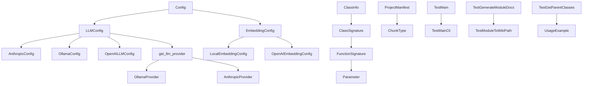
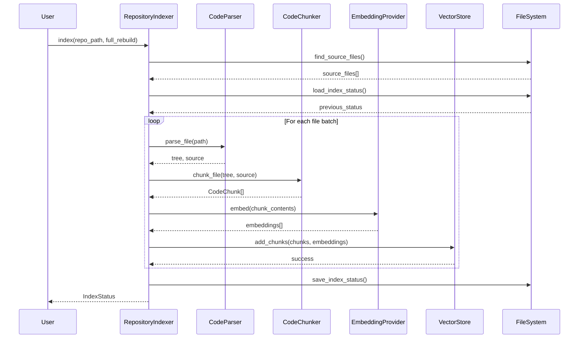

# Architecture Documentation

## System Overview

Local DeepWiki is a documentation generation system that processes codebases to create intelligent wiki documentation. The system is built around a provider-based architecture that supports multiple LLM providers (Ollama, Anthropic, OpenAI) and embedding providers (local, OpenAI) for generating and enhancing documentation content.

The system uses tree-sitter for code parsing, supports multiple programming languages including Python, TypeScript, Java, Swift, C++, Ruby, PHP, Kotlin, and C#, and provides various output formats including HTML export and PDF generation.

## Key Components

### Configuration Management

The **[Config](files/src/local_deepwiki/config.md)** class serves as the central configuration container, with specialized configuration classes for different system components:

- **[LLMConfig](files/src/local_deepwiki/config.md)** manages LLM provider selection and configuration, supporting three providers through dedicated config classes
- **[AnthropicConfig](files/src/local_deepwiki/config.md)** configures the Anthropic provider with model selection (defaulting to "claude-sonnet-4-20250514")
- **[OllamaConfig](files/src/local_deepwiki/config.md)** handles Ollama-specific settings
- **[OpenAILLMConfig](files/src/local_deepwiki/config.md)** manages OpenAI LLM configuration
- **[EmbeddingConfig](files/src/local_deepwiki/config.md)** controls embedding provider selection between local and OpenAI options
- **[LocalEmbeddingConfig](files/src/local_deepwiki/config.md)** and **[OpenAIEmbeddingConfig](files/src/local_deepwiki/config.md)** provide provider-specific embedding settings

### LLM Provider System

The system implements a factory pattern for LLM provider creation:

- **[OllamaProvider](files/src/local_deepwiki/providers/llm/ollama.md)** implements the LLM interface for Ollama models, providing health checking and generation capabilities
- **[AnthropicProvider](files/src/local_deepwiki/providers/llm/anthropic.md)** handles Anthropic's Claude models with a name method returning "anthropic:{model}"
- The **get_llm_provider** function serves as a factory, creating appropriate provider instances based on configuration

### Code Analysis and Parsing

Several components handle code structure analysis:

- **[ChunkType](files/src/local_deepwiki/models.md)** enumerates different types of code chunks for processing
- **[ClassInfo](files/src/local_deepwiki/generators/diagrams.md)**, **[ClassSignature](files/src/local_deepwiki/generators/api_docs.md)**, **[FunctionSignature](files/src/local_deepwiki/generators/api_docs.md)**, and **[Parameter](files/src/local_deepwiki/generators/api_docs.md)** classes model code structure elements
- **[UsageExample](files/src/local_deepwiki/generators/test_examples.md)** represents code usage patterns
- The **TestGetParentClasses** test class verifies parent class extraction across multiple languages (Python, TypeScript, Java, Swift, C++, Ruby, PHP, Kotlin, C#)

### Documentation Generation

- **[ProjectManifest](files/src/local_deepwiki/generators/manifest.md)** manages project metadata, providing technology stack summaries, dependency categorization, and entry point analysis
- **[ResearchCancelledError](files/src/local_deepwiki/core/deep_research.md)** handles interruption of long-running documentation generation processes

### Testing Infrastructure

The system includes comprehensive test coverage with specialized test classes:

- **TestMain** validates the [main](files/src/local_deepwiki/export/pdf.md) application entry point and watcher functionality
- **TestMainCli** tests CLI interface for PDF export functionality
- **TestGenerateModuleDocs** verifies module documentation generation with caching and filtering
- **TestModuleToWikiPath** ensures correct module-to-wiki-path conversion
- Various provider-specific test classes validate the factory pattern implementation

## Data Flow

1. **Configuration Loading**: The system loads configuration through the [Config](files/src/local_deepwiki/config.md) class, determining which LLM and embedding providers to use
2. **Provider Initialization**: Factory functions create appropriate provider instances based on configuration
3. **Code Parsing**: Tree-sitter parsers analyze source code, extracting class hierarchies and structure information
4. **Content Generation**: LLM providers generate documentation content based on parsed code structure
5. **Manifest Creation**: [ProjectManifest](files/src/local_deepwiki/generators/manifest.md) aggregates project metadata and dependency information
6. **Output Generation**: The system produces various output formats including HTML and PDF exports

## Component Diagram

## Key Design Decisions

### Provider Factory Pattern
The system uses factory functions like get_llm_provider to abstract provider creation, allowing runtime selection between Ollama, Anthropic, and OpenAI providers based on configuration.

### Configuration-Driven Architecture
All major system components are configured through Pydantic models, providing type safety and validation. The configuration system supports context managers for temporary configuration changes.

### Multi-Language Code Parsing
The system is designed to handle multiple programming languages through tree-sitter, with dedicated test coverage for inheritance patterns across languages including Python, Java, TypeScript, Swift, C++, Ruby, PHP, Kotlin, and C#.

### Comprehensive Testing Strategy
The architecture emphasizes testability with dedicated test classes for each major component, including provider factories, configuration management, and code parsing functionality.

### Modular Output Generation
The system supports multiple output formats (HTML, PDF) through separate CLI interfaces and export modules, allowing flexible documentation delivery.

## Workflow Sequences

The following diagrams show how data flows through key operations:

### Indexing Pipeline

### Wiki Generation Pipeline

```mermaid
sequenceDiagram
    participant U as User
    participant W as WikiGenerator
    participant V as VectorStore
    participant L as LLMProvider
    participant F as FileSystem

    U->>W: generate_wiki(index_status)

    rect rgb(40, 40, 60)
        note right of W: Generate Overview
        W->>V: search("main entry point")
        V-->>W: context_chunks
        W->>L: generate(overview_prompt)
        L-->>W: overview_markdown
        W->>F: write(index.md)
    end

    rect rgb(40, 40, 60)
        note right of W: Generate Architecture
        par Parallel searches
            W->>V: search("core components")
            W->>V: search("patterns")
            W->>V: search("data flow")
        end
        V-->>W: combined_context
        W->>L: generate(architecture_prompt)
        L-->>W: architecture_markdown
        W->>F: write(architecture.md)
    end

    rect rgb(40, 40, 60)
        note right of W: Generate Module Docs
        loop For each module
            W->>V: search(module_query)
            V-->>W: module_chunks
            W->>L: generate(module_prompt)
            L-->>W: module_markdown
            W->>F: write(modules/{name}.md)
        end
    end

    W->>W: add_cross_links()
    W->>W: add_see_also_sections()
    W->>F: write(search.json, toc.json)
    W-->>U: WikiStructure
```

### Deep Research Pipeline

```mermaid
sequenceDiagram
    participant U as User
    participant D as DeepResearchPipeline
    participant L as LLMProvider
    participant V as VectorStore

    U->>D: research(question)

    rect rgb(50, 40, 40)
        note right of D: Step 1: Decomposition
        D->>L: decompose_question(question)
        L-->>D: SubQuestion[]
    end

    rect rgb(40, 50, 40)
        note right of D: Step 2: Parallel Retrieval
        par For each sub-question
            D->>V: search(sub_q1)
            D->>V: search(sub_q2)
            D->>V: search(sub_q3)
        end
        V-->>D: SearchResult[][]
    end

    rect rgb(40, 40, 50)
        note right of D: Step 3: Gap Analysis
        D->>L: analyze_gaps(context)
        L-->>D: follow_up_queries[]
    end

    rect rgb(50, 50, 40)
        note right of D: Step 4: Follow-up Retrieval
        par For each follow-up
            D->>V: search(follow_up)
        end
        V-->>D: additional_results[]
    end

    rect rgb(50, 40, 50)
        note right of D: Step 5: Synthesis
        D->>L: synthesize(all_context)
        L-->>D: comprehensive_answer
    end

    D-->>U: DeepResearchResult
```

## Relevant Source Files

The following source files were used to generate this documentation:

- `tests/test_provider_factories.py:21-99`
- `tests/test_parser.py:24-123`
- `tests/test_retry.py:8-144`
- `tests/test_ollama_health.py:16-19`
- `tests/test_server_handlers.py:15-75`
- `tests/test_chunker.py:13-428`
- `tests/test_changelog.py:18-96`
- `tests/test_vectorstore.py:9-28`
- `tests/test_wiki_coverage.py:50-120`
- `tests/test_pdf_export.py:23-82`

*Showing 10 of 91 source files.*
