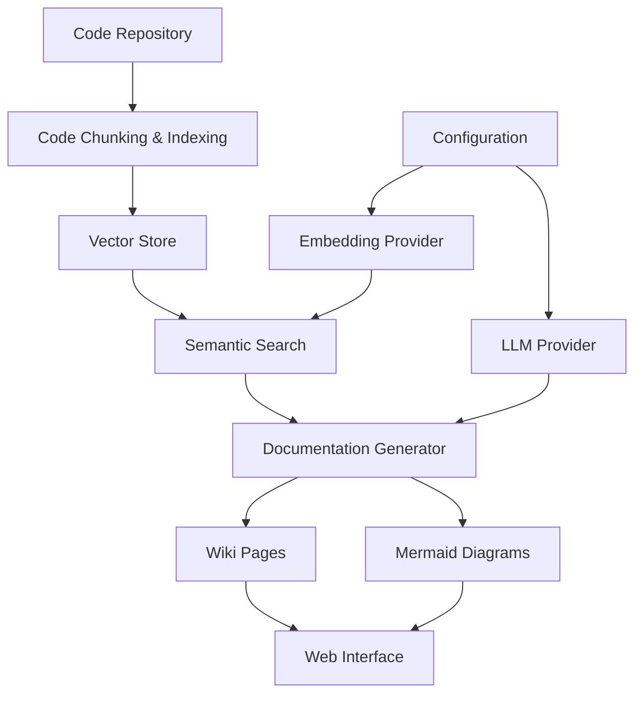
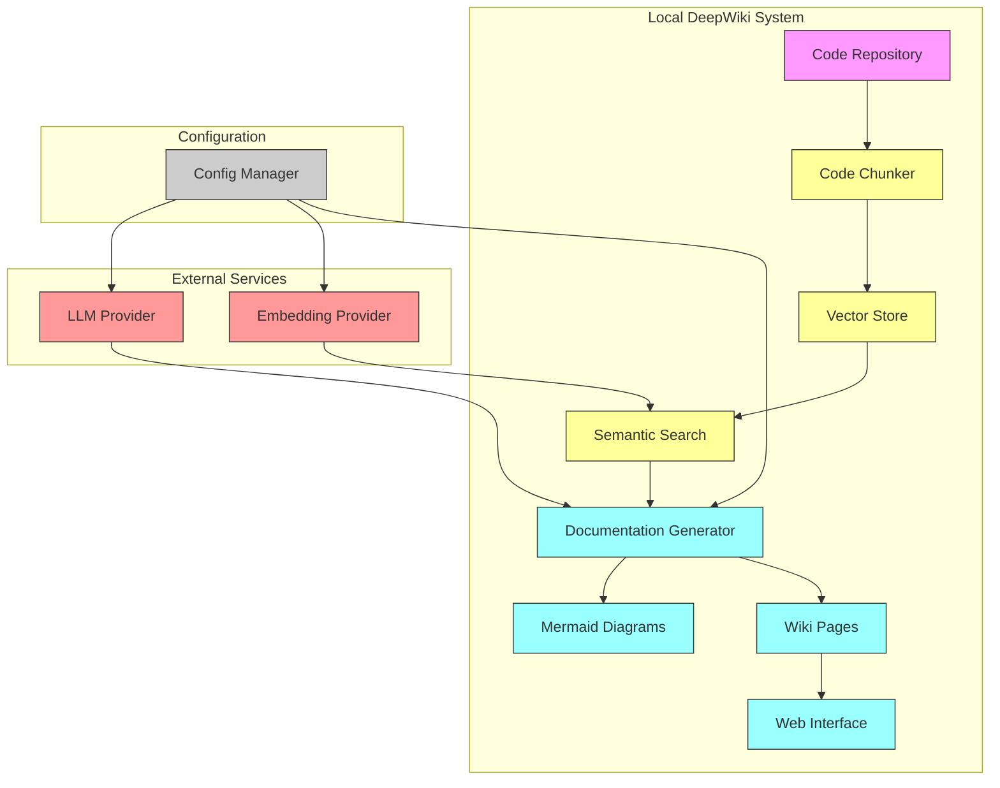

# System Architecture Documentation

## Overview

This document describes the architecture of the Local DeepWiki system, a documentation generation tool that leverages code analysis, vector search, and LLMs to create structured documentation including architecture diagrams and module overviews.

## Key Components and Responsibilities

### 1. Configuration Management (`src/local_deepwiki/config.py`)
- **Responsibility**: Centralized configuration management for all system components
- **Details**:
  - Manages LLM and embedding provider configurations
  - Supports multiple providers (Ollama, Anthropic, OpenAI)
  - Provides type-safe configuration models using Pydantic
  - Handles configuration loading and persistence

### 2. Data Models (`src/local_deepwiki/models.py`)
- **Responsibility**: Define data structures used throughout the system
- **Details**:
  - `CodeChunk`: Represents code segments with file path and content
  - `IndexStatus`: Tracks indexing progress and status
  - `WikiPage`: Represents generated documentation pages
  - `SearchResult`: Encapsulates search results from vector store

### 3. Providers (`src/local_deepwiki/providers/`)
- **Responsibility**: Abstract interfaces for external services
- **Details**:
  - `EmbeddingProvider`: Handles vector embeddings for semantic search
  - `LLMProvider`: Interfaces with large language models for generation
  - Specific implementations:
    - `OllamaProvider`: Connects to local Ollama LLMs
    - `AnthropicProvider`: Connects to Anthropic models
    - `OpenAIProvider`: Connects to OpenAI models

### 4. Vector Store (`src/local_deepwiki/vector_store/`)
- **Responsibility**: Semantic search and retrieval of code chunks
- **Details**:
  - Stores code chunks with vector embeddings
  - Enables semantic search for documentation generation
  - Supports efficient retrieval of relevant code for diagrams

### 5. Documentation Generators (`src/local_deepwiki/generators/`)
- **Responsibility**: Generate various types of documentation and diagrams
- **Details**:
  - `diagrams.py`: Generates Mermaid diagrams (architecture, class, dependency, file tree)
  - `wiki.py`: Generates wiki pages including architecture overviews and module indexes

### 6. Web Interface (`src/local_deepwiki/web/`)
- **Responsibility**: Web-based UI for documentation viewing
- **Details**:
  - Empty placeholder for future web interface implementation

## Data Flow

## Architecture Diagram

## Design Patterns Used

### 1. Strategy Pattern
- **Usage**: Multiple LLM and embedding provider implementations
- **Benefit**: Enables easy switching between different providers without changing core logic

### 2. Factory Pattern
- **Usage**: `get_llm_provider()` and `get_embedding_provider()` functions
- **Benefit**: Centralized creation logic for provider instances

### 3. Abstract Base Classes
- **Usage**: `LLMProvider` and `EmbeddingProvider` base classes
- **Benefit**: Ensures consistent interfaces across different implementations

### 4. Configuration-Driven Design
- **Usage**: All components configured via `Config` models
- **Benefit**: Flexible system that can be easily adapted to different environments

### 5. Asynchronous Programming
- **Usage**: All I/O operations use async/await
- **Benefit**: Efficient handling of network requests and database operations

### 6. Dependency Injection
- **Usage**: Providers are injected into generators and other components
- **Benefit**: Loose coupling and easier testing

## Integration Points

### External Services
- **LLM Services**: Ollama, Anthropic, OpenAI
- **Embedding Services**: Local (sentence-transformers), OpenAI

### Data Sources
- **Code Repository**: Source of code chunks for analysis
- **Vector Store**: Persistent storage for code embeddings

### Output Targets
- **Wiki Pages**: Structured documentation in Markdown
- **Mermaid Diagrams**: Visual representations of architecture and relationships
- **Web Interface**: User-facing documentation viewer

This architecture supports scalable documentation generation while maintaining flexibility for different LLM and embedding provider configurations.