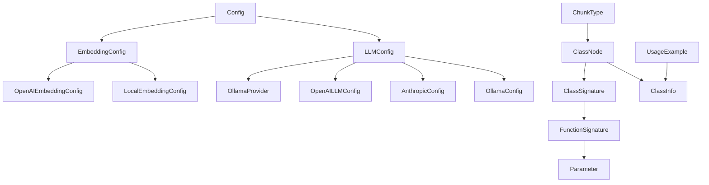
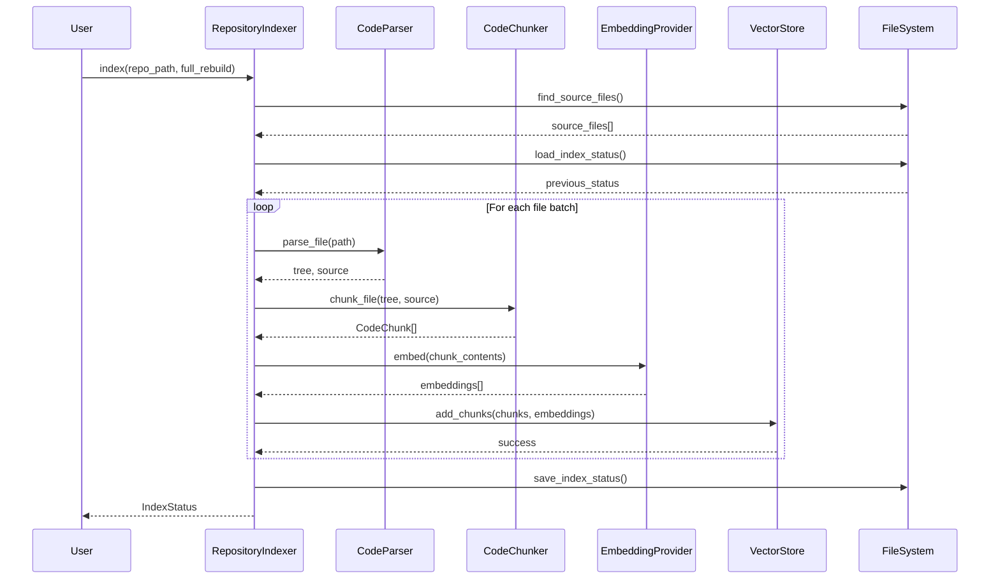

# Architecture Documentation

## System Overview

Local DeepWiki is a documentation generation system that processes codebases to create comprehensive wiki-style documentation. The system uses multiple LLM providers (Ollama, Anthropic, OpenAI) and embedding models to analyze code and generate intelligent documentation with features like inheritance diagrams, cross-linking, and module documentation.

## Key Components

### Configuration Management
The **[Config](files/src/local_deepwiki/config.md)** class serves as the central configuration hub, managing settings for LLM providers, embedding models, and system behavior. The **[LLMConfig](files/src/local_deepwiki/config.md)** class specifically handles LLM provider selection with support for Ollama, Anthropic, and OpenAI through dedicated configuration classes (**[OllamaConfig](files/src/local_deepwiki/config.md)**, **[AnthropicConfig](files/src/local_deepwiki/config.md)**, **[OpenAILLMConfig](files/src/local_deepwiki/config.md)**). The **[EmbeddingConfig](files/src/local_deepwiki/config.md)** class manages embedding provider settings with **[LocalEmbeddingConfig](files/src/local_deepwiki/config.md)** and **[OpenAIEmbeddingConfig](files/src/local_deepwiki/config.md)** for different embedding backends.

### LLM Provider System
The **[OllamaProvider](files/src/local_deepwiki/providers/llm/ollama.md)** implements LLM functionality for local Ollama models, providing methods for health checking, text generation, and streaming responses. The system uses a factory pattern through the `get_llm_provider` function to instantiate the appropriate provider based on configuration.

### Code Analysis and Documentation
The **[ClassNode](files/src/local_deepwiki/generators/inheritance.md)** represents classes in the codebase with information about inheritance relationships, file locations, and documentation. This component supports inheritance tree analysis and diagram generation for understanding code structure.

### Chunking and Parsing
The **[ChunkType](files/src/local_deepwiki/models.md)** enumeration defines different types of code chunks for processing. The system includes comprehensive parsing capabilities that handle multiple programming languages including Python, TypeScript, Java, Swift, C++, Ruby, PHP, Kotlin, and C#, as evidenced by the inheritance testing across these languages.

## Data Flow

1. **Configuration Loading**: The system loads configuration through the [Config](files/src/local_deepwiki/config.md) class, determining which LLM and embedding providers to use
2. **Code Parsing**: Source code files are parsed and analyzed to extract class information, creating [ClassNode](files/src/local_deepwiki/generators/inheritance.md) instances with inheritance relationships
3. **Provider Instantiation**: Based on configuration, appropriate LLM and embedding providers are created through factory functions
4. **Documentation Generation**: The system processes code chunks and generates documentation using the configured LLM providers
5. **Output Generation**: Results are exported to various formats including HTML and markdown

## Component Diagram

## Key Design Decisions

### Provider Abstraction Pattern
The system implements a provider pattern for both LLM and embedding services, allowing easy switching between different backends (Ollama, Anthropic, OpenAI) without changing core logic. This is evident in the factory functions and configuration structure.

### Configuration-Driven Architecture
All major system behavior is controlled through Pydantic-based configuration classes, providing type safety and validation. The configuration system supports context management and thread-safe operations.

### Multi-Language Code Analysis
The architecture supports parsing multiple programming languages through a unified interface, as demonstrated by the comprehensive test coverage for inheritance detection across Python, TypeScript, Java, Swift, C++, Ruby, PHP, Kotlin, and C#.

### Modular Testing Strategy
The system employs extensive test coverage with dedicated test classes for each component, ensuring reliability across different scenarios including edge cases for file processing, provider instantiation, and code analysis.

### Chunked Processing Model
Code is processed in chunks (defined by [ChunkType](files/src/local_deepwiki/models.md)) allowing for efficient handling of large codebases and enabling targeted analysis of specific code sections.

## Workflow Sequences

The following diagrams show how data flows through key operations:

### Indexing Pipeline

### Wiki Generation Pipeline

```mermaid
sequenceDiagram
    participant U as User
    participant W as WikiGenerator
    participant V as VectorStore
    participant L as LLMProvider
    participant F as FileSystem

    U->>W: generate_wiki(index_status)

    rect rgb(40, 40, 60)
        note right of W: Generate Overview
        W->>V: search("main entry point")
        V-->>W: context_chunks
        W->>L: generate(overview_prompt)
        L-->>W: overview_markdown
        W->>F: write(index.md)
    end

    rect rgb(40, 40, 60)
        note right of W: Generate Architecture
        par Parallel searches
            W->>V: search("core components")
            W->>V: search("patterns")
            W->>V: search("data flow")
        end
        V-->>W: combined_context
        W->>L: generate(architecture_prompt)
        L-->>W: architecture_markdown
        W->>F: write(architecture.md)
    end

    rect rgb(40, 40, 60)
        note right of W: Generate Module Docs
        loop For each module
            W->>V: search(module_query)
            V-->>W: module_chunks
            W->>L: generate(module_prompt)
            L-->>W: module_markdown
            W->>F: write(modules/{name}.md)
        end
    end

    W->>W: add_cross_links()
    W->>W: add_see_also_sections()
    W->>F: write(search.json, toc.json)
    W-->>U: WikiStructure
```

### Deep Research Pipeline

```mermaid
sequenceDiagram
    participant U as User
    participant D as DeepResearchPipeline
    participant L as LLMProvider
    participant V as VectorStore

    U->>D: research(question)

    rect rgb(50, 40, 40)
        note right of D: Step 1: Decomposition
        D->>L: decompose_question(question)
        L-->>D: SubQuestion[]
    end

    rect rgb(40, 50, 40)
        note right of D: Step 2: Parallel Retrieval
        par For each sub-question
            D->>V: search(sub_q1)
            D->>V: search(sub_q2)
            D->>V: search(sub_q3)
        end
        V-->>D: SearchResult[][]
    end

    rect rgb(40, 40, 50)
        note right of D: Step 3: Gap Analysis
        D->>L: analyze_gaps(context)
        L-->>D: follow_up_queries[]
    end

    rect rgb(50, 50, 40)
        note right of D: Step 4: Follow-up Retrieval
        par For each follow-up
            D->>V: search(follow_up)
        end
        V-->>D: additional_results[]
    end

    rect rgb(50, 40, 50)
        note right of D: Step 5: Synthesis
        D->>L: synthesize(all_context)
        L-->>D: comprehensive_answer
    end

    D-->>U: DeepResearchResult
```

## Relevant Source Files

The following source files were used to generate this documentation:

- `tests/test_provider_factories.py:21-99`
- `tests/test_parser.py:24-123`
- `tests/test_retry.py:8-144`
- `tests/test_ollama_health.py:16-19`
- `tests/test_server_handlers.py:15-75`
- `tests/test_chunker.py:13-428`
- `tests/test_changelog.py:18-96`
- `tests/test_coverage.py:13-50`
- `tests/test_vectorstore.py:9-28`
- `tests/test_wiki_coverage.py:50-120`

*Showing 10 of 98 source files.*
