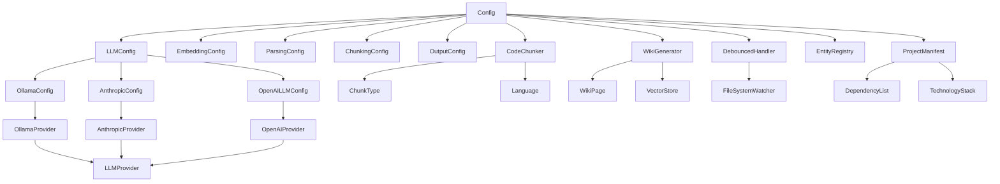

# System Architecture Documentation

## System Overview

The system is a local documentation generator that creates architecture documentation, API documentation, and cross-links between code components. It uses LLMs for content generation and vector stores for semantic search and retrieval. The system supports multiple LLM providers (Ollama, Anthropic, OpenAI) and can be configured through a YAML configuration file.

## Key Components

### Config
The [Config](files/src/local_deepwiki/config.md) class manages the overall system configuration, including embedding settings, LLM provider configurations, parsing settings, chunking configurations, and output options. It supports loading configuration from files or using defaults.

### LLMConfig
The [LLMConfig](files/src/local_deepwiki/config.md) class defines the configuration for LLM providers, supporting Ollama, Anthropic, and OpenAI providers with their respective model configurations.

### OllamaConfig
The [OllamaConfig](files/src/local_deepwiki/config.md) class holds configuration specific to the Ollama LLM provider, including the model name and base URL for the Ollama API.

### AnthropicConfig
The [AnthropicConfig](files/src/local_deepwiki/config.md) class holds configuration specific to the Anthropic LLM provider, including the model name.

### OpenAILLMConfig
The [OpenAILLMConfig](files/src/local_deepwiki/config.md) class holds configuration specific to the OpenAI LLM provider, including the model name.

### EmbeddingConfig
The [EmbeddingConfig](files/src/local_deepwiki/config.md) class manages embedding provider configuration, supporting both local and OpenAI embedding providers.

### ProjectManifest
The [ProjectManifest](files/src/local_deepwiki/generators/manifest.md) class collects and summarizes project information including technology stack, dependencies, and entry points.

### ChunkType
The ChunkType class defines the types of code chunks that can be processed, including functions, classes, methods, modules, imports, comments, and other code elements.

### Language
The Language class enumerates the supported programming languages for code processing.

### WikiGenerator
The [WikiGenerator](files/src/local_deepwiki/generators/wiki.md) class is responsible for generating documentation pages, including architecture documentation with diagrams and grounded facts.

### CodeChunker
The [CodeChunker](files/src/local_deepwiki/core/chunker.md) class handles breaking down code into semantic chunks for processing and indexing.

### DebouncedHandler
The [DebouncedHandler](files/src/local_deepwiki/watcher.md) class manages file system changes with debouncing to batch multiple changes before triggering reindexing operations.

### EntityRegistry
The [EntityRegistry](files/src/local_deepwiki/generators/crosslinks.md) class maintains a registry of code entities for cross-linking and semantic understanding.

### TestAPIDocExtractor
The [TestAPIDocExtractor](files/tests/test_api_docs.md) class is used for testing API documentation extraction functionality.

### TestExtractClassAttributes
The [TestExtractClassAttributes](files/tests/test_diagrams.md) class is used for testing class attribute extraction.

### TestExtractClassSignature
The [TestExtractClassSignature](files/tests/test_api_docs.md) class is used for testing class signature extraction.

### TestGenerateClassDiagram
The [TestGenerateClassDiagram](files/tests/test_diagrams.md) class is used for testing class diagram generation.

### TestNodeHelpers
The TestNodeHelpers class is used for testing node helper functionality.

### TestPathToModule
The [TestPathToModule](files/tests/test_diagrams.md) class is used for testing path to module conversion functionality.

### TestClassInfo
The [TestClassInfo](files/tests/test_diagrams.md) class is used for testing class information handling.

## Data Flow

1. The system starts by loading configuration from a file or using defaults through the [Config](files/src/local_deepwiki/config.md) class
2. Code is processed through the [CodeChunker](files/src/local_deepwiki/core/chunker.md) to break it into semantic chunks
3. These chunks are indexed into a vector store for semantic search
4. When generating documentation, the [WikiGenerator](files/src/local_deepwiki/generators/wiki.md) class searches the vector store for relevant context
5. The system uses the configured LLM provider (via get_llm_provider function) to generate content
6. File system changes are handled by the [DebouncedHandler](files/src/local_deepwiki/watcher.md) which batches changes and triggers reindexing
7. Project manifest information is gathered through the [ProjectManifest](files/src/local_deepwiki/generators/manifest.md) class to provide technology stack summaries

## Component Diagram

## Key Design Decisions

1. **Modular Configuration**: The system uses a modular configuration approach where each major component has its own configuration class, allowing for easy extension and modification.

2. **Provider Pattern**: The system implements a provider pattern for both LLM and embedding services, allowing support for multiple providers through a common interface.

3. **Debounced File Handling**: The [DebouncedHandler](files/src/local_deepwiki/watcher.md) uses a timer-based approach to batch file system changes, preventing excessive reindexing operations during rapid file modifications.

4. **Semantic Search Integration**: The system integrates vector stores for semantic search and retrieval, enabling more intelligent documentation generation based on code relationships.

5. **Test-Driven Development**: The system includes comprehensive test classes for each major functionality, ensuring reliability and maintainability.

6. **Extensible Architecture**: The system is designed to be extensible, with clear separation of concerns and dependency injection patterns that allow for easy addition of new providers or components.

## Relevant Source Files

The following source files were used to generate this documentation:

- `tests/test_parser.py:12-111`
- `tests/test_chunker.py:11-182`
- `tests/test_search.py:20-53`
- `tests/test_toc.py:16-44`
- [`tests/test_incremental_wiki.py:20-47`](files/tests/test_incremental_wiki.md)
- `tests/test_web.py:39-103`
- `tests/__init__.py`
- `tests/test_manifest.py:14-56`
- [`tests/test_api_docs.py:31-53`](files/tests/test_api_docs.md)
- `tests/test_see_also.py:16-177`

*Showing 10 of 52 source files.*
