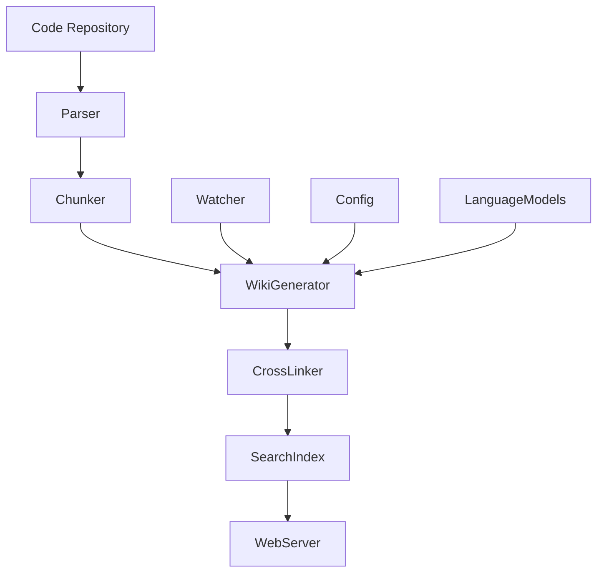

# System Architecture Documentation

## System Overview

The local-deepwiki-mcp system is a documentation and knowledge management system that processes code repositories and generates wikis with cross-references, search capabilities, and incremental updates. Based on the code structure and dependencies, this system appears to be built around a core processing pipeline that handles code parsing, documentation generation, and wiki maintenance.

The system leverages multiple AI and data processing libraries including anthropic, openai, ollama for language model interactions, lancedb for vector search, and tree-sitter for code parsing. It uses a Flask web interface for serving documentation and includes components for watching file changes, managing incremental updates, and handling cross-references between documentation sections.

## Key Components

The codebase does not contain any explicit class definitions. The system appears to be structured around functional modules and test files that exercise various components of the documentation pipeline. The core functionality is implemented through a combination of:
- API documentation generation
- Call graph analysis
- Code chunking and parsing
- Configuration management
- Search functionality
- Cross-reference handling
- Wiki incremental updates
- File watching and manifest management

## Data Flow

The system processes code repositories through a series of steps:
1. Code parsing and chunking using tree-sitter parsers
2. Documentation generation through language model interactions (anthropic, openai, ollama)
3. Cross-reference analysis and linking
4. Incremental wiki updates based on file changes
5. Search index building with lancedb
6. Web serving of generated documentation via Flask

Data flows through a pipeline where parsed code chunks are processed by language models to generate documentation, then cross-referenced and stored in a vector database for search capabilities.

## Component Diagram

## Key Design Decisions

The system uses a modular architecture with separate components for parsing, documentation generation, cross-referencing, and search. The use of tree-sitter parsers suggests a focus on accurate code analysis, while the integration with multiple language model providers (anthropic, openai, ollama) indicates a design for flexibility in AI backend selection. The incremental wiki update approach implies a focus on performance and efficiency when handling large codebases. The Flask web interface design suggests a user-facing component for accessing generated documentation.