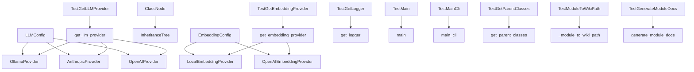
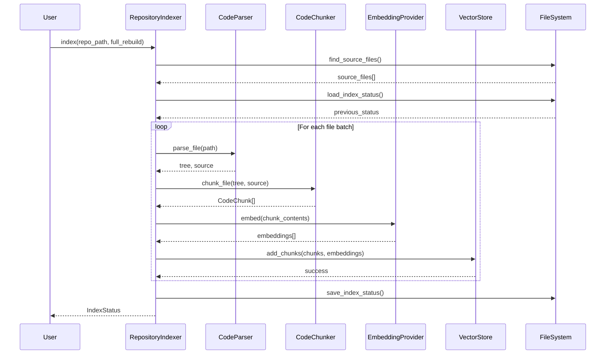

# System Overview

The system is a documentation generation tool that processes code repositories to create wikis and diagrams. It supports multiple LLM providers (Ollama, Anthropic, OpenAI) and embedding providers (local, OpenAI). The system parses code files to extract class information, inheritance relationships, and function signatures. It generates documentation in markdown format and supports features like incremental updates, caching, and cross-referencing.

# Key Components

## LLMConfig
The [LLMConfig](files/src/local_deepwiki/config.md) class holds configuration for LLM providers including Ollama, Anthropic, and OpenAI. It manages provider selection and specific configurations for each provider type.

## ClassNode
The [ClassNode](files/src/local_deepwiki/generators/inheritance.md) class represents a class in the inheritance tree. It stores class metadata including name, file path, parent classes, child classes, abstract status, and docstring.

## OllamaProvider
The [OllamaProvider](files/src/local_deepwiki/providers/llm/ollama.md) class implements the [LLMProvider](files/src/local_deepwiki/providers/base.md) interface for Ollama-based LLMs. It handles health checks, generation, and streaming responses from Ollama models.

## AnthropicProvider
The [AnthropicProvider](files/src/local_deepwiki/providers/llm/anthropic.md) class implements the [LLMProvider](files/src/local_deepwiki/providers/base.md) interface for Anthropic-based LLMs. It manages generation and streaming responses from Anthropic models.

## EmbeddingConfig
The [EmbeddingConfig](files/src/local_deepwiki/config.md) class holds configuration for embedding providers including local and OpenAI options. It manages provider selection and specific configurations for each provider type.

## TestGetLogger
The TestGetLogger class contains tests for the [get_logger](files/src/local_deepwiki/logging.md) function, which handles logger creation with proper package prefixing.

## TestMain
The TestMain class contains tests for the [main](files/src/local_deepwiki/export/pdf.md) application functionality, covering path validation, watcher behavior, and initial indexing.

## TestMainCli
The TestMainCli class contains tests for the command-line interface, covering various argument combinations and error handling.

## TestGetParentClasses
The TestGetParentClasses class contains tests for extracting parent classes from code files in multiple languages (Python, TypeScript, Java, etc.).

## TestGetLLMProvider
The TestGetLLMProvider class contains tests for the get_llm_provider factory function, ensuring correct provider instantiation based on configuration.

## TestGetEmbeddingProvider
The TestGetEmbeddingProvider class contains tests for the get_embedding_provider factory function, ensuring correct embedding provider instantiation based on configuration.

## TestModuleToWikiPath
The TestModuleToWikiPath class contains tests for converting module paths to wiki file paths.

## TestGenerateModuleDocs
The TestGenerateModuleDocs class contains tests for module documentation generation, covering caching, filtering, and status management.

# Data Flow

1. The system starts by parsing code files using a parser that identifies class declarations and inheritance relationships
2. Class information is extracted and stored in [ClassNode](files/src/local_deepwiki/generators/inheritance.md) objects
3. The inheritance tree is generated by analyzing parent-child relationships between classes
4. LLM providers are instantiated based on configuration and used to generate documentation content
5. Generated content is processed and saved as markdown files in the wiki structure
6. The system maintains a cache to avoid regenerating unchanged documentation
7. Module documentation is grouped by directory and generated into index files

# Component Diagram

# Key Design Decisions

1. **Factory Pattern for Providers**: The system uses factory functions (get_llm_provider, get_embedding_provider) to instantiate different provider implementations based on configuration, enabling easy extension with new providers.

2. **Configuration-Driven Architecture**: All major system components are configured through Pydantic models ([LLMConfig](files/src/local_deepwiki/config.md), [EmbeddingConfig](files/src/local_deepwiki/config.md)), allowing for flexible and type-safe configuration management.

3. **Separation of Concerns**: The system separates concerns between parsing (code analysis), generation (LLM usage), and storage (wiki file generation), making components reusable and testable.

4. **Incremental Updates**: The system maintains caching and status tracking to avoid regenerating unchanged documentation, improving performance for large codebases.

5. **Multi-[Language](files/src/local_deepwiki/models.md) Support**: The parser and parent class extraction logic support multiple programming languages, making the system applicable to diverse code repositories.

6. **Modular Documentation Generation**: The system generates documentation in a structured wiki format with proper directory organization and index files for easy navigation.

## Workflow Sequences

The following diagrams show how data flows through key operations:

### Indexing Pipeline

### Wiki Generation Pipeline

```mermaid
sequenceDiagram
    participant U as User
    participant W as WikiGenerator
    participant V as VectorStore
    participant L as LLMProvider
    participant F as FileSystem

    U->>W: generate_wiki(index_status)

    rect rgb(40, 40, 60)
        note right of W: Generate Overview
        W->>V: search("main entry point")
        V-->>W: context_chunks
        W->>L: generate(overview_prompt)
        L-->>W: overview_markdown
        W->>F: write(index.md)
    end

    rect rgb(40, 40, 60)
        note right of W: Generate Architecture
        par Parallel searches
            W->>V: search("core components")
            W->>V: search("patterns")
            W->>V: search("data flow")
        end
        V-->>W: combined_context
        W->>L: generate(architecture_prompt)
        L-->>W: architecture_markdown
        W->>F: write(architecture.md)
    end

    rect rgb(40, 40, 60)
        note right of W: Generate Module Docs
        loop For each module
            W->>V: search(module_query)
            V-->>W: module_chunks
            W->>L: generate(module_prompt)
            L-->>W: module_markdown
            W->>F: write(modules/{name}.md)
        end
    end

    W->>W: add_cross_links()
    W->>W: add_see_also_sections()
    W->>F: write(search.json, toc.json)
    W-->>U: WikiStructure
```

### Deep Research Pipeline

```mermaid
sequenceDiagram
    participant U as User
    participant D as DeepResearchPipeline
    participant L as LLMProvider
    participant V as VectorStore

    U->>D: research(question)

    rect rgb(50, 40, 40)
        note right of D: Step 1: Decomposition
        D->>L: decompose_question(question)
        L-->>D: SubQuestion[]
    end

    rect rgb(40, 50, 40)
        note right of D: Step 2: Parallel Retrieval
        par For each sub-question
            D->>V: search(sub_q1)
            D->>V: search(sub_q2)
            D->>V: search(sub_q3)
        end
        V-->>D: SearchResult[][]
    end

    rect rgb(40, 40, 50)
        note right of D: Step 3: Gap Analysis
        D->>L: analyze_gaps(context)
        L-->>D: follow_up_queries[]
    end

    rect rgb(50, 50, 40)
        note right of D: Step 4: Follow-up Retrieval
        par For each follow-up
            D->>V: search(follow_up)
        end
        V-->>D: additional_results[]
    end

    rect rgb(50, 40, 50)
        note right of D: Step 5: Synthesis
        D->>L: synthesize(all_context)
        L-->>D: comprehensive_answer
    end

    D-->>U: DeepResearchResult
```

## Relevant Source Files

The following source files were used to generate this documentation:

- `tests/test_provider_factories.py:21-99`
- `tests/test_parser.py:24-123`
- `tests/test_retry.py:8-144`
- `tests/test_ollama_health.py:16-19`
- `tests/test_server_handlers.py:15-75`
- `tests/test_chunker.py:13-428`
- `tests/test_changelog.py:18-96`
- `tests/test_coverage.py:13-50`
- `tests/test_vectorstore.py:9-28`
- `tests/test_wiki_coverage.py:50-120`

*Showing 10 of 102 source files.*
