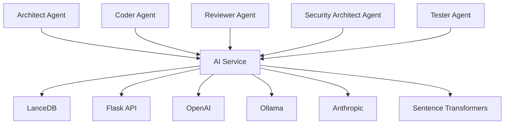
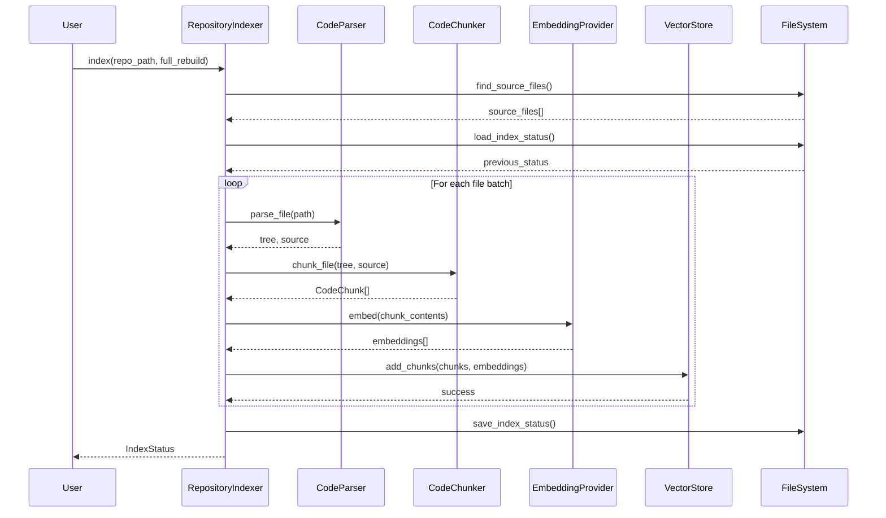
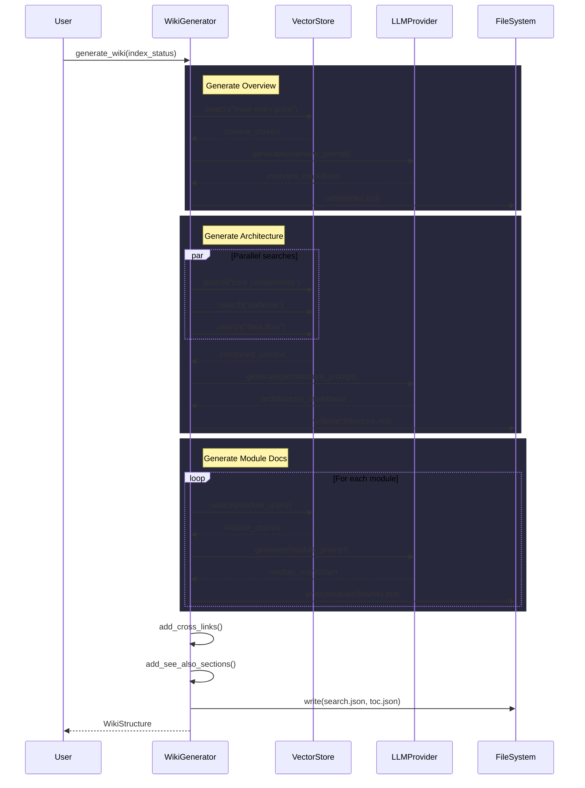
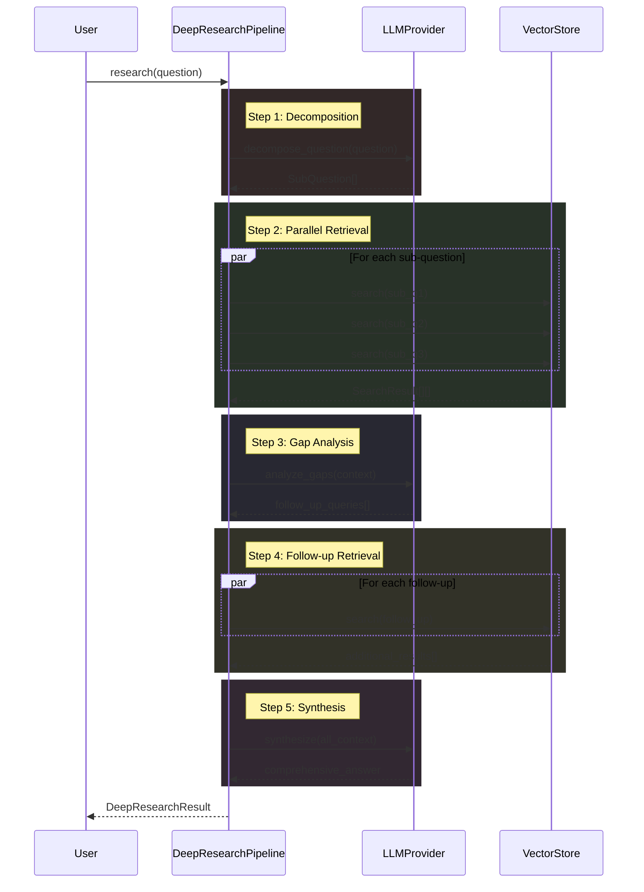

# System Architecture Documentation

## System Overview

The system appears to be a multi-agent architecture designed for software development tasks, likely centered around code generation, review, and testing. Based on the directory structure and agent configuration files, it utilizes various AI models (OpenAI, Ollama, Anthropic) and tools (Flask, LanceDB, etc.) to support a development workflow.

The system includes several specialized agents:
- Architect
- Coder
- Reviewer
- Security Architect
- Tester

These agents are likely orchestrated through the Multi-Client Protocol (MCP) framework, as suggested by the presence of the `mcp` dependency and the agent YAML configurations. The system appears to support embedding-based search and retrieval using tools like `sentence-transformers` and `lancedb`.

## Key Components

The system does not contain any classes in the code provided. Instead, it includes agent configuration files that define roles and capabilities. These configurations are YAML files that likely define how each agent is instantiated and what tasks they perform.

### Agent Configuration Files

The system contains several agent configuration files:
- `architect.yaml`
- `coder.yaml`
- `reviewer.yaml`
- `security-architect.yaml`
- `tester.yaml`

Each file defines an agent with specific responsibilities, likely corresponding to roles in a software development lifecycle.

## Data Flow

The data flow in the system is not directly visible from the provided code, but based on the agent configurations and dependencies, it can be inferred that:

1. Input data (requirements, code snippets, etc.) is processed by the agents
2. Agents interact with external services (OpenAI, Ollama, Anthropic) for AI-driven tasks
3. Data may be stored or retrieved using LanceDB for vector-based search
4. The system likely uses embeddings for semantic search and code understanding
5. The Flask framework may be used for serving the system or managing API endpoints

## Component Diagram

```mermaid
graph TD
    A[Architect Agent] --> B[AI Service]
    C[Coder Agent] --> B
    D[Reviewer Agent] --> B
    E[Security Architect Agent] --> B
    F[Tester Agent] --> B
    B --> G[LanceDB]
    B --> H[Flask API]
    B --> I[OpenAI]
    B --> J[Ollama]
    B --> K[Anthropic]
    B --> L[Sentence Transformers]
```

## Key Design Decisions

1. **Multi-Agent Architecture**: The system uses a multi-agent approach with specialized roles for different aspects of software development (architecture, coding, review, security, testing).

2. **Modular Agent Configuration**: Agents are defined through YAML configuration files, allowing for easy modification and extension of agent capabilities without code changes.

3. **Multi-Model Support**: The system supports multiple AI providers (OpenAI, Ollama, Anthropic) through the MCP framework, providing flexibility in model selection.

4. **Vector Database Integration**: Use of LanceDB suggests a design decision to support semantic search and retrieval of code and documentation.

5. **Embedding-Based Processing**: The inclusion of `sentence-transformers` indicates that the system performs embedding-based processing for understanding and searching code and documentation.

6. **Web Interface**: The presence of Flask suggests that the system provides a web interface for interaction and management.

7. **Code Coverage Tools**: The presence of coverage reports suggests that the system includes testing and code quality measurement capabilities.

The system appears to be designed for a development workflow that integrates AI tools to assist with various aspects of software engineering, from initial design through testing and security review.

## Workflow Sequences

The following diagrams show how data flows through key operations:

### Indexing Pipeline

```mermaid
sequenceDiagram
    participant U as User
    participant I as RepositoryIndexer
    participant P as CodeParser
    participant C as CodeChunker
    participant E as EmbeddingProvider
    participant V as VectorStore
    participant F as FileSystem

    U->>I: index(repo_path, full_rebuild)
    I->>F: find_source_files()
    F-->>I: source_files[]
    I->>F: load_index_status()
    F-->>I: previous_status

    loop For each file batch
        I->>P: parse_file(path)
        P-->>I: tree, source
        I->>C: chunk_file(tree, source)
        C-->>I: CodeChunk[]
        I->>E: embed(chunk_contents)
        E-->>I: embeddings[]
        I->>V: add_chunks(chunks, embeddings)
        V-->>I: success
    end

    I->>F: save_index_status()
    I-->>U: IndexStatus
```

### Wiki Generation Pipeline

```mermaid
sequenceDiagram
    participant U as User
    participant W as WikiGenerator
    participant V as VectorStore
    participant L as LLMProvider
    participant F as FileSystem

    U->>W: generate_wiki(index_status)

    rect rgb(40, 40, 60)
        note right of W: Generate Overview
        W->>V: search("main entry point")
        V-->>W: context_chunks
        W->>L: generate(overview_prompt)
        L-->>W: overview_markdown
        W->>F: write(index.md)
    end

    rect rgb(40, 40, 60)
        note right of W: Generate Architecture
        par Parallel searches
            W->>V: search("core components")
            W->>V: search("patterns")
            W->>V: search("data flow")
        end
        V-->>W: combined_context
        W->>L: generate(architecture_prompt)
        L-->>W: architecture_markdown
        W->>F: write(architecture.md)
    end

    rect rgb(40, 40, 60)
        note right of W: Generate Module Docs
        loop For each module
            W->>V: search(module_query)
            V-->>W: module_chunks
            W->>L: generate(module_prompt)
            L-->>W: module_markdown
            W->>F: write(modules/{name}.md)
        end
    end

    W->>W: add_cross_links()
    W->>W: add_see_also_sections()
    W->>F: write(search.json, toc.json)
    W-->>U: WikiStructure
```

### Deep Research Pipeline

```mermaid
sequenceDiagram
    participant U as User
    participant D as DeepResearchPipeline
    participant L as LLMProvider
    participant V as VectorStore

    U->>D: research(question)

    rect rgb(50, 40, 40)
        note right of D: Step 1: Decomposition
        D->>L: decompose_question(question)
        L-->>D: SubQuestion[]
    end

    rect rgb(40, 50, 40)
        note right of D: Step 2: Parallel Retrieval
        par For each sub-question
            D->>V: search(sub_q1)
            D->>V: search(sub_q2)
            D->>V: search(sub_q3)
        end
        V-->>D: SearchResult[][]
    end

    rect rgb(40, 40, 50)
        note right of D: Step 3: Gap Analysis
        D->>L: analyze_gaps(context)
        L-->>D: follow_up_queries[]
    end

    rect rgb(50, 50, 40)
        note right of D: Step 4: Follow-up Retrieval
        par For each follow-up
            D->>V: search(follow_up)
        end
        V-->>D: additional_results[]
    end

    rect rgb(50, 40, 50)
        note right of D: Step 5: Synthesis
        D->>L: synthesize(all_context)
        L-->>D: comprehensive_answer
    end

    D-->>U: DeepResearchResult
```

## Module Dependencies

For a detailed view of module interdependencies including circular dependency detection, see the [Dependency Graph](dependency-graph.md) page.

## Relevant Source Files

The following source files were used to generate this documentation:

- [`src/local_deepwiki/models.py:11-26`](files/src/local_deepwiki/models.md)
- `tests/test_manifest.py:19-61`
- [`src/local_deepwiki/server.py:47-558`](files/src/local_deepwiki/server.md)
- [`src/local_deepwiki/generators/diagrams.py:12-21`](files/src/local_deepwiki/generators/diagrams.md)
- [`src/local_deepwiki/handlers.py:695-715`](files/src/local_deepwiki/handlers.md)
- `coverage_html/coverage_html_cb_dd2e7eb5.js:11-19`
- `tests/test_provider_factories.py:21-99`
- `tests/test_streaming_export.py:48-71`
- `tests/test_parser.py:28-127`
- `tests/test_fuzzy_search.py:16-48`

*Showing 10 of 166 source files.*
