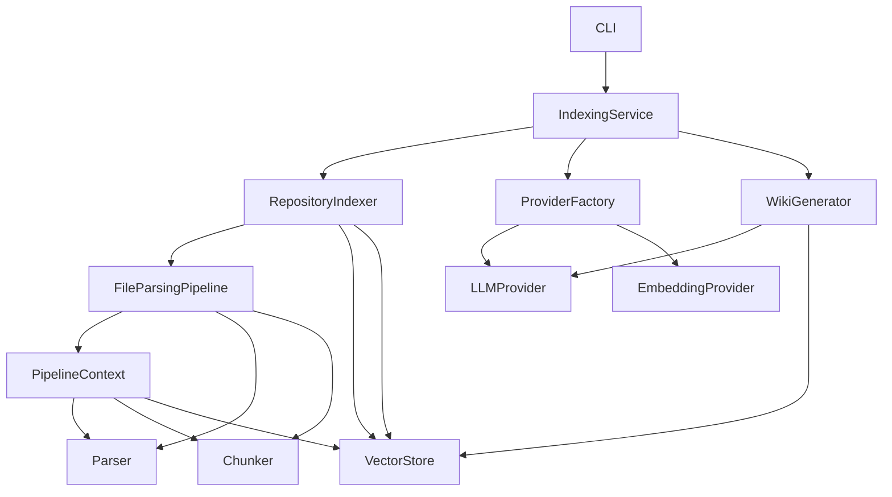

# Architecture Documentation

## 1. System Overview

The local-deepwiki system solves the problem of generating intelligent, structured documentation for software repositories by combining code analysis, semantic chunking, and LLM-powered summarization. The high-level approach involves parsing source code files, splitting them into semantically meaningful chunks using AST-aware techniques, embedding these chunks for vector search, and then generating wiki pages that organize this information into a coherent knowledge base.

The system is built around an indexing pipeline that orchestrates the flow of data from raw source files through to generated documentation. It supports multiple LLM and embedding providers through an abstraction layer, enabling flexibility in deployment environments. The architecture is designed for both local execution and integration with MCP (Model Control Protocol) servers, allowing for both standalone usage and integration into larger AI workflows.

## 2. Key Components

**[RepositoryIndexer](files/src/local_deepwiki/core/indexer.md)**
- Parses and indexes source code files in a repository, handling chunking, embedding, and storage.
- Separates the core indexing logic from service orchestration, making it reusable and testable.
- Depends on [FileParsingPipeline](files/src/local_deepwiki/core/parsing_pipeline.md), Parser, Chunker, and [VectorStore](files/src/local_deepwiki/core/vectorstore/store.md). Depends on by [IndexingService](files/src/local_deepwiki/services/indexing_service.md).

**[FileParsingPipeline](files/src/local_deepwiki/core/parsing_pipeline.md)**
- Manages the parallel parsing and chunking of files using configured parser and chunker.
- Enables concurrent processing of files while maintaining proper state management.
- Depends on [PipelineContext](files/src/local_deepwiki/core/parsing_pipeline.md), Parser, and Chunker. Depends on by [RepositoryIndexer](files/src/local_deepwiki/core/indexer.md).

**[PipelineContext](files/src/local_deepwiki/core/parsing_pipeline.md)**
- Encapsulates shared configuration and dependencies for parsing pipelines.
- Provides a consistent interface for pipeline components to access common resources.
- Depends on Parser, Chunker, and [VectorStore](files/src/local_deepwiki/core/vectorstore/store.md). Used by [FileParsingPipeline](files/src/local_deepwiki/core/parsing_pipeline.md).

**[IndexingService](files/src/local_deepwiki/services/indexing_service.md)**
- Orchestrates the full indexing pipeline, coordinating parsing, chunking, embedding, and wiki generation.
- Acts as the central coordinator that manages the flow from user request to final output.
- Depends on [RepositoryIndexer](files/src/local_deepwiki/core/indexer.md), [WikiGenerator](files/src/local_deepwiki/generators/wiki/generator.md), and [ProviderFactory](files/src/local_deepwiki/services/provider_factory.md). Depends on by CLI handlers and MCP server.

**[ProviderFactory](files/src/local_deepwiki/services/provider_factory.md)**
- Creates and manages LLM and embedding provider instances based on configuration.
- Enables flexible provider selection and caching while maintaining a consistent interface.
- Depends on [Config](files/src/local_deepwiki/config/models.md), [LLMConfig](files/src/local_deepwiki/config/provider_models.md), [EmbeddingConfig](files/src/local_deepwiki/config/provider_models.md), and provider modules. Depends on by [IndexingService](files/src/local_deepwiki/services/indexing_service.md).

**[WikiGenerator](files/src/local_deepwiki/generators/wiki/generator.md)**
- Generates structured wiki documentation from indexed code chunks and LLM responses.
- Separates the generation logic from the indexing pipeline, allowing for different generation modes.
- Depends on [LLMProvider](files/src/local_deepwiki/providers/base.md), [VectorStore](files/src/local_deepwiki/core/vectorstore/store.md), and other indexing components. Depends on by [IndexingService](files/src/local_deepwiki/services/indexing_service.md).

**[ProviderConnectionError](files/src/local_deepwiki/providers/errors.md), [ProviderError](files/src/local_deepwiki/providers/errors.md), [ProviderModelNotFoundError](files/src/local_deepwiki/providers/errors.md)**
- Exception classes that define the error handling contract for provider interactions.
- Provide specific error types to enable targeted error handling in provider abstraction layers.
- Used by [LLMProvider](files/src/local_deepwiki/providers/base.md) and [EmbeddingProvider](files/src/local_deepwiki/providers/base.md) implementations.

## 3. Data Flow

When a user indexes a repository, the data flows through the following sequence:

1. A user invokes the CLI with a repository path and indexing options
2. The CLI dispatcher calls [IndexingService](files/src/local_deepwiki/services/indexing_service.md).run_pipeline with an [IndexPipelineRequest](files/src/local_deepwiki/services/indexing_service.md)
3. [IndexingService](files/src/local_deepwiki/services/indexing_service.md) creates a [RepositoryIndexer](files/src/local_deepwiki/core/indexer.md) with the specified configuration
4. [RepositoryIndexer](files/src/local_deepwiki/core/indexer.md) calls its index method, which internally calls _parse_files_parallel
5. _parse_files_parallel creates a [FileParsingPipeline](files/src/local_deepwiki/core/parsing_pipeline.md) via _create_parsing_pipeline
6. [FileParsingPipeline](files/src/local_deepwiki/core/parsing_pipeline.md) processes files in parallel using _process_window
7. Each file is parsed and chunked by the [PipelineContext](files/src/local_deepwiki/core/parsing_pipeline.md)'s parser and chunker
8. Chunks are embedded using the configured embedding provider from [ProviderFactory](files/src/local_deepwiki/services/provider_factory.md)
9. The embedded chunks are stored in the vector store
10. [IndexingService](files/src/local_deepwiki/services/indexing_service.md) calls _generate_wiki to create wiki pages using the LLM provider
11. The [WikiGenerator](files/src/local_deepwiki/generators/wiki/generator.md) processes the indexed data and generates structured documentation
12. The final [IndexPipelineResult](files/src/local_deepwiki/services/models.md) is returned with statistics about the operation

## 4. Component Diagram

```mermaid
graph TD
    A[CLI] --> B[IndexingService]
    B --> C[RepositoryIndexer]
    B --> D[ProviderFactory]
    B --> E[WikiGenerator]
    C --> F[FileParsingPipeline]
    C --> G[VectorStore]
    F --> H[PipelineContext]
    F --> I[Parser]
    F --> J[Chunker]
    D --> K[LLMProvider]
    D --> L[EmbeddingProvider]
    H --> I
    H --> J
    H --> G
    E --> K
    E --> G
    C --> G
```

## 5. Design Decisions and Trade-offs

**Async throughout**
- Chosen: All core operations use asyncio
- Why: LLM calls and embedding operations are I/O-bound and benefit from concurrent execution
- Trade-off: Requires all callers to be async-aware, increasing complexity in synchronous contexts

**Frozen pydantic models**
- Chosen: Configuration objects are immutable pydantic models
- Why: Ensures configuration integrity and provides automatic validation
- Trade-off: Requires careful handling when configuration needs to be modified during runtime

**AST-aware chunking**
- Chosen: Code splits at function/class boundaries via tree-sitter
- Why: Provides semantically meaningful chunks that align with code structure
- Trade-off: Requires language-specific parsing libraries and increases processing complexity

**[Config](files/src/local_deepwiki/config/models.md) hierarchy**
- Chosen: CLI args > env vars > config file > defaults
- Why: Provides flexible configuration management while maintaining clear precedence
- Trade-off: Adds complexity to configuration resolution logic

**Provider abstraction**
- Chosen: LLM and embedding providers implement base classes in providers/base.py
- Why: Enables switching between different LLM services without changing core logic
- Trade-off: Requires maintaining provider implementations for each supported service

**Modular pipeline design**
- Chosen: Separate [RepositoryIndexer](files/src/local_deepwiki/core/indexer.md), [FileParsingPipeline](files/src/local_deepwiki/core/parsing_pipeline.md), and [PipelineContext](files/src/local_deepwiki/core/parsing_pipeline.md) components
- Why: Enables clear separation of concerns and facilitates testing
- Trade-off: Adds indirection that can make debugging more complex

## Module Dependencies

For a detailed view of module interdependencies including circular dependency detection, see the [Dependency Graph](dependency-graph.md) page.

## Relevant Source Files

The following source files were used to generate this documentation:

- [`src/local_deepwiki/server.py:98-100`](files/src/local_deepwiki/server.md)
- `src/local_deepwiki/models/__init__.py`
- [`src/local_deepwiki/tool_defs/analysis.py`](files/src/local_deepwiki/tool_defs/analysis.md)
- [`src/local_deepwiki/generators/analysis/duplication.py:26-37`](files/src/local_deepwiki/generators/analysis/duplication.md)
- [`src/local_deepwiki/generators/analysis/architecture_health.py:55-123`](files/src/local_deepwiki/generators/analysis/architecture_health.md)
- [`src/local_deepwiki/generators/analysis/maintainability.py:69-79`](files/src/local_deepwiki/generators/analysis/maintainability.md)
- [`src/local_deepwiki/models/tool_args.py:15-49`](files/src/local_deepwiki/models/tool_args.md)
- [`src/local_deepwiki/generators/analysis/cohesion.py:40-60`](files/src/local_deepwiki/generators/analysis/cohesion.md)
- [`src/local_deepwiki/generators/analysis/health_scoring.py:34-39`](files/src/local_deepwiki/generators/analysis/health_scoring.md)
- [`src/local_deepwiki/generators/analysis/churn.py:25-38`](files/src/local_deepwiki/generators/analysis/churn.md)

*Showing 10 of 268 source files.*
