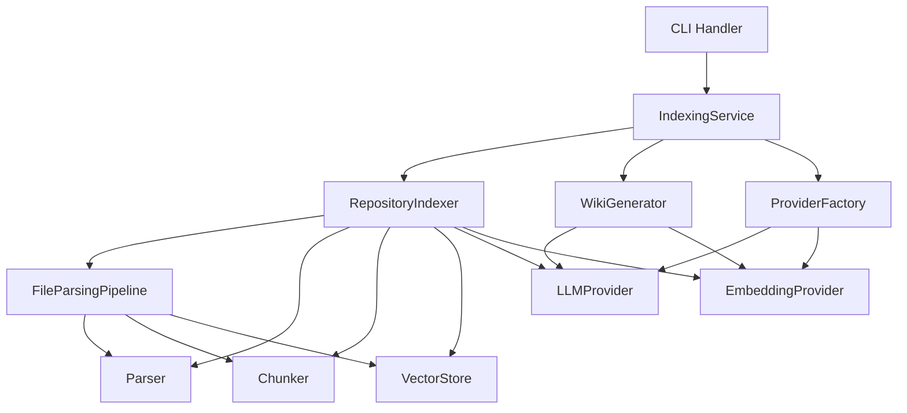

# Architecture Documentation

## 1. System Overview

The local-deepwiki system solves the problem of automatically generating and maintaining comprehensive documentation for code repositories by analyzing source code and creating structured wiki content. It addresses the challenge of keeping documentation synchronized with code changes while supporting multiple programming languages and LLM providers.

The high-level approach is to build a pipeline that parses source files, chunks them into meaningful units, embeds the chunks for semantic search, stores them in a vector database, and generates wiki pages using LLMs. The system supports both eager and hybrid wiki generation modes, allowing users to choose between immediate documentation creation and lazy generation.

The architecture is built around asynchronous operations throughout, using a modular design with clear separation of concerns. It leverages tree-sitter for AST-aware code chunking, supports multiple LLM and embedding providers through abstraction layers, and provides a CLI interface for command-line interaction.

## 2. Key Components

**[RepositoryIndexer](files/src/local_deepwiki/core/indexer.md)**
- Parses and indexes source code files in a repository
- Exists to centralize the core indexing logic and provide a clean API for the indexing service
- Depends on [FileParsingPipeline](files/src/local_deepwiki/core/parsing_pipeline.md), Parser, Chunker, and [VectorStore](files/src/local_deepwiki/core/vectorstore/store.md); is depended on by [IndexingService](files/src/local_deepwiki/services/indexing_service.md)

**[FileParsingPipeline](files/src/local_deepwiki/core/parsing_pipeline.md)**
- Handles parallel parsing and chunking of source files
- Exists to provide a reusable, parallelized parsing mechanism that can be shared across different indexing contexts
- Depends on Parser, Chunker, and [VectorStore](files/src/local_deepwiki/core/vectorstore/store.md); depends on [RepositoryIndexer](files/src/local_deepwiki/core/indexer.md) for orchestration

**[IndexingService](files/src/local_deepwiki/services/indexing_service.md)**
- Orchestrates the complete indexing pipeline from parse to wiki generation
- Exists to provide a clean interface for running the indexing pipeline with proper error handling and result management
- Depends on [RepositoryIndexer](files/src/local_deepwiki/core/indexer.md), [WikiGenerator](files/src/local_deepwiki/generators/wiki/generator.md), and [ProviderFactory](files/src/local_deepwiki/services/provider_factory.md); is depended on by CLI handlers

**[ProviderFactory](files/src/local_deepwiki/services/provider_factory.md)**
- Creates and manages LLM and embedding providers
- Exists to abstract provider instantiation and caching logic, allowing for flexible provider configuration
- Depends on configuration objects and provider implementations; is depended on by [IndexingService](files/src/local_deepwiki/services/indexing_service.md) and [RepositoryIndexer](files/src/local_deepwiki/core/indexer.md)

**[WikiGenerator](files/src/local_deepwiki/generators/wiki/generator.md)**
- Generates wiki pages from parsed code and indexing results
- Exists to provide a clean separation between code analysis and documentation generation
- Depends on LLM providers and configuration; is depended on by [IndexingService](files/src/local_deepwiki/services/indexing_service.md)

**Parser**
- Parses source code files into structured representations
- Exists to provide language-specific parsing capabilities using tree-sitter
- Depends on tree-sitter; is depended on by [FileParsingPipeline](files/src/local_deepwiki/core/parsing_pipeline.md) and [RepositoryIndexer](files/src/local_deepwiki/core/indexer.md)

**Chunker**
- Splits parsed code into semantic chunks
- Exists to provide AST-aware chunking that respects function and class boundaries
- Depends on Parser and tree-sitter; is depended on by [FileParsingPipeline](files/src/local_deepwiki/core/parsing_pipeline.md)

**[VectorStore](files/src/local_deepwiki/core/vectorstore/store.md)**
- Stores and retrieves code embeddings for semantic search
- Exists to provide efficient vector-based retrieval of code chunks
- Depends on embedding providers and storage backends; is depended on by [RepositoryIndexer](files/src/local_deepwiki/core/indexer.md) and [FileParsingPipeline](files/src/local_deepwiki/core/parsing_pipeline.md)

## 3. Data Flow

When a user indexes a repository, the data flows through the following sequence:

1. The CLI handler calls `IndexingService.run_pipeline` with an [`IndexPipelineRequest`](files/src/local_deepwiki/services/indexing_service.md)
2. [`IndexingService`](files/src/local_deepwiki/services/indexing_service.md) creates a [`RepositoryIndexer`](files/src/local_deepwiki/core/indexer.md) with the provided repository path and configuration
3. `RepositoryIndexer.index` is called, which internally calls `_parse_files_parallel`
4. `_parse_files_parallel` creates a [`FileParsingPipeline`](files/src/local_deepwiki/core/parsing_pipeline.md) and delegates to `parse_files_parallel`
5. `FileParsingPipeline.parse_files_parallel` processes files in parallel, calling `_process_window` for each batch
6. `_process_window` handles individual file parsing by calling `_handle_parse_result`
7. `_handle_parse_result` processes the parse result and may call `_process_chunk_batch` to store chunks
8. After parsing, [`IndexingService`](files/src/local_deepwiki/services/indexing_service.md) calls `_generate_wiki` to create wiki pages using the LLM provider
9. The final result is returned as an [`IndexPipelineResult`](files/src/local_deepwiki/services/models.md) containing statistics and metadata

## 4. Component Diagram

```mermaid
graph TD
    A[CLI Handler] --> B[IndexingService]
    B --> C[RepositoryIndexer]
    B --> D[WikiGenerator]
    B --> E[ProviderFactory]
    C --> F[FileParsingPipeline]
    C --> G[Parser]
    C --> H[Chunker]
    C --> I[VectorStore]
    F --> G
    F --> H
    F --> I
    E --> J[LLMProvider]
    E --> K[EmbeddingProvider]
    D --> J
    D --> K
    C --> J
    C --> K
```

## 5. Design Decisions and Trade-offs

**Async throughout**
- Chosen: All core operations use asyncio
- Why: LLM calls and I/O operations (file reading, database access) are I/O-bound and benefit from concurrent execution
- Trade-off: Requires all callers to be async-aware, increasing complexity for synchronous code

**AST-aware chunking**
- Chosen: Code splits at function/class boundaries using tree-sitter
- Why: Provides semantically meaningful chunks that align with code structure, improving LLM understanding
- Trade-off: Requires tree-sitter integration and adds parsing complexity

**Provider abstraction**
- Chosen: LLM and embedding providers implement base classes in providers/base.py
- Why: Enables support for multiple providers (OpenAI, Anthropic, Ollama) without changing core logic
- Trade-off: Adds indirection layer that requires careful configuration management

**[Config](files/src/local_deepwiki/config/models.md) hierarchy**
- Chosen: CLI args > env vars > config file > defaults
- Why: Provides flexible configuration management for different deployment scenarios
- Trade-off: Increases complexity in configuration resolution logic

**Frozen pydantic models**
- Chosen: Configuration objects are immutable
- Why: Prevents accidental configuration changes during execution and makes configuration thread-safe
- Trade-off: Requires explicit copying when configuration updates are needed

**Modular pipeline architecture**
- Chosen: Separate components for parsing, chunking, embedding, and wiki generation
- Why: Enables independent development, testing, and replacement of components
- Trade-off: Requires careful interface design and increases inter-component coupling through shared protocols

## Module Dependencies

For a detailed view of module interdependencies including circular dependency detection, see the [Dependency Graph](dependency-graph.md) page.

## Relevant Source Files

The following source files were used to generate this documentation:

- [`src/local_deepwiki/plugins/registry.py:25-361`](files/src/local_deepwiki/plugins/registry.md)
- [`src/local_deepwiki/generators/analysis/health_scoring.py:34-39`](files/src/local_deepwiki/generators/analysis/health_scoring.md)
- [`src/local_deepwiki/generators/analysis/duplication.py:26-37`](files/src/local_deepwiki/generators/analysis/duplication.md)
- [`src/local_deepwiki/generators/analysis/testability.py:26-37`](files/src/local_deepwiki/generators/analysis/testability.md)
- [`src/local_deepwiki/export/toc_renderer.py:8-17`](files/src/local_deepwiki/export/toc_renderer.md)
- [`src/local_deepwiki/export/pdf.py:129-534`](files/src/local_deepwiki/export/pdf.md)
- [`src/local_deepwiki/generators/analysis/cohesion.py:40-60`](files/src/local_deepwiki/generators/analysis/cohesion.md)
- [`src/local_deepwiki/generators/analysis/hotspots.py:69-89`](files/src/local_deepwiki/generators/analysis/hotspots.md)
- [`src/local_deepwiki/logging.py:28-83`](files/src/local_deepwiki/logging.md)
- [`src/local_deepwiki/server.py:98-100`](files/src/local_deepwiki/server.md)

*Showing 10 of 269 source files.*
