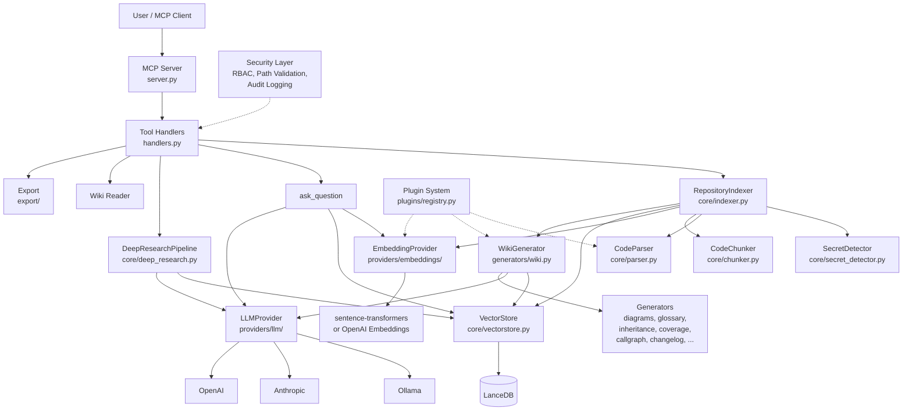
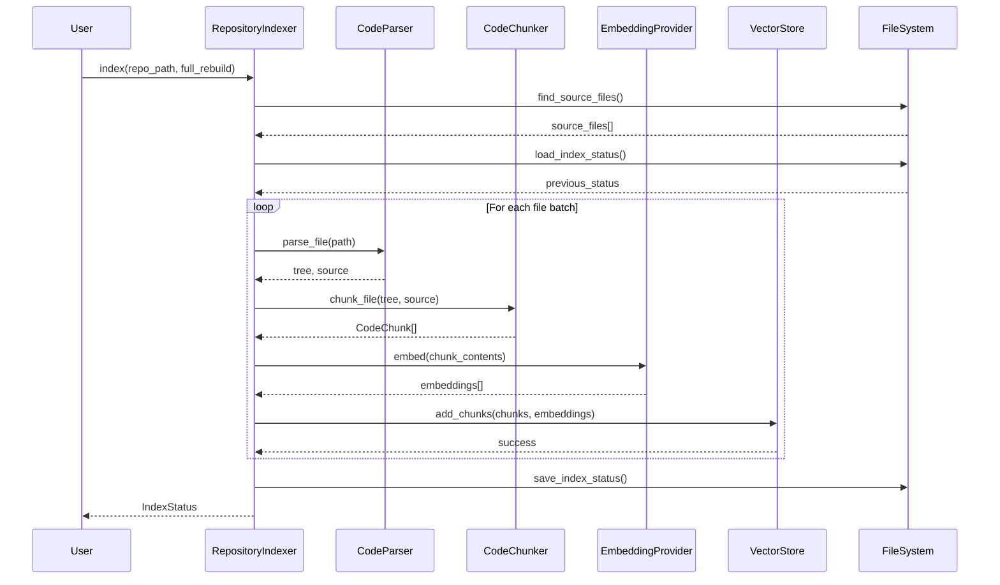
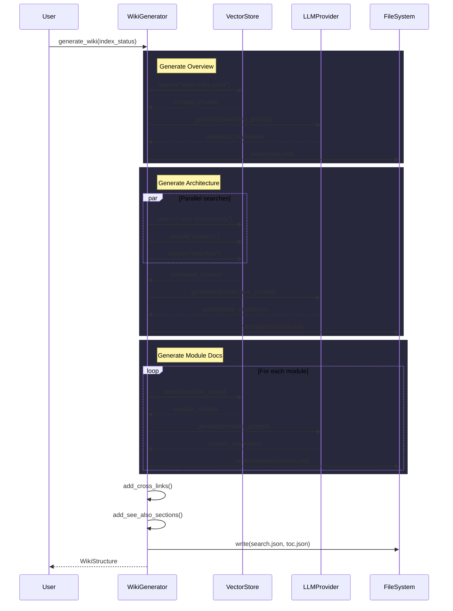
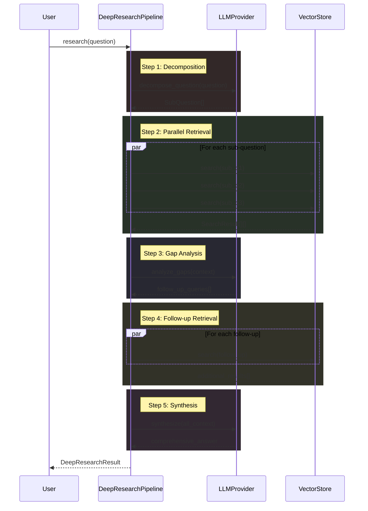

# System Architecture Documentation

## System Overview

Local DeepWiki is a privacy-focused MCP (Model Context Protocol) server that generates comprehensive documentation wikis for code repositories. It combines tree-sitter AST parsing, vector-based semantic search (LanceDB), and LLM-powered content generation to produce browsable, searchable documentation directly from source code. The system runs entirely locally -- no code leaves the user's machine unless an external LLM provider is explicitly configured.

## Key Components

The system is built around a pipeline architecture with pluggable providers:

- **MCP Server** (`server.py`, `handlers.py`): The entry point. Exposes 20+ tools via the FastMCP protocol, including `index_repository`, `ask_question`, `deep_research`, wiki reading, export, and generator tools. Tool dispatch is handled by `handlers.py` which contains all business logic.
- **Code Parser** (`core/parser.py`): Multi-language AST parsing using tree-sitter grammars. Supports 13 languages (Python, TypeScript, JavaScript, Go, Rust, Java, C, C++, Swift, Ruby, PHP, Kotlin, C#). Extracts functions, classes, methods, and module structure.
- **Code Chunker** (`core/chunker.py`): AST-aware semantic chunking that splits code at function/class boundaries rather than arbitrary token limits. Produces `CodeChunk` objects with metadata (language, type, name, line range).
- **Vector Store** (`core/vectorstore.py`): LanceDB-backed vector storage with adaptive search, pagination, and caching. Handles embedding storage, similarity search, and filter-based retrieval.
- **Repository Indexer** (`core/indexer.py`): Orchestrates the full pipeline: file discovery, secret scanning, parallel parsing, chunking, embedding, vector storage, and wiki generation. Supports incremental indexing via file hash manifests.
- **Deep Research** (`core/deep_research.py`): Multi-step reasoning pipeline that decomposes complex questions into sub-queries, performs parallel vector retrieval, runs gap analysis, and synthesizes comprehensive answers with checkpointing.
- **Wiki Generator** (`generators/wiki.py`): LLM-powered markdown generation producing per-file docs, module docs, architecture pages, glossaries, inheritance trees, and more. Orchestrates 15+ specialized generators.
- **Provider Abstraction** (`providers/`): Pluggable backends for LLM (Ollama, Anthropic, OpenAI) and embeddings (local sentence-transformers, OpenAI). All implement abstract base classes (`LLMProvider`, `EmbeddingProvider`).
- **Security Layer** (`security/`): RBAC access control, repository allowlist/denylist, secret detection, path traversal prevention, input validation, and audit logging.
- **Export** (`export/`): Static HTML and PDF export with streaming support for large wikis.
- **Web UI** (`web/app.py`): Flask-based wiki browser with chat interface and deep research integration.
- **Plugin System** (`plugins/`): Extensibility via `LanguageParserPlugin`, `WikiGeneratorPlugin`, and `EmbeddingProviderPlugin` interfaces with registry-based discovery.

## Data Flow

### Indexing (Write Path)

1. User calls `index_repository` with a repository path.
2. **Secret Detection**: `SecretDetector` scans for hardcoded credentials before processing.
3. **File Discovery**: `RepositoryIndexer._collect_files_to_process()` walks the repo, applies exclude patterns (`.venv`, `node_modules`, `.git`, etc.), filters by supported languages, and checks the manifest for changed files.
4. **Parallel Parsing**: `ThreadPoolExecutor` runs `CodeParser.parse_file()` concurrently across files, producing tree-sitter ASTs.
5. **Chunking**: `CodeChunker.chunk_file()` walks each AST and creates semantic `CodeChunk` objects at function/class boundaries.
6. **Embedding**: `EmbeddingProvider.embed()` generates vector embeddings for each chunk's content.
7. **Storage**: `VectorStore.add_chunks()` writes chunks and embeddings to LanceDB.
8. **Wiki Generation**: `WikiGenerator.generate_wiki()` runs a 10-phase pipeline producing markdown pages, diagrams, glossary, inheritance trees, cross-links, and search index.
9. **Manifest Update**: File hashes are saved for incremental re-indexing.

### Query (Read Path)

1. User calls `ask_question` with a question and repository path.
2. Question is embedded via `EmbeddingProvider.embed()`.
3. `VectorStore.search()` performs similarity search returning top-k relevant chunks.
4. Chunks are assembled into context and sent to `LLMProvider.generate()` for synthesis.
5. Answer is returned with source citations.

### Deep Research

1. Question is decomposed into 3-5 sub-questions via LLM.
2. Sub-questions are searched in parallel against the vector store.
3. Gap analysis identifies missing information.
4. Follow-up queries retrieve additional context.
5. All context is synthesized into a comprehensive answer with checkpointing for resumability.

## Component Diagram

```mermaid
graph TD
    U[User / MCP Client] --> S[MCP Server<br/>server.py]
    S --> H[Tool Handlers<br/>handlers.py]

    H --> IDX[RepositoryIndexer<br/>core/indexer.py]
    H --> QA[ask_question]
    H --> DR[DeepResearchPipeline<br/>core/deep_research.py]
    H --> WR[Wiki Reader]
    H --> EX[Export<br/>export/]

    IDX --> SD[SecretDetector<br/>core/secret_detector.py]
    IDX --> CP[CodeParser<br/>core/parser.py]
    IDX --> CC[CodeChunker<br/>core/chunker.py]
    IDX --> EP[EmbeddingProvider<br/>providers/embeddings/]
    IDX --> VS[VectorStore<br/>core/vectorstore.py]
    IDX --> WG[WikiGenerator<br/>generators/wiki.py]

    QA --> EP
    QA --> VS
    QA --> LLM[LLMProvider<br/>providers/llm/]

    DR --> VS
    DR --> LLM

    WG --> VS
    WG --> LLM
    WG --> GEN[Generators<br/>diagrams, glossary,<br/>inheritance, coverage,<br/>callgraph, changelog, ...]

    VS --> DB[(LanceDB)]
    EP --> ST[sentence-transformers<br/>or OpenAI Embeddings]
    LLM --> OL[Ollama]
    LLM --> AN[Anthropic]
    LLM --> OA[OpenAI]

    SEC[Security Layer<br/>RBAC, Path Validation,<br/>Audit Logging] -.-> H
    PLG[Plugin System<br/>plugins/registry.py] -.-> CP
    PLG -.-> WG
    PLG -.-> EP
```

## Key Design Decisions

- **Async throughout**: All core operations use asyncio for concurrent LLM/embedding calls and parallel file processing.
- **AST-aware chunking**: Code is split at function/class boundaries using tree-sitter, not arbitrary token limits, preserving semantic coherence.
- **Incremental indexing**: File hashes tracked in a manifest allow re-indexing only changed files, significantly reducing re-index time.
- **Provider abstraction**: LLM and embedding providers implement abstract base classes, allowing runtime switching between Ollama (local), Anthropic, and OpenAI.
- **Frozen Pydantic config**: Immutable configuration objects (`model_config = {"frozen": True}`) prevent accidental mutation.
- **6-layer path security**: Path traversal prevention via `Path.resolve()`, `is_relative_to()`, pattern validation, and dedicated validators in handlers, git_utils, validation, web, vectorstore, and events.
- **Plugin system**: Extensible architecture for custom parsers, generators, and embedding providers via registry with entry point support.
- **Event-driven hooks**: Pub-sub event system (`events.py`) decouples components across indexing, generation, and query lifecycles.
- **LRU caching**: LLM response cache (`core/llm_cache.py`) avoids redundant calls for identical prompts.

## Workflow Sequences

The following diagrams show how data flows through key operations:

### Indexing Pipeline

```mermaid
sequenceDiagram
    participant U as User
    participant I as RepositoryIndexer
    participant P as CodeParser
    participant C as CodeChunker
    participant E as EmbeddingProvider
    participant V as VectorStore
    participant F as FileSystem

    U->>I: index(repo_path, full_rebuild)
    I->>F: find_source_files()
    F-->>I: source_files[]
    I->>F: load_index_status()
    F-->>I: previous_status

    loop For each file batch
        I->>P: parse_file(path)
        P-->>I: tree, source
        I->>C: chunk_file(tree, source)
        C-->>I: CodeChunk[]
        I->>E: embed(chunk_contents)
        E-->>I: embeddings[]
        I->>V: add_chunks(chunks, embeddings)
        V-->>I: success
    end

    I->>F: save_index_status()
    I-->>U: IndexStatus
```

### Wiki Generation Pipeline

```mermaid
sequenceDiagram
    participant U as User
    participant W as WikiGenerator
    participant V as VectorStore
    participant L as LLMProvider
    participant F as FileSystem

    U->>W: generate_wiki(index_status)

    rect rgb(40, 40, 60)
        note right of W: Generate Overview
        W->>V: search("main entry point")
        V-->>W: context_chunks
        W->>L: generate(overview_prompt)
        L-->>W: overview_markdown
        W->>F: write(index.md)
    end

    rect rgb(40, 40, 60)
        note right of W: Generate Architecture
        par Parallel searches
            W->>V: search("core components")
            W->>V: search("patterns")
            W->>V: search("data flow")
        end
        V-->>W: combined_context
        W->>L: generate(architecture_prompt)
        L-->>W: architecture_markdown
        W->>F: write(architecture.md)
    end

    rect rgb(40, 40, 60)
        note right of W: Generate Module Docs
        loop For each module
            W->>V: search(module_query)
            V-->>W: module_chunks
            W->>L: generate(module_prompt)
            L-->>W: module_markdown
            W->>F: write(modules/{name}.md)
        end
    end

    W->>W: add_cross_links()
    W->>W: add_see_also_sections()
    W->>F: write(search.json, toc.json)
    W-->>U: WikiStructure
```

### Deep Research Pipeline

```mermaid
sequenceDiagram
    participant U as User
    participant D as DeepResearchPipeline
    participant L as LLMProvider
    participant V as VectorStore

    U->>D: research(question)

    rect rgb(50, 40, 40)
        note right of D: Step 1: Decomposition
        D->>L: decompose_question(question)
        L-->>D: SubQuestion[]
    end

    rect rgb(40, 50, 40)
        note right of D: Step 2: Parallel Retrieval
        par For each sub-question
            D->>V: search(sub_q1)
            D->>V: search(sub_q2)
            D->>V: search(sub_q3)
        end
        V-->>D: SearchResult[][]
    end

    rect rgb(40, 40, 50)
        note right of D: Step 3: Gap Analysis
        D->>L: analyze_gaps(context)
        L-->>D: follow_up_queries[]
    end

    rect rgb(50, 50, 40)
        note right of D: Step 4: Follow-up Retrieval
        par For each follow-up
            D->>V: search(follow_up)
        end
        V-->>D: additional_results[]
    end

    rect rgb(50, 40, 50)
        note right of D: Step 5: Synthesis
        D->>L: synthesize(all_context)
        L-->>D: comprehensive_answer
    end

    D-->>U: DeepResearchResult
```

## Module Dependencies

For a detailed view of module interdependencies including circular dependency detection, see the [Dependency Graph](dependency-graph.md) page.
