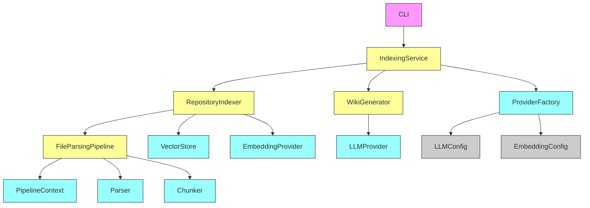

# Architecture Documentation

## 1. System Overview

This system provides an intelligent, code-aware wiki generation and indexing solution for software repositories. It addresses the challenge of maintaining up-to-date documentation for large codebases by automatically parsing source files, extracting meaningful code chunks, and generating contextual documentation. The approach combines AST-aware parsing with vector embeddings to create a searchable knowledge base that supports both automated and human-readable documentation generation.

The system operates through a multi-stage pipeline that processes repository files in parallel, chunks code at semantic boundaries, embeds content for similarity search, and generates wiki pages using LLMs. It supports multiple generation modes (eager, hybrid, etc.) and integrates with various LLM and embedding providers through a provider abstraction layer.

## 2. Key Components

### RepositoryIndexer
The [RepositoryIndexer](files/src/local_deepwiki/core/indexer.md) orchestrates the full indexing process for a repository, managing file parsing, chunking, embedding, and storage operations. It exists as a separate component to encapsulate the complex orchestration logic and maintain separation of concerns between parsing and storage operations. The [RepositoryIndexer](files/src/local_deepwiki/core/indexer.md) depends on the [FileParsingPipeline](files/src/local_deepwiki/core/parsing_pipeline.md) and vector store, while the indexing service depends on it to execute the pipeline.

### FileParsingPipeline
The [FileParsingPipeline](files/src/local_deepwiki/core/parsing_pipeline.md) handles the parallel parsing and chunking of source files, delegating to specific parser and chunker implementations. It exists to abstract the complexity of parallel file processing and batched chunking operations. The [FileParsingPipeline](files/src/local_deepwiki/core/parsing_pipeline.md) depends on a [PipelineContext](files/src/local_deepwiki/core/parsing_pipeline.md) containing parser, chunker, and configuration, and is used by the [RepositoryIndexer](files/src/local_deepwiki/core/indexer.md).

### PipelineContext
The [PipelineContext](files/src/local_deepwiki/core/parsing_pipeline.md) holds immutable configuration and shared resources for the parsing pipeline. It exists to centralize configuration and avoid passing large parameter sets to every parsing operation. It is consumed by [FileParsingPipeline](files/src/local_deepwiki/core/parsing_pipeline.md) and contains parser, chunker, and other pipeline-related dependencies.

### ProviderFactory
The [ProviderFactory](files/src/local_deepwiki/services/provider_factory.md) manages the creation and configuration of LLM and embedding providers. It exists to provide a centralized, consistent way to instantiate different provider implementations based on configuration. It depends on configuration objects and provider base classes, and is used by the indexing service and [RepositoryIndexer](files/src/local_deepwiki/core/indexer.md).

### IndexingService
The [IndexingService](files/src/local_deepwiki/services/indexing_service.md) provides the main entry point for executing the indexing pipeline with proper request handling and result formatting. It exists to encapsulate the business logic for running the indexing process and coordinating between different subsystems. It depends on [RepositoryIndexer](files/src/local_deepwiki/core/indexer.md) and the [WikiGenerator](files/src/local_deepwiki/generators/wiki/generator.md), and is used by the CLI and MCP handlers.

### WikiGenerator
The [WikiGenerator](files/src/local_deepwiki/generators/wiki/generator.md) creates documentation pages from parsed code and LLM responses. It exists to abstract the wiki generation logic from the indexing pipeline and support different generation modes. It depends on LLM providers and the indexing results, and is used by the [IndexingService](files/src/local_deepwiki/services/indexing_service.md).

### PluginRegistry
The [PluginRegistry](files/src/local_deepwiki/plugins/registry.md) manages the registration and retrieval of plugins that extend system functionality. It exists to support a plugin architecture for extending the system's capabilities without modifying core code. It depends on the [Plugin](files/src/local_deepwiki/plugins/base.md) class and is used by the main application components.

## 3. Data Flow

When a user indexes a repository, the data flows through the following sequence:

1. The CLI dispatcher receives the indexing command and creates an [IndexPipelineRequest](files/src/local_deepwiki/services/indexing_service.md) with repository path and configuration
2. The [IndexingService](files/src/local_deepwiki/services/indexing_service.md) receives the request and creates a [RepositoryIndexer](files/src/local_deepwiki/core/indexer.md) with the specified configuration
3. The [RepositoryIndexer](files/src/local_deepwiki/core/indexer.md) calls its index method which creates a [FileParsingPipeline](files/src/local_deepwiki/core/parsing_pipeline.md) via _create_parsing_pipeline
4. The [FileParsingPipeline](files/src/local_deepwiki/core/parsing_pipeline.md) parses files in parallel using _parse_files_parallel, which delegates to _parse_single_file
5. Each file is parsed by the parser, then chunked by the chunker, with chunks stored in a vector database
6. After parsing completes, the [IndexingService](files/src/local_deepwiki/services/indexing_service.md) calls _generate_wiki to create wiki pages using LLM providers
7. The [WikiGenerator](files/src/local_deepwiki/generators/wiki/generator.md) creates documentation pages from the parsed chunks and LLM responses
8. The [IndexingService](files/src/local_deepwiki/services/indexing_service.md) returns an [IndexPipelineResult](files/src/local_deepwiki/services/models.md) containing statistics and metadata

## 4. Component Diagram

```mermaid
graph TD
    A[CLI] --> B[IndexingService]
    B --> C[RepositoryIndexer]
    C --> D[FileParsingPipeline]
    D --> E[PipelineContext]
    C --> F[VectorStore]
    B --> G[WikiGenerator]
    G --> H[LLMProvider]
    B --> I[ProviderFactory]
    I --> J[LLMConfig]
    I --> K[EmbeddingConfig]
    C --> L[EmbeddingProvider]
    D --> M[Parser]
    D --> N[Chunker]
    
    style A fill:#f9f,stroke:#333
    style B fill:#ff9,stroke:#333
    style C fill:#ff9,stroke:#333
    style D fill:#ff9,stroke:#333
    style E fill:#9ff,stroke:#333
    style F fill:#9ff,stroke:#333
    style G fill:#ff9,stroke:#333
    style H fill:#9ff,stroke:#333
    style I fill:#9ff,stroke:#333
    style J fill:#ccc,stroke:#333
    style K fill:#ccc,stroke:#333
    style L fill:#9ff,stroke:#333
    style M fill:#9ff,stroke:#333
    style N fill:#9ff,stroke:#333
```

## 5. Design Decisions and Trade-offs

### Async throughout
**What was chosen**: The entire system uses asyncio for all core operations, including parsing, chunking, and LLM calls.
**Why**: LLM calls and I/O operations (file reading, database access) are I/O-bound and benefit from concurrent execution, improving throughput for large repositories.
**Trade-offs**: All callers must be async-aware, and error handling becomes more complex with async/await patterns.

### AST-aware chunking
**What was chosen**: Code chunks are split at function/class boundaries using tree-sitter parsing.
**Why**: This approach preserves semantic meaning of code units, making documentation more accurate and useful for developers.
**Trade-offs**: Requires integration with tree-sitter parsing, adds complexity to the chunking process, and may not work well for all file types.

### Config hierarchy
**What was chosen**: Configuration follows a hierarchy of CLI args > env vars > config file > defaults.
**Why**: This approach provides flexibility for different deployment scenarios while maintaining consistent behavior.
**Trade-offs**: Adds complexity to configuration loading and requires careful handling of precedence rules.

### Provider abstraction
**What was chosen**: LLM and embedding providers implement base classes in providers/base.py.
**Why**: This enables switching between different provider implementations (OpenAI, Anthropic, local models) without changing core logic.
**Trade-offs**: Requires maintaining base interfaces and adds indirection overhead, but provides flexibility for different deployment scenarios.

### Parallel file processing
**What was chosen**: Files are parsed in parallel using concurrent execution.
**Why**: This significantly improves performance for large repositories with many files.
**Trade-offs**: Requires careful thread safety considerations and adds complexity to error handling and progress tracking.

## Module Dependencies

For a detailed view of module interdependencies including circular dependency detection, see the [Dependency Graph](dependency-graph.md) page.

## Relevant Source Files

The following source files were used to generate this documentation:

- [`src/local_deepwiki/generators/analysis/coupling.py:48-90`](files/src/local_deepwiki/generators/analysis/coupling.md)
- [`src/local_deepwiki/generators/analysis/module_dependencies.py:30-40`](files/src/local_deepwiki/generators/analysis/module_dependencies.md)
- [`src/local_deepwiki/generators/analysis/health_scoring.py:29-34`](files/src/local_deepwiki/generators/analysis/health_scoring.md)
- [`src/local_deepwiki/logging.py:28-83`](files/src/local_deepwiki/logging.md)
- [`src/local_deepwiki/server.py:92-94`](files/src/local_deepwiki/server.md)
- [`src/local_deepwiki/cli_progress.py:147-199`](files/src/local_deepwiki/cli_progress.md)
- [`src/local_deepwiki/events.py:35-63`](files/src/local_deepwiki/events.md)
- `src/local_deepwiki/__init__.py`
- [`src/local_deepwiki/prompts.py:28-72`](files/src/local_deepwiki/prompts.md)
- [`src/local_deepwiki/error_factories.py:47-83`](files/src/local_deepwiki/error_factories.md)

*Showing 10 of 263 source files.*
