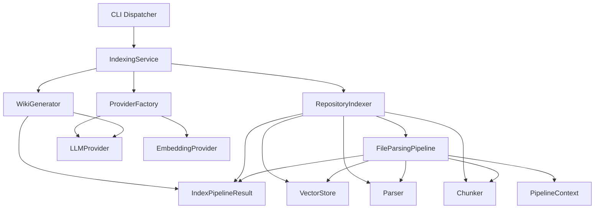

# Architecture Documentation

## 1. System Overview

The local-deepwiki system solves the problem of automatically generating and maintaining documentation for code repositories by analyzing source code and creating structured wiki content. It operates as a unified CLI tool that supports multiple indexing modes (eager, hybrid) and integrates with various LLM and embedding providers to create semantic representations of code.

The high-level approach is to parse source code files into semantic chunks, embed these chunks for semantic search, and then use LLMs to generate structured documentation. The system supports both full and incremental indexing, with the ability to cache LLM responses for performance. The architecture is built around a core indexing pipeline that orchestrates parsing, chunking, embedding, storage, and wiki generation phases.

## 2. Key Components

### Indexing Service
The [IndexingService](files/src/local_deepwiki/services/indexing_service.md) orchestrates the entire indexing pipeline, coordinating between the [RepositoryIndexer](files/src/local_deepwiki/core/indexer.md), provider factories, and wiki generation components. It exists as a separate component to provide a clean API boundary and encapsulate the complex orchestration logic needed to run the full indexing workflow. It depends on [RepositoryIndexer](files/src/local_deepwiki/core/indexer.md), [ProviderFactory](files/src/local_deepwiki/services/provider_factory.md), and [WikiGenerator](files/src/local_deepwiki/generators/wiki/generator.md), while being depended on by the CLI dispatcher and MCP server.

### RepositoryIndexer
The [RepositoryIndexer](files/src/local_deepwiki/core/indexer.md) handles the core indexing logic, including file parsing, chunking, and vector storage operations. It exists as a separate component to encapsulate repository-specific indexing logic and provide a clean separation between the pipeline orchestration and the actual indexing work. It depends on [FileParsingPipeline](files/src/local_deepwiki/core/parsing_pipeline.md), Chunker, Parser, and [VectorStore](files/src/local_deepwiki/core/vectorstore/store.md), and is depended on by [IndexingService](files/src/local_deepwiki/services/indexing_service.md).

### FileParsingPipeline
The [FileParsingPipeline](files/src/local_deepwiki/core/parsing_pipeline.md) manages the parallel processing of files, handling both single-file and batch processing with progress tracking. It exists as a separate component to provide a reusable abstraction for file parsing operations and to encapsulate the complexity of parallel execution and progress reporting. It depends on [PipelineContext](files/src/local_deepwiki/core/parsing_pipeline.md), Chunker, Parser, and [VectorStore](files/src/local_deepwiki/core/vectorstore/store.md), and is depended on by [RepositoryIndexer](files/src/local_deepwiki/core/indexer.md) and individual parsing methods.

### ProviderFactory
The [ProviderFactory](files/src/local_deepwiki/services/provider_factory.md) manages the creation and configuration of LLM and embedding providers, providing a centralized location for provider instantiation and caching. It exists as a separate component to abstract provider instantiation logic and support multiple provider backends. It depends on configuration objects and provider base classes, and is depended on by [IndexingService](files/src/local_deepwiki/services/indexing_service.md) and [RepositoryIndexer](files/src/local_deepwiki/core/indexer.md).

### WikiGenerator
The [WikiGenerator](files/src/local_deepwiki/generators/wiki/generator.md) is responsible for creating structured wiki content from indexed code data, supporting different generation modes (eager, hybrid). It exists as a separate component to encapsulate the logic for converting semantic code representations into human-readable documentation. It depends on LLM providers and indexing results, and is depended on by [IndexingService](files/src/local_deepwiki/services/indexing_service.md).

### PipelineContext
The [PipelineContext](files/src/local_deepwiki/core/parsing_pipeline.md) holds shared configuration and state for parsing pipelines, providing a clean way to pass common parameters without cluttering method signatures. It exists as a separate component to reduce parameter passing complexity and provide a single source of truth for pipeline configuration. It is depended on by [FileParsingPipeline](files/src/local_deepwiki/core/parsing_pipeline.md) and other pipeline components.

### IndexPipelineRequest
The [IndexPipelineRequest](files/src/local_deepwiki/services/indexing_service.md) encapsulates immutable parameters for indexing pipeline operations, providing a clean API boundary for pipeline execution. It exists as a separate component to ensure parameter immutability and provide a consistent interface for pipeline execution. It is depended on by [IndexingService](files/src/local_deepwiki/services/indexing_service.md) and related pipeline methods.

## 3. Data Flow

When a user indexes a repository, the data flows through the following sequence:

1. The CLI dispatcher receives the indexing command and creates an [IndexPipelineRequest](files/src/local_deepwiki/services/indexing_service.md) with repository path and configuration
2. The [IndexingService](files/src/local_deepwiki/services/indexing_service.md) receives the request and creates a [RepositoryIndexer](files/src/local_deepwiki/core/indexer.md) with the specified configuration
3. The [RepositoryIndexer](files/src/local_deepwiki/core/indexer.md) calls its index method which creates a [FileParsingPipeline](files/src/local_deepwiki/core/parsing_pipeline.md) through _create_parsing_pipeline
4. The [FileParsingPipeline](files/src/local_deepwiki/core/parsing_pipeline.md) parses files in parallel using _parse_files_parallel, which delegates to _parse_single_file for individual files
5. Each file is parsed by the parser and chunked by the chunker, with chunks stored in the vector store
6. After parsing completes, the [IndexingService](files/src/local_deepwiki/services/indexing_service.md) calls _generate_wiki to create wiki content
7. The [WikiGenerator](files/src/local_deepwiki/generators/wiki/generator.md) uses LLM providers to generate structured documentation from the indexed chunks
8. The final [IndexPipelineResult](files/src/local_deepwiki/services/models.md) is returned with statistics about the indexing operation

## 4. Component Diagram

```mermaid
graph TD
    A[CLI Dispatcher] --> B[IndexingService]
    B --> C[RepositoryIndexer]
    B --> D[ProviderFactory]
    B --> E[WikiGenerator]
    C --> F[FileParsingPipeline]
    C --> G[Chunker]
    C --> H[Parser]
    C --> I[VectorStore]
    F --> J[PipelineContext]
    F --> G
    F --> H
    F --> I
    D --> K[LLMProvider]
    D --> L[EmbeddingProvider]
    E --> K
    E --> M[IndexPipelineResult]
    C --> M
    F --> M
```

## 5. Design Decisions and Trade-offs

### Async throughout
The system uses async/await throughout the core operations because LLM calls and embedding operations are I/O-bound and benefit from concurrent execution. This approach allows multiple files to be processed simultaneously while waiting for external API calls. The trade-off is that all callers must be async-aware, which increases complexity in the codebase.

### AST-aware chunking
The system uses tree-sitter for AST-aware chunking at function/class boundaries rather than simple line-based chunking. This approach provides more semantically meaningful chunks that better represent code structure and relationships. The trade-off is increased complexity in the chunking logic and dependency on tree-sitter parsing.

### Config hierarchy
The system implements a configuration hierarchy (CLI args > env vars > config file > defaults) to provide flexible configuration management. This approach allows users to override settings at multiple levels without requiring complex configuration files. The trade-off is additional complexity in the configuration loading and merging logic.

### Provider abstraction
The system implements provider abstractions through base classes in providers/base.py that allow different LLM and embedding providers to be used interchangeably. This approach supports multiple backends without requiring code changes. The trade-off is an additional layer of abstraction that may add slight overhead.

### Frozen pydantic models
Configuration objects use pydantic models with frozen=True to ensure immutability. This prevents accidental configuration changes during execution. The trade-off is slightly more verbose configuration code and potential performance overhead from pydantic validation.

### Pipeline architecture
The system uses a pipeline-based architecture where each stage (parse, chunk, embed, store, generate) is clearly separated. This approach provides modularity and testability. The trade-off is that the pipeline structure adds some complexity to the orchestration logic.

## Module Dependencies

For a detailed view of module interdependencies including circular dependency detection, see the [Dependency Graph](dependency-graph.md) page.

## Relevant Source Files

The following source files were used to generate this documentation:

- [`src/local_deepwiki/generators/analysis/cohesion.py:40-60`](files/src/local_deepwiki/generators/analysis/cohesion.md)
- [`src/local_deepwiki/logging.py:28-83`](files/src/local_deepwiki/logging.md)
- [`src/local_deepwiki/server.py:98-100`](files/src/local_deepwiki/server.md)
- [`src/local_deepwiki/cli_progress.py:147-199`](files/src/local_deepwiki/cli_progress.md)
- [`src/local_deepwiki/events.py:35-63`](files/src/local_deepwiki/events.md)
- `src/local_deepwiki/__init__.py`
- [`src/local_deepwiki/prompts.py:28-72`](files/src/local_deepwiki/prompts.md)
- [`src/local_deepwiki/error_factories.py:47-83`](files/src/local_deepwiki/error_factories.md)
- [`src/local_deepwiki/errors.py:53-118`](files/src/local_deepwiki/errors.md)
- [`src/local_deepwiki/watcher.py:40-46`](files/src/local_deepwiki/watcher.md)

*Showing 10 of 269 source files.*
