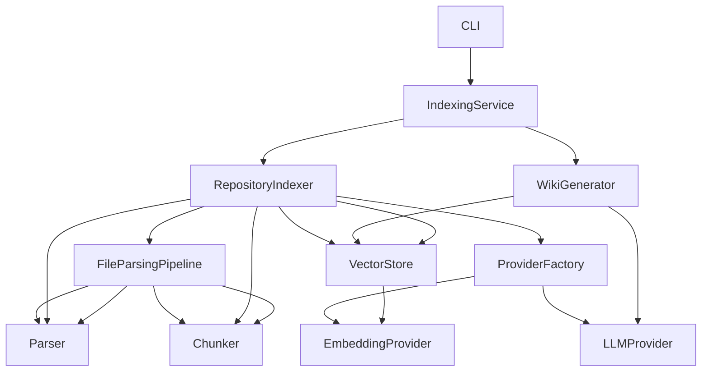

# Architecture Documentation

## 1. System Overview

This system solves the problem of generating intelligent, context-aware documentation for software repositories by combining code analysis, semantic chunking, and LLM-powered summarization. The architecture is designed around a core indexing pipeline that parses source code, chunks it using AST-aware techniques, embeds the chunks, stores them in a vector database, and generates wiki pages using LLMs. The system supports multiple LLM and embedding providers through a provider abstraction layer, and offers flexible configuration via CLI args, environment variables, config files, and defaults.

The system is built for asynchronous operation throughout, enabling efficient handling of I/O-bound operations like LLM calls and file processing. It supports both local and cloud-based providers, with a focus on modularity and extensibility. The architecture is designed to be incremental, allowing users to rebuild only changed files, and supports hybrid generation modes that balance performance with quality.

## 2. Key Components

### RepositoryIndexer
The [RepositoryIndexer](files/src/local_deepwiki/core/indexer.md) orchestrates the full indexing pipeline for a repository, managing the parsing, chunking, embedding, and storage of code. It exists to coordinate the complex multi-step process of turning source code into a searchable knowledge base. It depends on the [FileParsingPipeline](files/src/local_deepwiki/core/parsing_pipeline.md), Parser, Chunker, and [VectorStore](files/src/local_deepwiki/core/vectorstore/store.md), and is depended on by the [IndexingService](files/src/local_deepwiki/services/indexing_service.md). The [RepositoryIndexer](files/src/local_deepwiki/core/indexer.md) is responsible for coordinating the parallel processing of files and managing the overall indexing state.

### FileParsingPipeline
The [FileParsingPipeline](files/src/local_deepwiki/core/parsing_pipeline.md) handles the actual parsing and chunking of individual files in parallel, managing the sliding window of processing and batched operations. It exists to abstract the complexity of parallel file processing and batched chunk handling from the [RepositoryIndexer](files/src/local_deepwiki/core/indexer.md). It depends on the Parser and Chunker, and is depended on by the [RepositoryIndexer](files/src/local_deepwiki/core/indexer.md) and [RepositoryIndexer](files/src/local_deepwiki/core/indexer.md)'s _parse_files_parallel method. The pipeline uses async operations and manages futures for parallel execution.

### ProviderFactory
The [ProviderFactory](files/src/local_deepwiki/services/provider_factory.md) creates instances of LLM and embedding providers based on configuration, supporting caching and repository-specific provider selection. It exists to centralize provider instantiation logic and support flexible provider selection and caching. It depends on configuration objects and provider implementations, and is depended on by the [IndexingService](files/src/local_deepwiki/services/indexing_service.md) and [RepositoryIndexer](files/src/local_deepwiki/core/indexer.md). The factory abstracts provider creation to support different backends (local, cloud) without coupling consumers to specific implementations.

### IndexingService
The [IndexingService](files/src/local_deepwiki/services/indexing_service.md) provides the main entry point for executing the indexing pipeline, handling the orchestration of parsing, chunking, embedding, storage, and wiki generation. It exists to provide a clean API for triggering indexing operations with proper request handling and result formatting. It depends on the [RepositoryIndexer](files/src/local_deepwiki/core/indexer.md) and [WikiGenerator](files/src/local_deepwiki/generators/wiki/generator.md), and is depended on by CLI handlers and MCP server endpoints. The service manages the full lifecycle of an indexing operation, including progress reporting and result aggregation.

### WikiGenerator
The [WikiGenerator](files/src/local_deepwiki/generators/wiki/generator.md) creates structured wiki documentation from indexed code, supporting multiple generation modes and LLM-based summarization. It exists to abstract the complexity of wiki page creation and LLM interaction from the core indexing pipeline. It depends on LLM providers and the vector store, and is depended on by the [IndexingService](files/src/local_deepwiki/services/indexing_service.md). The generator handles both eager and hybrid wiki generation modes, creating structured documentation from code chunks.

### Provider Abstraction Layer
The provider abstraction layer defines base classes for LLM and embedding providers, enabling support for multiple backends. It exists to allow switching between different LLM and embedding providers without changing core logic. It is depended on by the [ProviderFactory](files/src/local_deepwiki/services/provider_factory.md), [RepositoryIndexer](files/src/local_deepwiki/core/indexer.md), and [WikiGenerator](files/src/local_deepwiki/generators/wiki/generator.md), and depends on specific provider implementations. This layer enables the system to work with local models like Ollama or cloud providers like Anthropic.

## 3. Data Flow

When a user indexes a repository, the data flows through the following sequence:

1. The CLI dispatcher receives the command and creates an [IndexPipelineRequest](files/src/local_deepwiki/services/indexing_service.md) with repository path, rebuild flag, and progress callback
2. The [IndexingService](files/src/local_deepwiki/services/indexing_service.md) receives the request and creates a [RepositoryIndexer](files/src/local_deepwiki/core/indexer.md) with the specified configuration
3. The [RepositoryIndexer](files/src/local_deepwiki/core/indexer.md) calls its index method, which in turn calls _parse_files_parallel
4. _parse_files_parallel creates a [FileParsingPipeline](files/src/local_deepwiki/core/parsing_pipeline.md) and calls parse_files_parallel with the files to process
5. [FileParsingPipeline](files/src/local_deepwiki/core/parsing_pipeline.md) processes files in parallel windows, calling _process_window for each completed future
6. _process_window handles individual file parsing results, collecting chunks for graph entity linking if enabled
7. The parsed chunks are passed to the [RepositoryIndexer](files/src/local_deepwiki/core/indexer.md)'s vector store for embedding and storage
8. After indexing completes, the [IndexingService](files/src/local_deepwiki/services/indexing_service.md) calls _generate_wiki to create wiki pages
9. The [WikiGenerator](files/src/local_deepwiki/generators/wiki/generator.md) uses the LLM provider to summarize code chunks into wiki documentation
10. The [IndexingService](files/src/local_deepwiki/services/indexing_service.md) returns an [IndexPipelineResult](files/src/local_deepwiki/services/models.md) containing statistics and metadata

## 4. Component Diagram

```mermaid
graph TD
    A[CLI] --> B[IndexingService]
    B --> C[RepositoryIndexer]
    B --> D[WikiGenerator]
    C --> E[FileParsingPipeline]
    C --> F[VectorStore]
    C --> G[ProviderFactory]
    E --> H[Parser]
    E --> I[Chunker]
    G --> J[LLMProvider]
    G --> K[EmbeddingProvider]
    D --> J
    D --> F
    F --> K
    C --> F
    C --> H
    C --> I
    E --> H
    E --> I
```

## 5. Design Decisions and Trade-offs

### Async throughout
The system uses async/await throughout for I/O-bound operations. This approach was chosen because LLM calls and file I/O are inherently asynchronous and benefit from concurrent execution. The trade-off is that all callers must be async-aware, requiring careful attention to async compatibility throughout the codebase.

### AST-aware chunking
Code chunks are split at function/class boundaries using tree-sitter, rather than simple line-based or regex-based chunking. This approach was chosen because it preserves semantic boundaries in code, making chunks more meaningful for LLM understanding. The trade-off is increased complexity in the chunking logic and dependency on tree-sitter parsing.

### Provider abstraction
The system implements a provider abstraction layer for LLM and embedding providers. This approach was chosen to support multiple backends (local, cloud) without tightly coupling the system to specific implementations. The trade-off is additional indirection that adds complexity to the provider instantiation and selection logic.

### Config hierarchy
Configuration follows a hierarchy of CLI args > env vars > config file > defaults. This approach was chosen to provide flexible configuration management with clear precedence rules. The trade-off is that configuration resolution logic is more complex and requires careful handling of default values.

### Parallel processing with batching
The system uses parallel file processing with batched chunk operations. This approach was chosen to efficiently handle large repositories while maintaining memory usage. The trade-off is increased complexity in managing concurrent operations and ensuring thread safety in shared data structures.

## Module Dependencies

For a detailed view of module interdependencies including circular dependency detection, see the [Dependency Graph](dependency-graph.md) page.

## Relevant Source Files

The following source files were used to generate this documentation:

- [`src/local_deepwiki/tool_defs/analysis.py`](files/src/local_deepwiki/tool_defs/analysis.md)
- [`src/local_deepwiki/generators/analysis/coupling.py:48-90`](files/src/local_deepwiki/generators/analysis/coupling.md)
- [`src/local_deepwiki/handlers/analysis_architecture.py:43-94`](files/src/local_deepwiki/handlers/analysis_architecture.md)
- [`src/local_deepwiki/models/tool_args.py:15-49`](files/src/local_deepwiki/models/tool_args.md)
- [`src/local_deepwiki/generators/analysis/design_smells.py:162-163`](files/src/local_deepwiki/generators/analysis/design_smells.md)
- [`src/local_deepwiki/logging.py:28-83`](files/src/local_deepwiki/logging.md)
- [`src/local_deepwiki/server.py:92-94`](files/src/local_deepwiki/server.md)
- [`src/local_deepwiki/cli_progress.py:147-199`](files/src/local_deepwiki/cli_progress.md)
- [`src/local_deepwiki/events.py:35-63`](files/src/local_deepwiki/events.md)
- `src/local_deepwiki/__init__.py`

*Showing 10 of 263 source files.*
