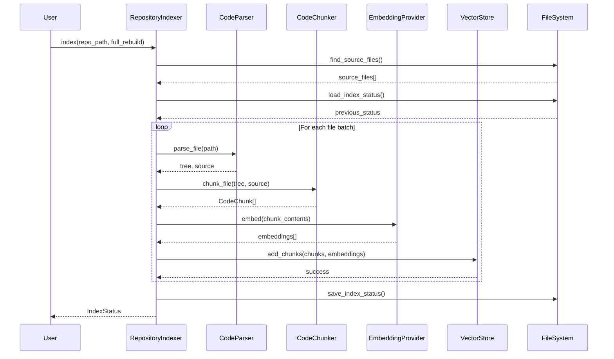
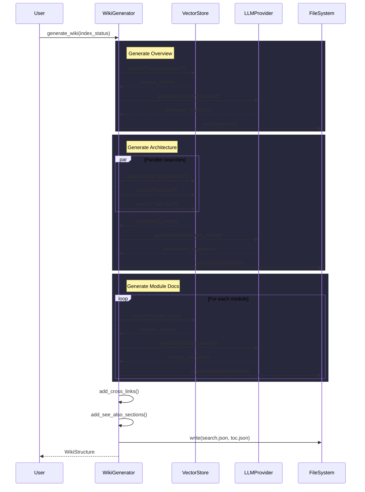
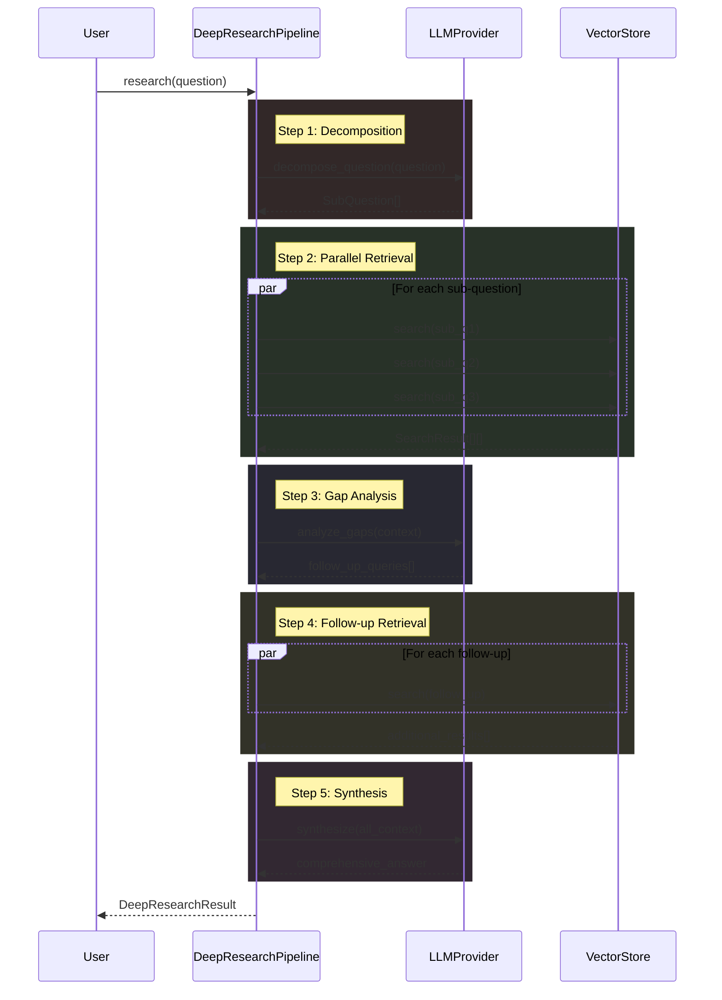

# Architecture Documentation

## System Overview

The system is designed to manage and generate various components related to codebase documentation, configuration management, and API testing. The primary functionalities include parsing code files, generating module documentation, handling LLM (Large [Language](files/src/local_deepwiki/models.md) Model) providers, and managing inheritance diagrams.

## Key Components

1. **[LLMConfig](files/src/local_deepwiki/config.md)**
   - Manages the configuration for different Large [Language](files/src/local_deepwiki/models.md) Models such as Ollama, Anthropic, and OpenAI. It uses Pydantic's BaseModel to enforce type safety and provide default configurations.

2. **[OllamaProvider](files/src/local_deepwiki/providers/llm/ollama.md)**
   - A specific implementation of an LLM provider that interacts with the Ollama model. It includes methods like `check_health`, `generate`, and `generate_stream`.

3. **[ClassNode](files/src/local_deepwiki/generators/inheritance.md)**
   - Represents a class in the inheritance tree, holding information such as the class name, file path, parents, children, whether it is abstract, and its docstring.

4. **TestMain** and **TestMainCli**
   - Test classes for the [main](files/src/local_deepwiki/export/html.md) application logic, covering scenarios like non-existent paths, running initial indices, handling full rebuilds, and CLI-specific functionalities like custom wiki paths and export options.

5. **[EmbeddingConfig](files/src/local_deepwiki/config.md)**
   - Manages configurations for embedding providers, similar to [LLMConfig](files/src/local_deepwiki/config.md), with support for local and OpenAI embeddings.

6. **TestGetLLMProvider** and **TestGetEmbeddingProvider**
   - Test classes for factory functions that return specific provider instances based on configuration settings.

7. **TestGenerateModuleDocs**
   - Tests the generation of module documentation, ensuring modules are correctly indexed and documented from the source code.

8. **[ResearchCancelledError](files/src/local_deepwiki/core/deep_research.md)**
   - An error class indicating that a research operation has been cancelled.

## Data Flow

1. **Configuration Management**: The system starts by loading configuration settings using [`LLMConfig`](files/src/local_deepwiki/config.md) and [`EmbeddingConfig`](files/src/local_deepwiki/config.md). These configurations dictate which LLM or embedding provider is used.

2. **[LLM Provider](files/src/local_deepwiki/providers/base.md) Initialization**: Based on the configuration, the appropriate LLM provider (e.g., [OllamaProvider](files/src/local_deepwiki/providers/llm/ollama.md)) is instantiated through the `get_llm_provider` function.

3. **Code Parsing**: The system parses code files to extract class information and inheritance relationships using classes like [`ClassNode`](files/src/local_deepwiki/generators/inheritance.md).

4. **Inheritance Diagram Generation**: Using parsed data, the system generates inheritance diagrams that visualize class hierarchies.

5. **Module Documentation Generation**: The system processes modules, generating documentation based on parsed source code. This includes indexing and handling of different file types and directories.

6. **Testing**: Various test classes (e.g., `TestMain`, `TestGetParentClasses`) validate the functionality of core components, ensuring that configurations are correctly applied and operations behave as expected.

## Component Diagram

```mermaid
classDiagram
    class LLMConfig {
        +provider: Literal["ollama", "anthropic", "openai"]
        +ollama: OllamaConfig
        +anthropic: AnthropicConfig
        +openai: OpenAILLMConfig
    }

    class OllamaProvider {
        +__init__(model: str, base_url: str)
        +check_health()
        +_ensure_healthy()
        +generate(prompt: str)
        +generate_stream(prompt: str)
        +name() String
    }

    class ClassNode {
        +name: str
        +file_path: str
        +parents: list[str]
        +children: list[str]
        +is_abstract: bool
        +docstring: str | None
    }

    class TestMain {
        +test_main_path_does_not_exist()
        +test_main_path_is_not_directory()
        +test_main_skip_initial_starts_watcher()
        +test_main_with_options()
        +test_main_runs_initial_index()
        +test_main_with_full_rebuild()
        +test_main_default_repo_path()
        +test_main_watcher_stops_on_interrupt()
    }

    class TestMainCli {
        +test_main_default_args()
        +test_main_custom_wiki_path()
        +test_main_with_output_option()
        +test_main_with_separate_option()
        +test_main_nonexistent_wiki_path()
        +test_main_handles_export_exception()
    }

    class EmbeddingConfig {
        +provider: Literal["local", "openai"]
        +local: LocalEmbeddingConfig
        +openai: OpenAIEmbeddingConfig
    }

    class TestGetLLMProvider {
        +test_returns_ollama_provider()
        +test_returns_anthropic_provider()
    }

    class TestGetEmbeddingProvider {
        +test_returns_local_provider()
        +test_returns_openai_provider()
    }

    class TestGenerateModuleDocs {
        +generate_module_docs_from_source()
        +index_modules()
    }

    LLMConfig --> OllamaProvider
    ClassNode -->|parses from| TestMain
    ClassNode -->|parses from| TestGetParentClasses
    TestMain -->|uses| EmbeddingConfig
    TestMainCli -->|uses| EmbeddingConfig
    TestGetLLMProvider -->|uses| LLMConfig
    TestGetEmbeddingProvider -->|uses| EmbeddingConfig
    TestGenerateModuleDocs -->|generates from| ClassNode
```

## Key Design Decisions

1. **Configuration Management**: The use of Pydantic's `BaseModel` for configuration classes like [`LLMConfig`](files/src/local_deepwiki/config.md) and [`EmbeddingConfig`](files/src/local_deepwiki/config.md) ensures strong typing and easy management of default values.

2. **Factory Pattern**: The `get_llm_provider` function exemplifies the factory pattern, allowing for dynamic instantiation of LLM providers based on configuration settings. This design promotes flexibility and decouples provider creation from application logic.

3. **Modular Testing**: The system is highly modular with dedicated test classes for each major component (e.g., `TestMain`, `TestGetParentClasses`). This approach ensures that individual components can be tested in isolation, facilitating easier maintenance and development.

4. **Inheritance Diagram Generation**: By parsing code files into [`ClassNode`](files/src/local_deepwiki/generators/inheritance.md) objects, the system efficiently constructs inheritance diagrams, providing a visual representation of class hierarchies within the codebase.

## Workflow Sequences

The following diagrams show how data flows through key operations:

### Indexing Pipeline

```mermaid
sequenceDiagram
    participant U as User
    participant I as RepositoryIndexer
    participant P as CodeParser
    participant C as CodeChunker
    participant E as EmbeddingProvider
    participant V as VectorStore
    participant F as FileSystem

    U->>I: index(repo_path, full_rebuild)
    I->>F: find_source_files()
    F-->>I: source_files[]
    I->>F: load_index_status()
    F-->>I: previous_status

    loop For each file batch
        I->>P: parse_file(path)
        P-->>I: tree, source
        I->>C: chunk_file(tree, source)
        C-->>I: CodeChunk[]
        I->>E: embed(chunk_contents)
        E-->>I: embeddings[]
        I->>V: add_chunks(chunks, embeddings)
        V-->>I: success
    end

    I->>F: save_index_status()
    I-->>U: IndexStatus
```

### Wiki Generation Pipeline

```mermaid
sequenceDiagram
    participant U as User
    participant W as WikiGenerator
    participant V as VectorStore
    participant L as LLMProvider
    participant F as FileSystem

    U->>W: generate_wiki(index_status)

    rect rgb(40, 40, 60)
        note right of W: Generate Overview
        W->>V: search("main entry point")
        V-->>W: context_chunks
        W->>L: generate(overview_prompt)
        L-->>W: overview_markdown
        W->>F: write(index.md)
    end

    rect rgb(40, 40, 60)
        note right of W: Generate Architecture
        par Parallel searches
            W->>V: search("core components")
            W->>V: search("patterns")
            W->>V: search("data flow")
        end
        V-->>W: combined_context
        W->>L: generate(architecture_prompt)
        L-->>W: architecture_markdown
        W->>F: write(architecture.md)
    end

    rect rgb(40, 40, 60)
        note right of W: Generate Module Docs
        loop For each module
            W->>V: search(module_query)
            V-->>W: module_chunks
            W->>L: generate(module_prompt)
            L-->>W: module_markdown
            W->>F: write(modules/{name}.md)
        end
    end

    W->>W: add_cross_links()
    W->>W: add_see_also_sections()
    W->>F: write(search.json, toc.json)
    W-->>U: WikiStructure
```

### Deep Research Pipeline

```mermaid
sequenceDiagram
    participant U as User
    participant D as DeepResearchPipeline
    participant L as LLMProvider
    participant V as VectorStore

    U->>D: research(question)

    rect rgb(50, 40, 40)
        note right of D: Step 1: Decomposition
        D->>L: decompose_question(question)
        L-->>D: SubQuestion[]
    end

    rect rgb(40, 50, 40)
        note right of D: Step 2: Parallel Retrieval
        par For each sub-question
            D->>V: search(sub_q1)
            D->>V: search(sub_q2)
            D->>V: search(sub_q3)
        end
        V-->>D: SearchResult[][]
    end

    rect rgb(40, 40, 50)
        note right of D: Step 3: Gap Analysis
        D->>L: analyze_gaps(context)
        L-->>D: follow_up_queries[]
    end

    rect rgb(50, 50, 40)
        note right of D: Step 4: Follow-up Retrieval
        par For each follow-up
            D->>V: search(follow_up)
        end
        V-->>D: additional_results[]
    end

    rect rgb(50, 40, 50)
        note right of D: Step 5: Synthesis
        D->>L: synthesize(all_context)
        L-->>D: comprehensive_answer
    end

    D-->>U: DeepResearchResult
```

## Relevant Source Files

The following source files were used to generate this documentation:

- `tests/test_parser.py:24-123`
- `tests/test_provider_factories.py:21-99`
- `tests/test_retry.py:8-144`
- `tests/test_ollama_health.py:16-19`
- `tests/test_chunker.py:13-428`
- `tests/test_changelog.py:18-96`
- `tests/test_server_handlers.py:15-75`
- `tests/test_coverage.py:13-50`
- `tests/test_vectorstore.py:9-28`
- `tests/test_wiki_coverage.py:50-120`

*Showing 10 of 102 source files.*
