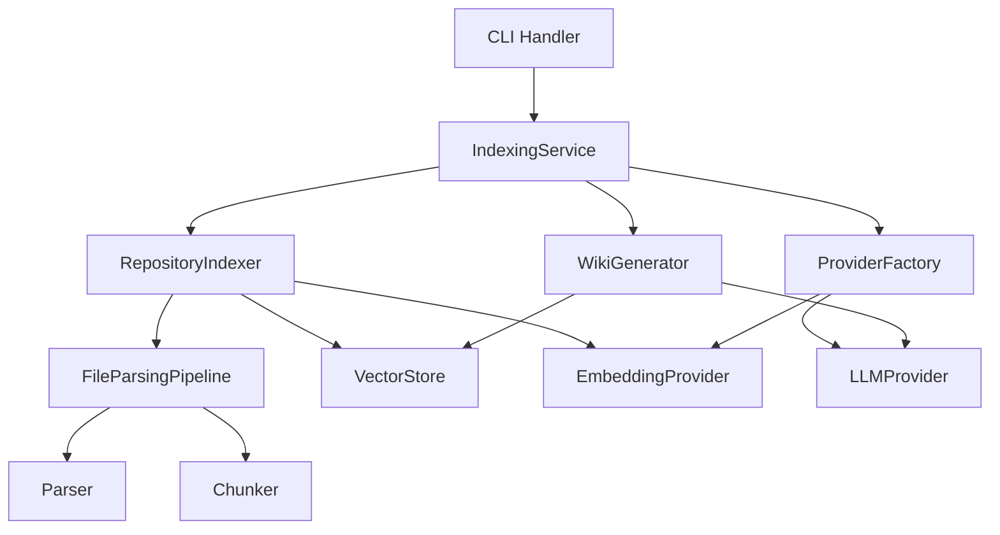

# Architecture Documentation

## 1. System Overview

This system provides a comprehensive codebase indexing and documentation generation solution for software repositories. It addresses the challenge of understanding large codebases by automatically analyzing source code, creating semantic chunks, generating embeddings, and producing structured wiki documentation. The architecture supports multiple LLM and embedding providers through abstraction layers, enabling flexible deployment in local, hybrid, or cloud environments.

The core approach is a multi-stage pipeline that parses source files, chunks code at semantic boundaries (function/class level), creates vector embeddings, stores them in a vector database, and finally generates wiki pages using LLMs. The system supports both full and incremental indexing, with progress tracking and status reporting capabilities.

## 2. Key Components

**[RepositoryIndexer](files/src/local_deepwiki/core/indexer.md)**
- Parses and indexes source code files in a repository, handling chunking, embedding, and storage
- Separates the core indexing logic from the service layer, enabling reuse in different contexts
- Depends on [FileParsingPipeline](files/src/local_deepwiki/core/parsing_pipeline.md), Parser, Chunker, [VectorStore](files/src/local_deepwiki/core/vectorstore/store.md), and [EmbeddingProvider](files/src/local_deepwiki/providers/base.md); is depended on by [IndexingService](files/src/local_deepwiki/services/indexing_service.md)

**[FileParsingPipeline](files/src/local_deepwiki/core/parsing_pipeline.md)**
- Handles parallel file parsing and chunking operations with batching and progress tracking
- Isolate the complexity of concurrent file processing and sliding window management
- Depends on Parser, Chunker, and [VectorStore](files/src/local_deepwiki/core/vectorstore/store.md); is depended on by [RepositoryIndexer](files/src/local_deepwiki/core/indexer.md)

**[IndexingService](files/src/local_deepwiki/services/indexing_service.md)**
- Orchestrates the full indexing pipeline, coordinating parsing, chunking, embedding, storage, and wiki generation
- Provides a clean interface for external callers to initiate indexing operations
- Depends on [RepositoryIndexer](files/src/local_deepwiki/core/indexer.md), [WikiGenerator](files/src/local_deepwiki/generators/wiki/generator.md), and [ProviderFactory](files/src/local_deepwiki/services/provider_factory.md); is depended on by CLI handlers

**[ProviderFactory](files/src/local_deepwiki/services/provider_factory.md)**
- Creates and manages LLM and embedding provider instances based on configuration
- Enables flexible provider selection and caching without coupling consumers to specific implementations
- Depends on configuration objects and provider modules; is depended on by [RepositoryIndexer](files/src/local_deepwiki/core/indexer.md) and [IndexingService](files/src/local_deepwiki/services/indexing_service.md)

**[WikiGenerator](files/src/local_deepwiki/generators/wiki/generator.md)**
- Generates wiki documentation pages from indexed code chunks and LLM responses
- Separates the documentation generation logic from the indexing pipeline for maintainability
- Depends on [LLMProvider](files/src/local_deepwiki/providers/base.md) and vector store; is depended on by [IndexingService](files/src/local_deepwiki/services/indexing_service.md)

**[PipelineContext](files/src/local_deepwiki/core/parsing_pipeline.md)**
- Holds shared state and dependencies for parsing pipelines
- Provides a consistent interface for passing configuration and shared resources
- Is depended on by [FileParsingPipeline](files/src/local_deepwiki/core/parsing_pipeline.md)

## 3. Data Flow

When a user indexes a repository, the data flows through the following sequence:

1. The CLI handler calls `IndexingService.run_pipeline` with an [`IndexPipelineRequest`](files/src/local_deepwiki/services/indexing_service.md)
2. [`IndexingService`](files/src/local_deepwiki/services/indexing_service.md) creates a [`RepositoryIndexer`](files/src/local_deepwiki/core/indexer.md) with the specified configuration
3. `RepositoryIndexer.index` calls `_parse_files_parallel` which delegates to `FileParsingPipeline.parse_files_parallel`
4. [`FileParsingPipeline`](files/src/local_deepwiki/core/parsing_pipeline.md) processes files in parallel using `_process_window` which handles sliding windows of futures
5. Each file is parsed by `_parse_single_file` which creates a [`FileParsingPipeline`](files/src/local_deepwiki/core/parsing_pipeline.md) and calls `parse_single_file`
6. The parser extracts code chunks using AST-aware chunking, then chunks are embedded via [`EmbeddingProvider`](files/src/local_deepwiki/providers/base.md)
7. Chunks are stored in [`VectorStore`](files/src/local_deepwiki/core/vectorstore/store.md) with embeddings
8. After indexing, [`IndexingService`](files/src/local_deepwiki/services/indexing_service.md) calls `_generate_wiki` which uses [`WikiGenerator`](files/src/local_deepwiki/generators/wiki/generator.md) to create documentation pages
9. The final [`IndexPipelineResult`](files/src/local_deepwiki/services/models.md) is returned with statistics including files indexed, chunks created, and wiki pages generated

## 4. Component Diagram

```mermaid
graph TD
    A[CLI Handler] --> B[IndexingService]
    B --> C[RepositoryIndexer]
    B --> D[WikiGenerator]
    B --> E[ProviderFactory]
    C --> F[FileParsingPipeline]
    C --> G[VectorStore]
    C --> H[EmbeddingProvider]
    F --> I[Parser]
    F --> J[Chunker]
    E --> K[LLMProvider]
    E --> H
    D --> K
    D --> G
```

## 5. Design Decisions and Trade-offs

**Async throughout**
- Chosen: All core operations use asyncio
- Why: LLM calls and I/O operations (file reading, vector store operations) are I/O-bound and benefit from concurrent execution
- Trade-off: Requires all callers to be async-aware and introduces complexity in error handling

**AST-aware chunking**
- Chosen: Code splits at function/class boundaries via tree-sitter
- Why: Semantic boundaries provide more meaningful chunks for LLM understanding than line-based or arbitrary splitting
- Trade-off: Requires language-specific parsers and adds complexity to the chunking process

**Provider abstraction**
- Chosen: LLM and embedding providers implement base classes in providers/base.py
- Why: Enables switching between different LLM providers (OpenAI, Anthropic, Ollama) without changing core logic
- Trade-off: Adds indirection layer that may impact performance slightly and requires consistent interface design

**[Config](files/src/local_deepwiki/config/models.md) hierarchy**
- Chosen: CLI args > env vars > config file > defaults
- Why: Provides flexible configuration management for different deployment scenarios
- Trade-off: Increases complexity in configuration resolution logic

**Frozen pydantic models**
- Chosen: Configuration objects are immutable
- Why: Ensures configuration consistency and prevents runtime modifications that could cause unexpected behavior
- Trade-off: Requires explicit copying when configuration changes are needed, and adds validation overhead

## Module Dependencies

For a detailed view of module interdependencies including circular dependency detection, see the [Dependency Graph](dependency-graph.md) page.

## Relevant Source Files

The following source files were used to generate this documentation:

- [`src/local_deepwiki/core/git_utils.py:28-31`](files/src/local_deepwiki/core/git_utils.md)
- [`src/local_deepwiki/core/chunker.py:50-63`](files/src/local_deepwiki/core/chunker.md)
- [`src/local_deepwiki/server.py:92-94`](files/src/local_deepwiki/server.md)
- [`src/local_deepwiki/core/vectorstore/embedding.py:20-30`](files/src/local_deepwiki/core/vectorstore/embedding.md)
- [`src/local_deepwiki/core/graph_rag/store.py:44-411`](files/src/local_deepwiki/core/graph_rag/store.md)
- [`src/local_deepwiki/config/provider_models.py:10-20`](files/src/local_deepwiki/config/provider_models.md)
- [`src/local_deepwiki/core/indexer.py:233-263`](files/src/local_deepwiki/core/indexer.md)
- `src/local_deepwiki/providers/llm/__init__.py:16-19`
- [`src/local_deepwiki/cli/init_cli.py:30-43`](files/src/local_deepwiki/cli/init_cli.md)
- [`src/local_deepwiki/web/app.py:87-96`](files/src/local_deepwiki/web/app.md)

*Showing 10 of 263 source files.*
