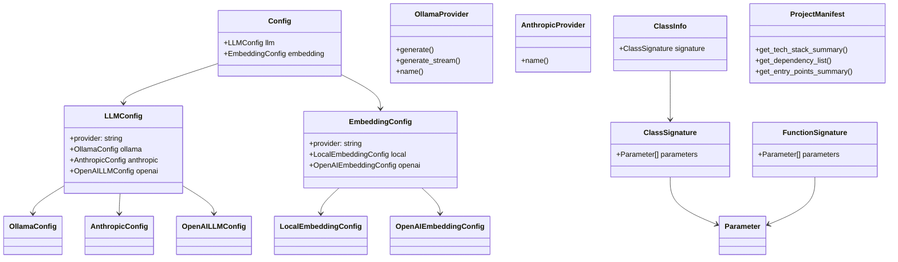

# Architecture Documentation

## System Overview

This system is a documentation generation and research platform that processes codebases to create comprehensive wiki-style documentation. The system supports multiple LLM providers (Ollama, Anthropic, OpenAI) and embedding providers (local, OpenAI) for content generation and semantic search capabilities.

The architecture follows a provider pattern for extensible AI service integration, with configurable components for parsing, chunking, and generating documentation from source code.

## Key Components

### Configuration Management
- **[Config](files/src/local_deepwiki/config.md)** - Central configuration class that manages system-wide settings
- **[LLMConfig](files/src/local_deepwiki/config.md)** - Handles configuration for language model providers with support for Ollama, Anthropic, and OpenAI
- **[EmbeddingConfig](files/src/local_deepwiki/config.md)** - Manages embedding provider configuration for local and OpenAI services
- **[AnthropicConfig](files/src/local_deepwiki/config.md)** - Specific configuration for Anthropic Claude models
- **[OllamaConfig](files/src/local_deepwiki/config.md)** - Configuration for local Ollama installations
- **[OpenAILLMConfig](files/src/local_deepwiki/config.md)** - OpenAI language model configuration
- **[LocalEmbeddingConfig](files/src/local_deepwiki/config.md)** - Configuration for local embedding models
- **[OpenAIEmbeddingConfig](files/src/local_deepwiki/config.md)** - Configuration for OpenAI embedding services

### Provider System
- **[OllamaProvider](files/src/local_deepwiki/providers/llm/ollama.md)** - Implements LLM functionality using local Ollama installations
- **[AnthropicProvider](files/src/local_deepwiki/providers/llm/anthropic.md)** - Provides integration with Anthropic's Claude models

### Code Analysis
- **[ChunkType](files/src/local_deepwiki/models.md)** - Enumeration defining different types of code chunks for processing
- **[ClassInfo](files/src/local_deepwiki/generators/diagrams.md)** - Data structure containing metadata about discovered classes
- **[ClassSignature](files/src/local_deepwiki/generators/api_docs.md)** - Represents the signature information of a class
- **[FunctionSignature](files/src/local_deepwiki/generators/api_docs.md)** - Captures function signature details
- **[Parameter](files/src/local_deepwiki/generators/api_docs.md)** - Represents function or method parameters

### Project Analysis
- **[ProjectManifest](files/src/local_deepwiki/generators/manifest.md)** - Analyzes and summarizes project structure, dependencies, and entry points

### Error Handling
- **[ResearchCancelledError](files/src/local_deepwiki/core/deep_research.md)** - Custom exception for handling cancelled research operations

## Data Flow

1. **Configuration Loading**: The [Config](files/src/local_deepwiki/config.md) class loads system settings, which are used by provider factories to instantiate appropriate AI services
2. **Code Parsing**: Source code files are processed to extract [ClassInfo](files/src/local_deepwiki/generators/diagrams.md), [ClassSignature](files/src/local_deepwiki/generators/api_docs.md), and [FunctionSignature](files/src/local_deepwiki/generators/api_docs.md) objects
3. **Provider Selection**: The get_llm_provider function uses [LLMConfig](files/src/local_deepwiki/config.md) to instantiate the appropriate provider ([OllamaProvider](files/src/local_deepwiki/providers/llm/ollama.md) or [AnthropicProvider](files/src/local_deepwiki/providers/llm/anthropic.md))
4. **Content Generation**: Providers process extracted code information to generate documentation
5. **Project Analysis**: [ProjectManifest](files/src/local_deepwiki/generators/manifest.md) analyzes the codebase structure and dependencies to provide high-level summaries

## Component Diagram

## Key Design Decisions

### Provider Pattern Implementation
The system implements a provider pattern for AI services, allowing runtime selection between different LLM and embedding providers. The get_llm_provider factory function uses configuration to instantiate the appropriate provider class, enabling easy switching between Ollama, Anthropic, and OpenAI services.

### Configuration-Driven Architecture
All major components are configured through Pydantic models ([Config](files/src/local_deepwiki/config.md), [LLMConfig](files/src/local_deepwiki/config.md), [EmbeddingConfig](files/src/local_deepwiki/config.md)), providing type safety and validation. This approach centralizes configuration management and makes the system easily configurable for different deployment scenarios.

### Structured Code Analysis
The system uses dedicated data classes ([ClassInfo](files/src/local_deepwiki/generators/diagrams.md), [ClassSignature](files/src/local_deepwiki/generators/api_docs.md), [FunctionSignature](files/src/local_deepwiki/generators/api_docs.md), [Parameter](files/src/local_deepwiki/generators/api_docs.md)) to represent code structure, enabling systematic analysis and documentation generation. This structured approach allows for consistent processing across different programming languages.

### Modular Testing Strategy
The extensive test coverage shown in the test classes indicates a modular design where each component can be tested independently. Test classes like TestGetLLMProvider and TestGetEmbeddingProvider validate the provider factory pattern implementation.

### Error Handling Strategy
Custom exceptions like [ResearchCancelledError](files/src/local_deepwiki/core/deep_research.md) provide specific error handling for domain-specific operations, allowing for graceful handling of interrupted or cancelled processes.

## Workflow Sequences

The following diagrams show how data flows through key operations:

### Indexing Pipeline

### Wiki Generation Pipeline

### Deep Research Pipeline

## Relevant Source Files

The following source files were used to generate this documentation:

- `tests/test_provider_factories.py:21-99`
- `tests/test_parser.py:24-123`
- `tests/test_retry.py:8-144`
- `tests/test_ollama_health.py:16-19`
- `tests/test_server_handlers.py:15-75`
- `tests/test_chunker.py:13-428`
- `tests/test_changelog.py:18-96`
- `tests/test_vectorstore.py:9-28`
- `tests/test_wiki_coverage.py:50-120`
- `tests/test_pdf_export.py:23-82`

*Showing 10 of 91 source files.*
