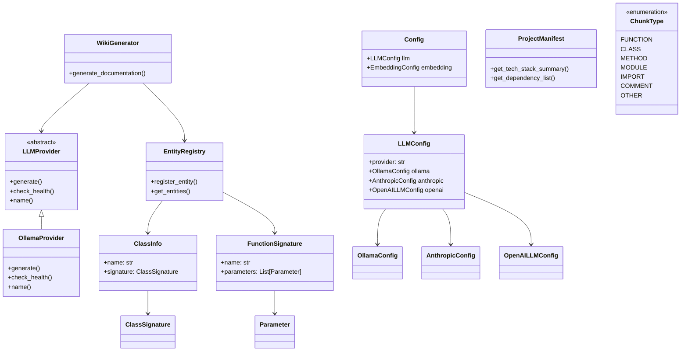

# Architecture Documentation

## System Overview

The local-deepwiki system is a documentation generation tool that uses multiple LLM providers to analyze codebases and generate comprehensive wiki documentation. The system is built around a flexible provider architecture that supports different LLM services (Ollama, Anthropic, OpenAI) and embedding providers for semantic analysis.

## Key Components

### Configuration System

The **[Config](files/src/local_deepwiki/config.md)** class serves as the central configuration hub, managing settings for all system components. The **[LLMConfig](files/src/local_deepwiki/config.md)** class specifically handles LLM provider selection and configuration, supporting three providers through dedicated configuration classes:

- **[OllamaConfig](files/src/local_deepwiki/config.md)** - Manages local Ollama deployment settings with configurable model and API URL
- **[AnthropicConfig](files/src/local_deepwiki/config.md)** - Handles Anthropic Claude model configuration  
- **[OpenAILLMConfig](files/src/local_deepwiki/config.md)** - Manages OpenAI model settings

The **[EmbeddingConfig](files/src/local_deepwiki/config.md)** class manages embedding provider configuration, supporting both local and OpenAI-based embedding services.

### LLM Provider Architecture

The **[LLMProvider](files/src/local_deepwiki/providers/base.md)** abstract base class defines the interface for all LLM implementations. The **[OllamaProvider](files/src/local_deepwiki/providers/llm/ollama.md)** class implements this interface for local Ollama deployments, providing health checking and streaming generation capabilities.

The `get_llm_provider` function acts as a factory, instantiating the appropriate provider based on configuration settings.

### Data Models

The **[ChunkType](files/src/local_deepwiki/models.md)** enum defines the types of code elements the system can process (functions, classes, methods, modules, imports, comments, and other code structures).

The **[ProjectManifest](files/src/local_deepwiki/generators/manifest.md)** class manages project metadata and dependency analysis, providing methods to categorize dependencies and generate technology stack summaries.

### Code Analysis Components

The **[EntityRegistry](files/src/local_deepwiki/generators/crosslinks.md)** class manages the registration and tracking of code entities during analysis. Supporting classes include:

- **[ClassInfo](files/src/local_deepwiki/generators/diagrams.md)** and **[ClassSignature](files/src/local_deepwiki/generators/api_docs.md)** - Handle class metadata and structure analysis
- **[FunctionSignature](files/src/local_deepwiki/generators/api_docs.md)** and **[Parameter](files/src/local_deepwiki/generators/api_docs.md)** - Manage function analysis and parameter extraction
- **[UsageExample](files/src/local_deepwiki/generators/test_examples.md)** - Stores code usage examples for documentation

### Documentation Generation

The **[WikiGenerator](files/src/local_deepwiki/generators/wiki.md)** class orchestrates the documentation generation process, coordinating between code analysis, LLM providers, and output formatting.

### Error Handling

The **[ResearchCancelledError](files/src/local_deepwiki/core/deep_research.md)** exception provides specific error handling for cancelled research operations.

## Data Flow

1. **Configuration Loading**: The system loads configuration through the [Config](files/src/local_deepwiki/config.md) class, determining which LLM and embedding providers to use
2. **Provider Initialization**: Based on configuration, appropriate provider instances are created via the factory function
3. **Code Analysis**: The system processes source code, categorizing elements using [ChunkType](files/src/local_deepwiki/models.md) and storing metadata in [EntityRegistry](files/src/local_deepwiki/generators/crosslinks.md)
4. **Documentation Generation**: [WikiGenerator](files/src/local_deepwiki/generators/wiki.md) coordinates with LLM providers to generate documentation content
5. **Output Processing**: Generated content is formatted and exported to the html-export directory structure

## Component Diagram

## Key Design Decisions

### Provider Pattern Implementation
The system implements a provider pattern for LLM services, allowing runtime selection between different AI providers. This is evident in the [LLMConfig](files/src/local_deepwiki/config.md) class supporting multiple provider configurations and the factory function that instantiates the appropriate provider.

### Configuration-Driven Architecture
The extensive configuration system using Pydantic models enables flexible deployment scenarios. Each provider has its own configuration class with sensible defaults, allowing users to customize behavior without code changes.

### Enumerated Code Types
The [ChunkType](files/src/local_deepwiki/models.md) enum provides a standardized way to categorize different code elements, ensuring consistent processing across the analysis pipeline.

### Separation of Concerns
The architecture clearly separates code analysis ([EntityRegistry](files/src/local_deepwiki/generators/crosslinks.md), [ClassInfo](files/src/local_deepwiki/generators/diagrams.md)), content generation ([WikiGenerator](files/src/local_deepwiki/generators/wiki.md)), and provider management ([LLMProvider](files/src/local_deepwiki/providers/base.md) hierarchy), making the system modular and testable.

### Health Checking
The LLM provider interface includes health checking capabilities, allowing the system to verify provider availability before attempting generation operations.

## Workflow Sequences

The following diagrams show how data flows through key operations:

### Indexing Pipeline

### Wiki Generation Pipeline

### Deep Research Pipeline

## Relevant Source Files

The following source files were used to generate this documentation:

- [`tests/test_parser.py:24-123`](files/tests/test_parser.md)
- [`tests/test_retry.py:8-144`](files/tests/test_retry.md)
- `tests/test_ollama_health.py:16-19`
- `tests/test_server_handlers.py:15-69`
- `tests/test_chunker.py:11-182`
- `tests/test_changelog.py:18-96`
- [`tests/test_vectorstore.py:9-28`](files/tests/test_vectorstore.md)
- `tests/test_pdf_export.py:21-80`
- `tests/test_search.py:20-53`
- `tests/test_toc.py:17-43`

*Showing 10 of 76 source files.*
