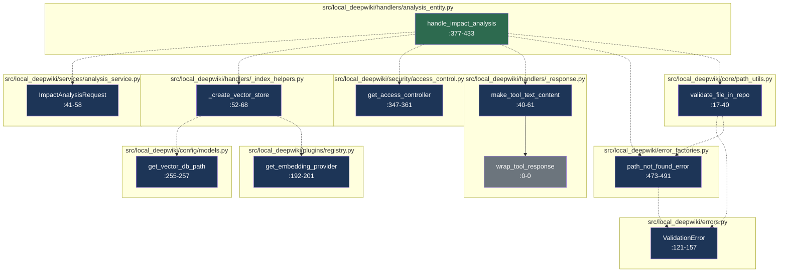

# Codemap: How handle_impact_analysis Works

> Entry point: [`handle_impact_analysis`](../files/src/local_deepwiki/handlers/analysis_entity.md) in `src/local_deepwiki/handlers/analysis_entity.py`

## Execution Flow

## Trace

## Summary
This code flow implements the impact analysis functionality that determines the blast radius of changes to a file or entity by examining multiple dependency types including reverse call graphs, inheritance relationships, file imports, and wiki documentation. The [`handle_impact_analysis`](../files/src/local_deepwiki/handlers/analysis_entity.md) function serves as the main entry point that orchestrates the analysis process by validating inputs, creating necessary components like vector stores, and coordinating various analysis services to [collect](../files/src/local_deepwiki/web/routes_chat.md) information about affected entities.

## Execution Trace
1. [`handle_impact_analysis`](../files/src/local_deepwiki/handlers/analysis_entity.md) (src/local_deepwiki/handlers/analysis_entity.py:377-433) - Main function that processes impact analysis requests by validating arguments, creating vector stores, and calling analysis services
   - Calls [`ImpactAnalysisArgs`](../files/src/local_deepwiki/models/tool_args.md) (src/local_deepwiki/models/tool_args.py:375-401) to validate and parse input arguments
   - Calls [`validate_file_in_repo`](../files/src/local_deepwiki/core/path_utils.md) (src/local_deepwiki/core/path_utils.py:17-40) to ensure the file path is valid and within repository bounds
   - Calls `_create_vector_store` (src/local_deepwiki/handlers/_index_helpers.py:52-68) to initialize the vector database for semantic analysis
   - Calls [`get_access_controller`](../files/src/local_deepwiki/security/access_control.md) (src/local_deepwiki/security/access_control.py:347-361) to verify access permissions

2. `_create_vector_store` (src/local_deepwiki/handlers/_index_helpers.py:52-68) - Creates a vector store with configured embedding provider for semantic similarity analysis
   - Calls `Config.get_vector_db_path` (src/local_deepwiki/config/models.py:255-257) to determine the vector database path
   - Calls `PluginRegistry.get_embedding_provider` (src/local_deepwiki/plugins/registry.py:192-201) to get the embedding provider plugin

3. [`ImpactAnalysisRequest`](../files/src/local_deepwiki/services/analysis_service.md) (src/local_deepwiki/services/analysis_service.py:41-58) - Creates an immutable request object containing analysis parameters
   - Calls [`CallGraphExtractor`](../files/src/local_deepwiki/generators/analysis/callgraph.md) (src/local_deepwiki/generators/analysis/callgraph.py:314-382) to initialize the call graph extraction component

4. Various analysis collection functions are called in sequence:
   - `_collect_reverse_calls` (src/local_deepwiki/services/analysis_service.py:615-678) - Extracts reverse call graph information
   - `_collect_inheritance_dependents` (src/local_deepwiki/services/analysis_service.py:681-721) - Finds inheritance-based dependents
   - `_collect_file_dependents` (src/local_deepwiki/services/analysis_service.py:724-767) - Identifies file import dependents
   - `_collect_affected_wiki_pages` (src/local_deepwiki/services/analysis_service.py:770-797) - Finds wiki documentation that references the file

5. Final processing:
   - Calls [`make_tool_text_content`](../files/src/local_deepwiki/handlers/_response.md) (src/local_deepwiki/handlers/_response.py:40-61) to format the results
   - Calls [`wrap_tool_response`](../files/src/local_deepwiki/handlers/_response.md) (src/local_deepwiki/handlers/_response.py:12-37) to wrap the response in a standard JSON envelope

## Key Observations
- The code follows a service-oriented architecture where different analysis components (call graph, inheritance, file dependencies, wiki pages) are handled by separate functions that [collect](../files/src/local_deepwiki/web/routes_chat.md) specific types of information
- Input validation is comprehensive, checking file paths against repository boundaries and using structured validation through pydantic models
- The design uses dependency injection patterns where components like vector stores and embedding providers are created through factory methods rather than direct instantiation
- Error handling is robust with specific error types like [`ValidationError`](../files/src/local_deepwiki/errors.md) and proper path validation to prevent security issues like path traversal attacks

## Statistics

| Metric | Value |
|--------|-------|
| Nodes | 11 |
| Edges | 12 |
| Cross-file edges | 11 |
| Files involved | 10 |

## Files Involved

- [`src/local_deepwiki/config/models.py`](../files/src/local_deepwiki/config/models.md)
- [`src/local_deepwiki/core/path_utils.py`](../files/src/local_deepwiki/core/path_utils.md)
- [`src/local_deepwiki/error_factories.py`](../files/src/local_deepwiki/error_factories.md)
- [`src/local_deepwiki/errors.py`](../files/src/local_deepwiki/errors.md)
- [`src/local_deepwiki/handlers/_index_helpers.py`](../files/src/local_deepwiki/handlers/_index_helpers.md)
- [`src/local_deepwiki/handlers/_response.py`](../files/src/local_deepwiki/handlers/_response.md)
- [`src/local_deepwiki/handlers/analysis_entity.py`](../files/src/local_deepwiki/handlers/analysis_entity.md)
- [`src/local_deepwiki/plugins/registry.py`](../files/src/local_deepwiki/plugins/registry.md)
- [`src/local_deepwiki/security/access_control.py`](../files/src/local_deepwiki/security/access_control.md)
- [`src/local_deepwiki/services/analysis_service.py`](../files/src/local_deepwiki/services/analysis_service.md)

## Relevant Source Files

- [`src/local_deepwiki/handlers/analysis_entity.py:46-55`](../files/src/local_deepwiki/handlers/analysis_entity.md)
