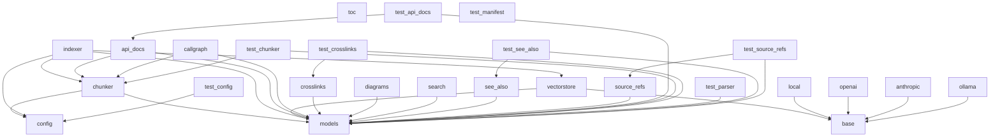

# Dependencies Overview

## External Dependencies

| Dependency                  | Purpose                                                                 |
|-----------------------------|-------------------------------------------------------------------------|
| anthropic                   | Provides access to Anthropic's AI models, likely used for LLM interactions. |
| flask                       | Web framework for building the application's API and web interface.     |
| lancedb                     | Vector database for storing and querying embeddings and vector data.    |
| markdown                    | Library for parsing and rendering Markdown text.                        |
| mcp                         | Likely used for Model Control Protocol interactions or similar.         |
| ollama                      | Interface for interacting with locally hosted LLMs via Ollama.          |
| openai                      | Client library for interacting with OpenAI's API for LLMs and embeddings. |
| pandas                      | Data manipulation and analysis library.                                 |
| pydantic                    | Data validation and settings management using Python type annotations.  |
| pyyaml                      | YAML parsing and serialization.                                         |
| rich                        | Library for rich text and beautiful formatting in the terminal.         |
| sentence-transformers       | Provides pre-trained models for generating sentence embeddings.         |
| tree-sitter                 | Parser library for parsing code in multiple languages.                  |
| tree-sitter-c               | Tree-sitter grammar for C language parsing.                             |
| tree-sitter-cpp             | Tree-sitter grammar for C++ language parsing.                           |
| tree-sitter-go              | Tree-sitter grammar for Go language parsing.                            |
| tree-sitter-java            | Tree-sitter grammar for Java language parsing.                          |
| tree-sitter-javascript      | Tree-sitter grammar for JavaScript language parsing.                    |
| tree-sitter-python          | Tree-sitter grammar for Python language parsing.                        |
| tree-sitter-rust            | Tree-sitter grammar for Rust language parsing.                          |
| tree-sitter-swift           | Tree-sitter grammar for Swift language parsing.                         |
| tree-sitter-typescript      | Tree-sitter grammar for TypeScript language parsing.                    |
| watchdog                    | File system monitoring library for watching changes in directories.     |

## Dev Dependencies

| Dependency             | Purpose                                   |
|------------------------|-------------------------------------------|
| pytest                 | Testing framework for Python.             |
| pytest-asyncio         | Plugin for pytest to support async testing. |

## Internal Module Dependencies

The internal modules of the application are structured with clear dependencies based on import statements. Below is a breakdown of how these modules depend on each other.

### Configuration and Models

- `local_deepwiki.config` depends on `pyyaml` and `pydantic` for configuration handling and validation.
- `local_deepwiki.models` depends on `pydantic` for data models and type validation.

### Core Functionality

- `local_deepwiki.core.chunker` depends on `tree_sitter` and `local_deepwiki.core.parser` for parsing code into chunks.
- `local_deepwiki.core.parser` depends on `tree_sitter` for parsing code nodes.
- `local_deepwiki.core.vectorstore` depends on `lancedb` and `local_deepwiki.providers.base` for vector storage and embedding handling.

### Providers

- `local_deepwiki.providers.base` defines abstract base classes for `EmbeddingProvider` and `LLMProvider`.
- `local_deepwiki.providers.embeddings` depends on `local_deepwiki.providers.base`, `sentence_transformers`, and `openai` for local and OpenAI embedding providers.
- `local_deepwiki.providers.llm.ollama` depends on `local_deepwiki.providers.base` and `ollama` for Ollama LLM interactions.

### Generators

- `local_deepwiki.generators.api_docs` depends on `tree_sitter`, `local_deepwiki.core.parser`, and `local_deepwiki.core.chunker` for extracting and formatting API documentation.
- `local_deepwiki.generators.callgraph` depends on `tree_sitter`, `local_deepwiki.core.parser`, and `local_deepwiki.core.chunker` for generating call graphs.
- `local_deepwiki.generators.crosslinks` depends on `local_deepwiki.models` and `re` for adding cross-links.
- `local_deepwiki.generators.diagrams` depends on `local_deepwiki.models`.
- `local_deepwiki.generators.search` depends on `local_deepwiki.models`.
- `local_deepwiki.generators.see_also` depends on `local_deepwiki.models` and `re` for generating "see also" sections.
- `local_deepwiki.generators.source_refs` depends on `local_deepwiki.models`.
- `local_deepwiki.generators.toc` depends on `local_deepwiki.models` and `json`.

### Test Modules

- Test modules depend on various internal modules to validate functionality, such as `local_deepwiki.generators.api_docs`, `local_deepwiki.core.chunker`, `local_deepwiki.core.parser`, and `local_deepwiki.models`.

This structure ensures a clear separation of concerns and modularity, allowing for easy maintenance and testing of individual components.

## Module Dependency Graph

The following diagram shows internal module dependencies:

## Relevant Source Files

The following source files were used to generate this documentation:

- `tests/test_parser.py`
- [`tests/test_chunker.py`](files/tests/test_chunker.md)
- `tests/test_search.py`
- `tests/test_toc.py`
- [`tests/test_incremental_wiki.py`](files/tests/test_incremental_wiki.md)
- `tests/test_web.py`
- `tests/__init__.py`
- `tests/test_manifest.py`
- [`tests/test_api_docs.py`](files/tests/test_api_docs.md)
- [`tests/test_see_also.py`](files/tests/test_see_also.md)

*Showing 10 of 48 source files.*
