# Dependencies Overview

## External Dependencies

| Dependency                | Purpose                                                                                                                                 |
|--------------------------|-----------------------------------------------------------------------------------------------------------------------------------------|
| `anthropic` (>=0.40)     | Provides access to Anthropic's AI models, likely used for LLM-based features.                                                           |
| `flask` (>=3.0)          | Web framework for building the API server and handling HTTP requests.                                                                   |
| `lancedb` (>=0.15)       | Vector database for storing and retrieving embeddings for semantic search and retrieval.                                                |
| `markdown` (>=3.0)       | Library for parsing and rendering Markdown text.                                                                                        |
| `mcp` (>=1.2.0)          | Likely used for managing model configuration and prompting.                                                                             |
| `ollama` (>=0.4)         | Interface to Ollama's local LLM inference engine.                                                                                       |
| `openai` (>=1.0)         | Client library for interacting with OpenAI's API, used for external LLM and embedding services.                                         |
| `pandas` (>=2.0)         | Data manipulation and analysis library, used for processing structured data.                                                            |
| `pydantic` (>=2.0)       | Data validation and settings management using Python type annotations.                                                                  |
| `pyyaml` (>=6.0)         | YAML parsing and serialization for configuration files.                                                                                 |
| `rich` (>=13.0)          | Library for rich text and beautiful formatting in the terminal.                                                                         |
| `sentence-transformers` (>=3.0) | Library for generating sentence and document embeddings using transformer models.                                                |
| `tree-sitter` (>=0.23)   | Parser library for parsing source code into syntax trees for analysis.                                                                  |
| `tree-sitter-c` (>=0.23) | Tree-sitter parser for C language.                                                                                                      |
| `tree-sitter-c-sharp` (>=0.23) | Tree-sitter parser for C# language.                                                                                               |
| `tree-sitter-cpp` (>=0.23) | Tree-sitter parser for C++ language.                                                                                               |
| `tree-sitter-go` (>=0.23) | Tree-sitter parser for Go language.                                                                                                    |
| `tree-sitter-java` (>=0.23) | Tree-sitter parser for Java language.                                                                                               |
| `tree-sitter-javascript` (>=0.23) | Tree-sitter parser for JavaScript language.                                                                                   |
| `tree-sitter-kotlin` (>=0.23) | Tree-sitter parser for Kotlin language.                                                                                           |
| `tree-sitter-php` (>=0.23) | Tree-sitter parser for PHP language.                                                                                                 |
| `tree-sitter-python` (>=0.23) | Tree-sitter parser for Python language.                                                                                            |
| `tree-sitter-ruby` (>=0.23) | Tree-sitter parser for Ruby language.                                                                                               |
| `tree-sitter-rust` (>=0.23) | Tree-sitter parser for Rust language.                                                                                               |
| `tree-sitter-swift` (>=0.0.1) | Tree-sitter parser for Swift language.                                                                                            |
| `tree-sitter-typescript` (>=0.23) | Tree-sitter parser for TypeScript language.                                                                                     |
| `watchdog` (>=4.0)       | File system monitoring library, likely used for watching repository changes.                                                            |
| `weasyprint` (>=62.0)    | Library for converting HTML to PDF, used for exporting wikis to PDF format.                                                             |

## Dev Dependencies

| Dependency              | Purpose                                                                 |
|------------------------|-------------------------------------------------------------------------|
| `black` (>=24.0)       | Code formatter to enforce consistent code style.                        |
| `isort` (>=5.0)        | Tool to sort and organize import statements.                            |
| `mypy` (>=1.0)         | Static type checker for Python.                                         |
| `pre-commit` (>=3.0)   | Framework for managing and maintaining pre-commit hooks.                |
| `pytest` (>=8.0)       | Testing framework for running unit and integration tests.               |
| `pytest-asyncio` (>=0.24) | Plugin for pytest to support async test functions.                   |
| `types-Markdown` (>=3.0) | Type stubs for the `markdown` library.                                |
| `types-PyYAML` (>=6.0) | Type stubs for the `pyyaml` library.                                    |

## Internal Module Dependencies

- `local_deepwiki.generators.crosslinks` depends on:
  - `local_deepwiki.models` (imports [`ChunkType`](files/src/local_deepwiki/models.md), [`CodeChunk`](files/src/local_deepwiki/models.md), [`WikiPage`](files/src/local_deepwiki/models.md))

- `local_deepwiki.validation` depends on:
  - `local_deepwiki.models` (imports [`Language`](files/src/local_deepwiki/models.md))

- `local_deepwiki.providers` depends on:
  - `local_deepwiki.providers.base` (imports [`EmbeddingProvider`](files/src/local_deepwiki/providers/base.md), [`LLMProvider`](files/src/local_deepwiki/providers/base.md))

- `local_deepwiki.generators.toc` depends on:
  - `local_deepwiki.models` (imports [`ChunkType`](files/src/local_deepwiki/models.md), [`CodeChunk`](files/src/local_deepwiki/models.md), [`WikiPage`](files/src/local_deepwiki/models.md))

- `local_deepwiki.generators.see_also` depends on:
  - `local_deepwiki.models` (imports [`ChunkType`](files/src/local_deepwiki/models.md), [`CodeChunk`](files/src/local_deepwiki/models.md), [`WikiPage`](files/src/local_deepwiki/models.md))

- `local_deepwiki.generators.diagrams` depends on:
  - `local_deepwiki.models` (imports [`ChunkType`](files/src/local_deepwiki/models.md), [`IndexStatus`](files/src/local_deepwiki/models.md))

- `local_deepwiki.generators.api_docs` depends on:
  - `local_deepwiki.core.parser` (imports [`CodeParser`](files/src/local_deepwiki/core/parser.md))
  - `local_deepwiki.models` (imports [`Language`](files/src/local_deepwiki/models.md))

- `local_deepwiki.generators.test_examples` depends on:
  - `local_deepwiki.models` (imports [`Language`](files/src/local_deepwiki/models.md))

- `local_deepwiki.generators.context_builder` depends on:
  - `local_deepwiki.models` (imports [`ChunkType`](files/src/local_deepwiki/models.md), [`CodeChunk`](files/src/local_deepwiki/models.md), [`Language`](files/src/local_deepwiki/models.md))

- `local_deepwiki.generators.source_refs` depends on:
  - `local_deepwiki.models` (imports [`WikiPage`](files/src/local_deepwiki/models.md), [`WikiPageStatus`](files/src/local_deepwiki/models.md))

- `local_deepwiki.core.parser` depends on:
  - `local_deepwiki.models` (imports [`Language`](files/src/local_deepwiki/models.md))

- `local_deepwiki.providers.embeddings` depends on:
  - `local_deepwiki.config` (imports [`EmbeddingConfig`](files/src/local_deepwiki/config.md), [`get_config`](files/src/local_deepwiki/config.md))
  - `local_deepwiki.providers.base` (imports [`EmbeddingProvider`](files/src/local_deepwiki/providers/base.md))
  - `local_deepwiki.providers.embeddings.local` (imports [`LocalEmbeddingProvider`](files/src/local_deepwiki/providers/embeddings/local.md))
  - `local_deepwiki.providers.embeddings.openai` (imports [`OpenAIEmbeddingProvider`](files/src/local_deepwiki/providers/embeddings/openai.md))

- `local_deepwiki.export` depends on:
  - `local_deepwiki.export.html` (imports [`HtmlExporter`](files/src/local_deepwiki/export/html.md), [`export_to_html`](files/src/local_deepwiki/export/html.md))
  - `local_deepwiki.export` (imports `pdf`)

- `local_deepwiki.generators.callgraph` depends on:
  - `local_deepwiki.core.chunker` (imports `CLASS_NODE_TYPES`, `FUNCTION_NODE_TYPES`)
  - `local_deepwiki.core.parser` (imports [`CodeParser`](files/src/local_deepwiki/core/parser.md), [`find_nodes_by_type`](files/src/local_deepwiki/core/parser.md), [`get_node_name`](files/src/local_deepwiki/core/parser.md), [`get_node_text`](files/src/local_deepwiki/core/parser.md))
  - `local_deepwiki.models` (imports [`Language`](files/src/local_deepwiki/models.md))

- `local_deepwiki.generators.glossary` depends on:
  - `local_deepwiki.core.vectorstore` (imports [`VectorStore`](files/src/local_deepwiki/core/vectorstore.md))
  - `local_deepwiki.models` (imports [`ChunkType`](files/src/local_deepwiki/models.md), [`IndexStatus`](files/src/local_deepwiki/models.md))

- `local_deepwiki.core.chunker` depends on:
  - `local_deepwiki.config` (imports [`ChunkingConfig`](files/src/local_deepwiki/config.md), [`get_config`](files/src/local_deepwiki/config.md))
  - `local_deepwiki.core.parser` (imports [`CodeParser`](files/src/local_deepwiki/core/parser.md), [`find_nodes_by_type`](files/src/local_deepwiki/core/parser.md), [`get_docstring`](files/src/local_deepwiki/core/parser.md), [`get_node_name`](files/src/local_deepwiki/core/parser.md), [`get_node_text`](files/src/local_deepwiki/core/parser.md))
  - `local_deepwiki.logging` (imports [`get_logger`](files/src/local_deepwiki/logging.md))
  - `local_deepwiki.models` (imports [`ChunkType`](files/src/local_deepwiki/models.md), [`CodeChunk`](files/src/local_deepwiki/models.md), [`Language`](files/src/local_deepwiki/models.md))

- `local_deepwiki.providers.embeddings.openai` depends on:
  - `openai` (imports `AsyncOpenAI`)
  - `local_deepwiki.providers.base` (imports [`EmbeddingProvider`](files/src/local_deepwiki/providers/base.md))

## Module Dependency Graph

The following diagram shows module dependencies. Click on a module to view its documentation. External dependencies are shown with dashed borders.

```mermaid
flowchart TD
    subgraph config[Config]
        M0[config]
    end
    subgraph core[Core]
        M1[chunker]
        M2[deep_research]
        M3[git_utils]
        M4[indexer]
        M5[llm_cache]
        M6[parser]
        M7[vectorstore]
    end
    subgraph export[Export]
        M8[html]
        M9[pdf]
    end
    subgraph generators[Generators]
        M10[api_docs]
        M11[callgraph]
        M12[context_builder]
        M13[coverage]
        M14[crosslinks]
        M15[diagrams]
        M16[glossary]
        M17[inheritance]
        M18[manifest]
        M19[search]
        M20[see_also]
        M21[source_refs]
        M22[stale_detection]
        M23[test_examples]
        M24[toc]
        M25[wiki]
        M26[wiki_files]
        M27[wiki_modules]
        M28[wiki_pages]
        M29[wiki_status]
    end
    subgraph handlers[Handlers]
        M30[handlers]
    end
    subgraph logging[Logging]
        M31[logging]
    end
    subgraph models[Models]
        M32[models]
    end
    subgraph providers[Providers]
        M33[base]
        M34[embeddings]
        M35[local]
        M36[openai]
        M37[llm]
    end
    subgraph server[Server]
        M38[server]
    end
    subgraph validation[Validation]
        M39[validation]
    end
    subgraph external[External Dependencies]
        E0([pathlib]):::external
        E1([typing]):::external
        E2([re]):::external
        E3([dataclasses]):::external
        E4([json]):::external
        E5([lancedb]):::external
        E6([asyncio]):::external
        E7([time]):::external
        E8([mcp]):::external
        E9([tree_sitter]):::external
    end
    M1 --> M0
    M1 --> M6
    M1 --> M31
    M1 --> M32
    M3 --> M31
    M4 --> M0
    M4 --> M1
    M4 --> M6
    M4 --> M7
    M4 --> M31
    M4 --> M32
    M4 --> M34
    M5 --> M0
    M5 --> M31
    M5 --> M33
    M7 --> M31
    M7 --> M32
    M7 --> M33
    M9 --> M31
    M10 --> M1
    M10 --> M6
    M10 --> M32
    M11 --> M1
    M11 --> M6
    M11 --> M32
    M13 --> M7
    M13 --> M32
    M14 --> M32
    M15 --> M32
    M16 --> M7
    M16 --> M32
    M17 --> M7
    M17 --> M15
    M17 --> M32
    M18 --> M31
    M19 --> M7
    M19 --> M32
    M20 --> M32
    M21 --> M32
    M25 --> M0
    M25 --> M3
    M25 --> M7
    M25 --> M13
    M25 --> M14
    M25 --> M16
    M25 --> M17
    M25 --> M18
    M25 --> M19
    M25 --> M20
    M25 --> M21
    M25 --> M22
    M25 --> M24
    M25 --> M26
    M25 --> M27
    M25 --> M28
    M25 --> M29
    M25 --> M31
    M25 --> M32
    M25 --> M37
    M26 --> M0
    M26 --> M3
    M26 --> M7
    M26 --> M10
    M26 --> M11
    M26 --> M12
    M26 --> M14
    M26 --> M15
    M26 --> M23
    M26 --> M29
    M26 --> M31
    M26 --> M32
    M26 --> M33
    M30 --> M0
    M30 --> M2
    M30 --> M4
    M30 --> M7
    M30 --> M8
    M30 --> M9
    M30 --> M25
    M30 --> M31
    M30 --> M32
    M30 --> M34
    M30 --> M37
    M30 --> M39
    M35 --> M33
    M36 --> M33
    M38 --> M30
    M38 --> M31
    M39 --> M32
    M0 -.-> E0
    M0 -.-> E1
    M1 -.-> E0
    M1 -.-> E9
    M1 -.-> E1
    M3 -.-> E3
    M3 -.-> E0
    M3 -.-> E2
    M4 -.-> E4
    M4 -.-> E0
    M4 -.-> E7
    M5 -.-> E5
    M5 -.-> E0
    M5 -.-> E7
    M5 -.-> E1
    M7 -.-> E4
    M7 -.-> E5
    M7 -.-> E0
    M7 -.-> E1
    M9 -.-> E4
    M9 -.-> E0
    M9 -.-> E2
    M9 -.-> E1
    M10 -.-> E3
    M10 -.-> E0
    M10 -.-> E2
    M10 -.-> E9
    M11 -.-> E0
    M11 -.-> E9
    M13 -.-> E3
    M13 -.-> E0
    M14 -.-> E3
    M14 -.-> E0
    M14 -.-> E2
    M15 -.-> E3
    M15 -.-> E0
    M15 -.-> E2
    M16 -.-> E3
    M16 -.-> E0
    M17 -.-> E3
    M17 -.-> E0
    M18 -.-> E3
    M18 -.-> E4
    M18 -.-> E0
    M18 -.-> E2
    M18 -.-> E1
    M19 -.-> E4
    M19 -.-> E0
    M19 -.-> E2
    M20 -.-> E3
    M20 -.-> E0
    M20 -.-> E2
    M21 -.-> E0
    M21 -.-> E2
    M24 -.-> E3
    M24 -.-> E4
    M24 -.-> E0
    M24 -.-> E1
    M25 -.-> E6
    M25 -.-> E4
    M25 -.-> E0
    M25 -.-> E7
    M26 -.-> E6
    M26 -.-> E0
    M26 -.-> E2
    M26 -.-> E7
    M26 -.-> E1
    M30 -.-> E6
    M30 -.-> E4
    M30 -.-> E8
    M30 -.-> E0
    M30 -.-> E1
    M31 -.-> E1
    M32 -.-> E4
    M32 -.-> E0
    M32 -.-> E1
    M35 -.-> E1
    M38 -.-> E6
    M38 -.-> E8
    M38 -.-> E1
    M39 -.-> E1
    click M0 "files/src/local_deepwiki/config.md"
    click M1 "files/src/local_deepwiki/core/chunker.md"
    click M2 "files/src/local_deepwiki/core/deep_research.md"
    click M3 "files/src/local_deepwiki/core/git_utils.md"
    click M4 "files/src/local_deepwiki/core/indexer.md"
    click M5 "files/src/local_deepwiki/core/llm_cache.md"
    click M6 "files/src/local_deepwiki/core/parser.md"
    click M7 "files/src/local_deepwiki/core/vectorstore.md"
    click M8 "files/src/local_deepwiki/export/html.md"
    click M9 "files/src/local_deepwiki/export/pdf.md"
    click M10 "files/src/local_deepwiki/generators/api_docs.md"
    click M11 "files/src/local_deepwiki/generators/callgraph.md"
    click M12 "files/src/local_deepwiki/generators/context_builder.md"
    click M13 "files/src/local_deepwiki/generators/coverage.md"
    click M14 "files/src/local_deepwiki/generators/crosslinks.md"
    click M15 "files/src/local_deepwiki/generators/diagrams.md"
    click M16 "files/src/local_deepwiki/generators/glossary.md"
    click M17 "files/src/local_deepwiki/generators/inheritance.md"
    click M18 "files/src/local_deepwiki/generators/manifest.md"
    click M19 "files/src/local_deepwiki/generators/search.md"
    click M20 "files/src/local_deepwiki/generators/see_also.md"
    click M21 "files/src/local_deepwiki/generators/source_refs.md"
    click M22 "files/src/local_deepwiki/generators/stale_detection.md"
    click M23 "files/src/local_deepwiki/generators/test_examples.md"
    click M24 "files/src/local_deepwiki/generators/toc.md"
    click M25 "files/src/local_deepwiki/generators/wiki.md"
    click M26 "files/src/local_deepwiki/generators/wiki_files.md"
    click M27 "files/src/local_deepwiki/generators/wiki_modules.md"
    click M28 "files/src/local_deepwiki/generators/wiki_pages.md"
    click M29 "files/src/local_deepwiki/generators/wiki_status.md"
    click M30 "files/src/local_deepwiki/handlers.md"
    click M31 "files/src/local_deepwiki/logging.md"
    click M32 "files/src/local_deepwiki/models.md"
    click M33 "files/src/local_deepwiki/providers/base.md"
    click M34 "files/src/local_deepwiki/providers/embeddings.md"
    click M35 "files/src/local_deepwiki/providers/embeddings/local.md"
    click M36 "files/src/local_deepwiki/providers/embeddings/openai.md"
    click M37 "files/src/local_deepwiki/providers/llm.md"
    click M38 "files/src/local_deepwiki/server.md"
    click M39 "files/src/local_deepwiki/validation.md"
    classDef external fill:#2d2d3d,stroke:#666,stroke-dasharray: 5 5
```

## Relevant Source Files

The following source files were used to generate this documentation:

- [`src/local_deepwiki/generators/crosslinks.py:16-23`](files/src/local_deepwiki/generators/crosslinks.md)
- [`src/local_deepwiki/validation.py:22-42`](files/src/local_deepwiki/validation.md)
- `src/local_deepwiki/providers/__init__.py`
- [`src/local_deepwiki/generators/toc.py:10-27`](files/src/local_deepwiki/generators/toc.md)
- [`src/local_deepwiki/logging.py:18-72`](files/src/local_deepwiki/logging.md)
- [`src/local_deepwiki/generators/see_also.py:16-22`](files/src/local_deepwiki/generators/see_also.md)
- [`src/local_deepwiki/generators/diagrams.py:11-20`](files/src/local_deepwiki/generators/diagrams.md)
- [`src/local_deepwiki/generators/source_refs.py:14-53`](files/src/local_deepwiki/generators/source_refs.md)
- `src/local_deepwiki/providers/embeddings/__init__.py:7-28`
- `src/local_deepwiki/export/__init__.py:9-22`

*Showing 10 of 71 source files.*
