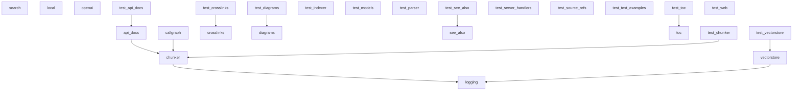

# Dependencies Overview

## External Dependencies

The project relies on several third-party libraries for different functional areas:

### AI and Machine Learning
- **anthropic** (>=0.40) - Anthropic's API client for Claude models
- **openai** (>=1.0) - OpenAI API client for GPT models and embeddings
- **ollama** (>=0.4) - Local LLM inference client
- **sentence-transformers** (>=3.0) - Local text embedding models
- **mcp** (>=1.2.0) - Model Context Protocol implementation

### Code Analysis
- **tree-sitter** (>=0.23) - Core syntax tree parsing library
- **tree-sitter-c** (>=0.23) - C language parser
- **tree-sitter-c-sharp** (>=0.23) - C# language parser
- **tree-sitter-cpp** (>=0.23) - C++ language parser
- **tree-sitter-go** (>=0.23) - Go language parser
- **tree-sitter-java** (>=0.23) - Java language parser
- **tree-sitter-javascript** (>=0.23) - JavaScript language parser
- **tree-sitter-kotlin** (>=0.23) - Kotlin language parser
- **tree-sitter-php** (>=0.23) - PHP language parser
- **tree-sitter-python** (>=0.23) - Python language parser
- **tree-sitter-ruby** (>=0.23) - Ruby language parser
- **tree-sitter-rust** (>=0.23) - Rust language parser
- **tree-sitter-swift** (>=0.0.1) - Swift language parser
- **tree-sitter-typescript** (>=0.23) - TypeScript language parser

### Data Processing and Storage
- **lancedb** (>=0.15) - Vector database for embeddings storage
- **pandas** (>=2.0) - Data manipulation and analysis
- **pydantic** (>=2.0) - Data validation and serialization

### Web and Output Generation
- **flask** (>=3.0) - Web framework for server functionality
- **markdown** (>=3.0) - Markdown processing
- **weasyprint** (>=62.0) - HTML to PDF conversion

### Utilities
- **pyyaml** (>=6.0) - YAML configuration file parsing
- **rich** (>=13.0) - Rich text and terminal formatting
- **watchdog** (>=4.0) - File system monitoring

## Dev Dependencies

Development and testing tools:

- **black** (>=24.0) - Code formatting
- **isort** (>=5.0) - Import sorting
- **mypy** (>=1.0) - Static type checking
- **pre-commit** (>=3.0) - Git pre-commit hooks
- **pytest** (>=8.0) - Testing framework
- **pytest-asyncio** (>=0.24) - Async testing support

## Internal Module Dependencies

Based on the import statements, the internal modules have the following dependency relationships:

### Core Infrastructure
- **CodeParser** - Used by CodeChunker, APIDocExtractor, and CallGraph generator for parsing source code
- **CodeChunker** - Used by RepositoryIndexer for breaking code into analyzable chunks
- **VectorStore** - Used for embedding storage and similarity search operations
- **RepositoryIndexer** - Coordinates the indexing process using CodeParser and CodeChunker

### Data Models
- **Models module** - Provides core data structures ([CodeChunk](files/src/local_deepwiki/models.md), [WikiPage](files/src/local_deepwiki/models.md), [Language](files/src/local_deepwiki/models.md), [ChunkType](files/src/local_deepwiki/models.md), etc.) used throughout the system
- **[Config](files/src/local_deepwiki/config.md) module** - Provides configuration classes used by core components

### Providers
- **EmbeddingProvider and LLMProvider** - Base classes for AI service integrations
- **LocalEmbeddingProvider** - Uses sentence-transformers for local embeddings
- **OpenAIEmbeddingProvider** - Uses OpenAI API for embeddings

### Generators
- **[CrossLinker](files/src/local_deepwiki/generators/crosslinks.md)** - Uses [EntityRegistry](files/src/local_deepwiki/generators/crosslinks.md) to add cross-references between wiki pages
- **APIDocExtractor** - Uses CodeParser to extract API documentation from code
- **Diagram generators** - Use various models and parsing utilities to create visual documentation
- **Search generator** - Works with [WikiPage](files/src/local_deepwiki/models.md) models to create search functionality
- **See Also generator** - Uses RelationshipAnalyzer and FileRelationships to suggest related content

### Server Components
- **Server handlers** - Coordinate between core indexing, search, and wiki generation functionality

The architecture follows a layered approach with core parsing and chunking at the base, provider abstractions for AI services, and specialized generators for different types of documentation output.

## Module Dependency Graph

The following diagram shows internal module dependencies:

## Relevant Source Files

The following source files were used to generate this documentation:

- [`tests/test_parser.py:24-123`](files/tests/test_parser.md)
- [`tests/test_retry.py:8-144`](files/tests/test_retry.md)
- `tests/test_ollama_health.py:16-19`
- `tests/test_server_handlers.py:15-69`
- `tests/test_chunker.py:11-182`
- `tests/test_changelog.py:18-96`
- [`tests/test_vectorstore.py:9-28`](files/tests/test_vectorstore.md)
- [`tests/test_pdf_export.py:21-80`](files/tests/test_pdf_export.md)
- `tests/test_search.py:20-53`
- `tests/test_toc.py:17-43`

*Showing 10 of 74 source files.*
