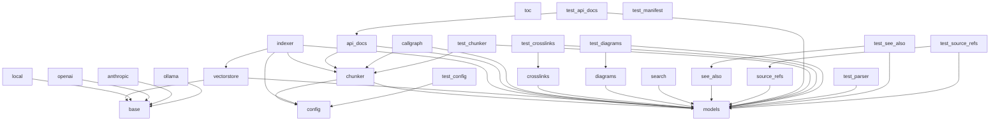

# Dependencies Overview

## External Dependencies

| Dependency                  | Purpose                                                                 |
|-----------------------------|-------------------------------------------------------------------------|
| anthropic (>=0.40)          | Provides access to Anthropic's AI models, likely used for LLM interactions. |
| flask (>=3.0)               | Web framework used for building the application's HTTP API.             |
| lancedb (>=0.15)            | Vector database for storing and querying embeddings.                    |
| markdown (>=3.0)            | Library for parsing and rendering Markdown text.                        |
| mcp (>=1.2.0)               | Likely used for Model Communication Protocol interactions.              |
| ollama (>=0.4)              | Interface to Ollama's local LLM inference engine.                       |
| openai (>=1.0)              | Client for interacting with OpenAI's API for embeddings and LLMs.       |
| pandas (>=2.0)              | Data manipulation and analysis library.                                 |
| pydantic (>=2.0)            | Data validation and settings management using Python type annotations.  |
| pyyaml (>=6.0)              | YAML parsing and serialization.                                         |
| rich (>=13.0)               | Library for rich text and beautiful formatting in the terminal.         |
| sentence-transformers (>=3.0)| Library for generating sentence embeddings.                              |
| tree-sitter (>=0.23)        | Parser generator tool and an incremental parsing library.               |
| tree-sitter-c (>=0.23)      | Tree-sitter grammar for C language.                                     |
| tree-sitter-cpp (>=0.23)    | Tree-sitter grammar for C++ language.                                   |
| tree-sitter-go (>=0.23)     | Tree-sitter grammar for Go language.                                    |
| tree-sitter-java (>=0.23)   | Tree-sitter grammar for Java language.                                  |
| tree-sitter-javascript (>=0.23) | Tree-sitter grammar for JavaScript language.                        |
| tree-sitter-python (>=0.23) | Tree-sitter grammar for Python language.                                |
| tree-sitter-rust (>=0.23)   | Tree-sitter grammar for Rust language.                                  |
| tree-sitter-swift (>=0.0.1) | Tree-sitter grammar for Swift language.                                 |
| tree-sitter-typescript (>=0.23) | Tree-sitter grammar for TypeScript language.                        |
| watchdog (>=4.0)            | File system event monitoring library.                                   |

## Dev Dependencies

| Dependency             | Purpose                                               |
|------------------------|-------------------------------------------------------|
| pytest (>=8.0)         | Testing framework for running unit and integration tests. |
| pytest-asyncio (>=0.24)| Plugin for testing async code with pytest.             |

## Internal Module Dependencies

The following describes how internal modules depend on each other based on import statements:

- **[Config](files/src/local_deepwiki/config.md) Module** (`src/local_deepwiki/config.py`) depends on:
  - `pyyaml` for YAML parsing
  - `pydantic` for configuration model definitions

- **Models Module** (`src/local_deepwiki/models.py`) depends on:
  - `pydantic` for data models
  - `enum` and `pathlib` for basic type handling

- **Core Chunker Module** (`src/local_deepwiki/core/chunker.py`) depends on:
  - `tree_sitter` for parsing code
  - `local_deepwiki.config` for configuration
  - `local_deepwiki.core.parser` for parsing utilities
  - `local_deepwiki.models` for data models

- **Core Parser Module** (`src/local_deepwiki/core/parser.py`) depends on:
  - `tree_sitter` for parsing code
  - `local_deepwiki.models` for data models

- **Core [Vector Store](files/src/local_deepwiki/core/vectorstore.md) Module** (`src/local_deepwiki/core/vectorstore.py`) depends on:
  - `lancedb` for vector database operations
  - `local_deepwiki.models` for data models
  - `local_deepwiki.providers.base` for embedding provider interface

- **Generators Module**:
  - `crosslinks.py` depends on:
    - `local_deepwiki.models`
  - `diagrams.py` depends on:
    - `local_deepwiki.models`
  - `toc.py` depends on:
    - `local_deepwiki.models`
  - `see_also.py` depends on:
    - `local_deepwiki.models`
  - `callgraph.py` depends on:
    - `local_deepwiki.core.parser`
    - `local_deepwiki.core.chunker`
    - `local_deepwiki.models`
  - `api_docs.py` depends on:
    - `local_deepwiki.core.parser`
    - `local_deepwiki.core.chunker`
    - `local_deepwiki.models`
  - `source_refs.py` depends on:
    - `local_deepwiki.models`
  - `search.py` depends on:
    - `local_deepwiki.models`

- **Providers Module**:
  - `__init__.py` depends on:
    - `local_deepwiki.providers.base`
  - `base.py` depends on:
    - `typing` and `abc` for abstract base classes
  - `embeddings/local.py` depends on:
    - `sentence_transformers`
    - `local_deepwiki.providers.base`
  - `embeddings/openai.py` depends on:
    - `openai`
    - `local_deepwiki.providers.base`

- **Export Module**:
  - `__init__.py` depends on:
    - `local_deepwiki.export.html`

- **Tests**:
  - Various test modules depend on:
    - `pytest`
    - `local_deepwiki.*` modules depending on the test scope
    - `local_deepwiki.core.parser`
    - `local_deepwiki.models`
    - `local_deepwiki.config`
    - `local_deepwiki.generators.*`
    - `local_deepwiki.providers.*`
    - `local_deepwiki.core.chunker`
    - `local_deepwiki.core.vectorstore`

## Module Dependency Graph

The following diagram shows internal module dependencies:

## Relevant Source Files

The following source files were used to generate this documentation:

- `tests/test_parser.py:12-111`
- `tests/test_chunker.py:11-182`
- `tests/test_search.py:20-53`
- `tests/test_toc.py:16-44`
- [`tests/test_incremental_wiki.py:20-47`](files/tests/test_incremental_wiki.md)
- `tests/test_web.py:39-103`
- `tests/__init__.py`
- `tests/test_manifest.py:14-56`
- [`tests/test_api_docs.py:31-53`](files/tests/test_api_docs.md)
- `tests/test_see_also.py:16-177`

*Showing 10 of 52 source files.*
