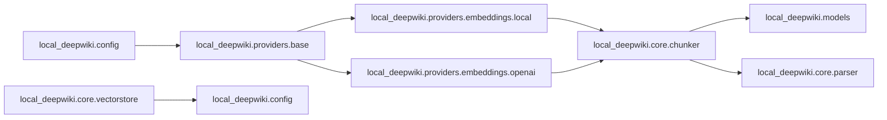

# Dependencies Overview
=====================================

### External Dependencies

The following external libraries and packages are used in the project:

* `sentence_transformers` for sentence embeddings
* `openai` for OpenAI API access
* `lancedb` for vector database operations
* `tree_sitter_python`, `tree_sitter_javascript`, etc. for parser configuration and language support

### Internal Module Dependencies

The following modules depend on each other:

### Notable Dependency Patterns

* The `local_deepwiki.providers.base` module is a base class for all provider classes, and both `LocalEmbeddingProvider` and `OpenAIEmbeddingProvider` depend on it.
* The `local_deepwiki.core.parser` module depends on several external libraries (`tree_sitter_python`, etc.) to configure the parser.
* The `local_deepwiki.models` module is used throughout the project, and all providers that embed sentences (both local and OpenAI) depend on it.

Note: This documentation only includes a high-level overview of dependencies. A more detailed dependency graph can be found in individual code files and modules.