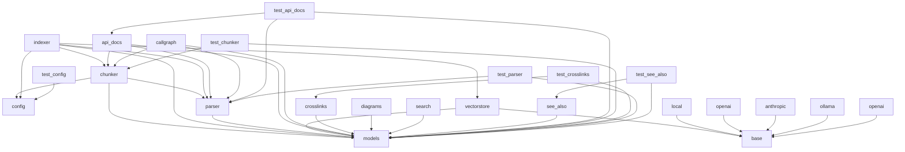

# Dependencies Overview

## External Dependencies

The project relies on several third-party libraries for core functionality:

- **tree-sitter** - A parsing library used for parsing code into structured syntax trees, enabling semantic analysis of source code.
- **sentence-transformers** - Used for generating embeddings from text using pre-trained models.
- **openai** - Provides access to OpenAI's API for generating embeddings via the OpenAIEmbeddingProvider.
- **pydantic** - Used for data validation and settings management, particularly in configuration handling.
- **yaml** - For parsing YAML configuration files.
- **lancedb** - A vector database used for storing and querying embeddings.
- **pytest** - Testing framework used for unit and integration tests.
- **pathlib** - Standard library for handling filesystem paths.
- **re** - Standard library for regular expressions.
- **os** - Standard library for interacting with the operating system.
- **dataclasses** - Standard library for creating data classes.
- **collections.abc** - Standard library for abstract base classes.
- **typing** - Standard library for type hints.

## Internal Module Dependencies

The internal modules are organized in a layered structure with clear dependencies:

### Core Modules
- **[CodeChunker](files/src/local_deepwiki/core/chunker.md)** in `core.chunker` depends on:
  - `parser` for parsing code and extracting nodes
  - `config` for chunking configuration
  - `models` for [`CodeChunk`](files/src/local_deepwiki/models.md), [`ChunkType`](files/src/local_deepwiki/models.md), and [`Language`](files/src/local_deepwiki/models.md) models

- **[CodeParser](files/src/local_deepwiki/core/parser.md)** in `core.parser` depends on:
  - `models` for [`Language`](files/src/local_deepwiki/models.md) and [`FileInfo`](files/src/local_deepwiki/models.md) models
  - Tree-sitter language parsers for different programming languages

- **[VectorStore](files/src/local_deepwiki/core/vectorstore.md)** in `core.vectorstore` depends on:
  - `models` for [`CodeChunk`](files/src/local_deepwiki/models.md) and [`SearchResult`](files/src/local_deepwiki/models.md) models
  - `providers.base` for `EmbeddingProvider` interface
  - `lancedb` for vector database operations

### Generators
- **[CrossLinker](files/src/local_deepwiki/generators/crosslinks.md)** in `generators.crosslinks` depends on:
  - `models` for [`ChunkType`](files/src/local_deepwiki/models.md), [`CodeChunk`](files/src/local_deepwiki/models.md), and [`WikiPage`](files/src/local_deepwiki/models.md)
  - `core.chunker` for chunking logic

- **SeeAlsoGenerator** in `generators.see_also` depends on:
  - `models` for [`ChunkType`](files/src/local_deepwiki/models.md), [`CodeChunk`](files/src/local_deepwiki/models.md), and [`WikiPage`](files/src/local_deepwiki/models.md)
  - `core.chunker` for chunking logic

- **CallGraphGenerator** in `generators.callgraph` depends on:
  - `core.parser` for parsing code and extracting nodes
  - `core.chunker` for node type definitions

- **APIDocsGenerator** in `generators.api_docs` depends on:
  - `core.parser` for parsing code and extracting nodes
  - `core.chunker` for node type definitions

### Providers
- **EmbeddingProvider** in `providers.base` is an abstract base class used by:
  - `providers.embeddings.local` for local embeddings
  - `providers.embeddings.openai` for OpenAI embeddings

- **LocalEmbeddingProvider** in `providers.embeddings.local` depends on:
  - `sentence_transformers` for embedding generation
  - `providers.base` for `EmbeddingProvider` interface

- **OpenAIEmbeddingProvider** in `providers.embeddings.openai` depends on:
  - `openai` for API access
  - `providers.base` for `EmbeddingProvider` interface

### Configuration
- **[Config](files/src/local_deepwiki/config.md)** in `config` depends on:
  - `pydantic` for model validation
  - `yaml` for parsing configuration files
  - `pathlib` for path handling

## Dependency Patterns

### Provider Pattern
The project implements a provider pattern for embedding generation:

- The `EmbeddingProvider` base class defines the interface for embedding generation.
- Concrete implementations like `LocalEmbeddingProvider` and `OpenAIEmbeddingProvider` implement this interface.
- The `EmbeddingProvider` is injected into [`VectorStore`](files/src/local_deepwiki/core/vectorstore.md) to enable flexible embedding generation strategies.

### Dependency Injection
Several classes use dependency injection for flexibility:

- [`VectorStore`](files/src/local_deepwiki/core/vectorstore.md) receives an `EmbeddingProvider` instance during initialization
- [`CodeChunker`](files/src/local_deepwiki/core/chunker.md) uses configuration from `get_config()` for chunking behavior
- [`CrossLinker`](files/src/local_deepwiki/generators/crosslinks.md) and other generators use models and chunking logic from core modules

### Layered Architecture
The architecture follows a layered approach:

1. **Core Layer** (`core.chunker`, `core.parser`) - Provides parsing and chunking functionality
2. **Models Layer** (`models`) - Defines data structures and enums used across the system
3. **Generators Layer** (`generators`) - Uses core modules to generate documentation and cross-links
4. **Providers Layer** (`providers`) - Handles external integrations like embeddings and LLMs
5. **Configuration Layer** (`config`) - Manages system-wide settings and configurations

This layered approach ensures that higher-level modules depend only on abstractions defined in lower-level modules, promoting loose coupling and testability.

## Module Dependency Graph

The following diagram shows internal module dependencies:

