# Dependencies Overview

## External Dependencies

| Package | Version | Purpose |
|---------|---------|---------|
| `yaml` | - | Configuration file parsing |
| `pydantic` | - | Data validation and settings management |
| `sentence_transformers` | - | Local embedding model for semantic similarity |
| `openai` | - | OpenAI API client for embeddings |
| `tree_sitter` | - | Tree-sitter parser for code analysis |
| `tree_sitter_python` | - | Python language support for tree-sitter |
| `tree_sitter_javascript` | - | JavaScript language support for tree-sitter |
| `tree_sitter_typescript` | - | TypeScript language support for tree-sitter |
| `tree_sitter_go` | - | Go language support for tree-sitter |
| `tree_sitter_rust` | - | Rust language support for tree-sitter |
| `tree_sitter_java` | - | Java language support for tree-sitter |
| `tree_sitter_c` | - | C language support for tree-sitter |
| `tree_sitter_cpp` | - | C++ language support for tree-sitter |
| `lancedb` | - | Vector database for semantic search |

## Internal Module Dependencies

| Module | Depends On |
|--------|------------|
| `src/local_deepwiki/config.py` | `os`, `pathlib.Path`, `typing`, `yaml`, `pydantic` |
| `src/local_deepwiki/providers/__init__.py` | `local_deepwiki.providers.base` |
| `src/local_deepwiki/generators/diagrams.py` | `local_deepwiki.models` |
| `tests/test_chunker.py` | `pathlib.Path`, `pytest`, `local_deepwiki.core.chunker`, `local_deepwiki.models` |
| `src/local_deepwiki/providers/base.py` | `abc.ABC`, `typing.AsyncIterator` |
| `src/local_deepwiki/providers/embeddings/local.py` | `sentence_transformers`, `local_deepwiki.providers.base` |
| `tests/test_config.py` | `pathlib.Path`, `pytest`, `local_deepwiki.config` |
| `src/local_deepwiki/core/chunker.py` | `hashlib`, `pathlib.Path`, `typing.Iterator`, `tree_sitter.Node`, `local_deepwiki.config`, `local_deepwiki.core.parser`, `local_deepwiki.models` |
| `src/local_deepwiki/providers/embeddings/__init__.py` | `local_deepwiki.config`, `local_deepwiki.providers.base`, `local_deepwiki.providers.embeddings.local`, `local_deepwiki.providers.embeddings.openai` |
| `src/local_deepwiki/models.py` | `enum.Enum`, `pathlib.Path`, `typing`, `pydantic` |
| `src/local_deepwiki/providers/embeddings/openai.py` | `os`, `openai.AsyncOpenAI`, `local_deepwiki.providers.base` |
| `src/local_deepwiki/core/parser.py` | `hashlib`, `pathlib.Path`, `typing`, `tree_sitter` modules, `local_deepwiki.models` |
| `src/local_deepwiki/core/vectorstore.py` | `json`, `pathlib.Path`, `typing`, `lancedb`, `local_deepwiki.models`, `local_deepwiki.providers.base` |

## Dependency Graph

```mermaid
graph TD
    A[src/local_deepwiki/config.py] --> B[pydantic]
    A --> C[yaml]
    A --> D[pathlib.Path]
    A --> E[typing]

    F[src/local_deepwiki/providers/base.py] --> G[abc.ABC]
    F --> H[typing.AsyncIterator]

    I[src/local_deepwiki/providers/__init__.py] --> F
    I --> J[src/local_deepwiki/providers/embeddings/local.py]
    I --> K[src/local_deepwiki/providers/embeddings/openai.py]

    L[src/local_deepwiki/providers/embeddings/local.py] --> M[sentence_transformers]
    L --> F

    N[src/local_deepwiki/providers/embeddings/openai.py] --> O[openai.AsyncOpenAI]
    N --> F

    P[src/local_deepwiki/core/chunker.py] --> Q[hashlib]
    P --> R[pathlib.Path]
    P --> S[typing.Iterator]
    P --> T[tree_sitter.Node]
    P --> U[src/local_deepwiki/config]
    P --> V[src/local_deepwiki/core/parser]
    P --> W[src/local_deepwiki/models]

    X[src/local_deepwiki/core/parser.py] --> Y[hashlib]
    X --> Z[pathlib.Path]
    X --> AA[typing]
    X --> AB[tree_sitter.*]
    X --> AC[src/local_deepwiki/models]

    AD[src/local_deepwiki/core/vectorstore.py] --> AE[json]
    AD --> AF[pathlib.Path]
    AD --> AG[typing]
    AD --> AH[lancedb]
    AD --> AI[src/local_deepwiki/models]
    AD --> F

    AJ[src/local_deepwiki/models.py] --> AK[enum.Enum]
    AJ --> AL[pathlib.Path]
    AJ --> AM[typing]
    AJ --> B

    AN[src/local_deepwiki/generators/diagrams.py] --> AI

    AO[tests/test_chunker.py] --> AP[pathlib.Path]
    AO --> AQ[pytest]
    AO --> P
    AO --> W

    AR[tests/test_config.py] --> AP
    AR --> AQ
    AR --> A

    AS[main modules] --> A
    AS --> F
    AS --> P
    AS --> X
    AS --> AD
    AS --> AJ
    AS --> I
    AS --> L
    AS --> N
    AS --> AJ
    AS --> AN
```

## Notable Dependency Patterns

1. **Layered Architecture**: The codebase follows a layered architecture with clear separation of concerns:
   - Configuration layer (`config.py`)
   - Core logic layer (`chunker.py`, `parser.py`)
   - Provider layer (`providers/`)
   - Data models (`models.py`)
   - Vector storage (`vectorstore.py`)

2. **Provider Pattern**: Embedding and LLM providers follow a base interface pattern (`EmbeddingProvider`, `LLMProvider`) with concrete implementations for local and OpenAI providers.

3. **Dependency Injection**: Configuration is injected through `get_config()` function, allowing for flexible configuration management.

4. **Tree-sitter Language Support**: The parser module depends on multiple language-specific tree-sitter packages to support various programming languages.

5. **Pydantic Integration**: All configuration and data models use Pydantic for validation and type safety.

6. **Asynchronous Support**: The base provider classes define abstract methods for asynchronous operations, supporting both local and cloud-based providers.