# Dependencies Overview

## External Dependencies

The project relies on several third-party libraries for different functionality areas:

### AI and Machine Learning
- **anthropic** (>=0.40) - Anthropic's Claude AI API client
- **openai** (>=1.0) - OpenAI API client for GPT models and embeddings
- **ollama** (>=0.4) - Local LLM inference server client
- **sentence-transformers** (>=3.0) - Local text embedding models
- **mcp** (>=1.2.0) - Model Context Protocol implementation

### Code Analysis
- **tree-sitter** (>=0.23) - Syntax tree parsing library
- **tree-sitter-c** (>=0.23) - C language parser
- **tree-sitter-c-sharp** (>=0.23) - C# language parser
- **tree-sitter-cpp** (>=0.23) - C++ language parser
- **tree-sitter-go** (>=0.23) - Go language parser
- **tree-sitter-java** (>=0.23) - Java language parser
- **tree-sitter-javascript** (>=0.23) - JavaScript language parser
- **tree-sitter-kotlin** (>=0.23) - Kotlin language parser
- **tree-sitter-php** (>=0.23) - PHP language parser
- **tree-sitter-python** (>=0.23) - Python language parser
- **tree-sitter-ruby** (>=0.23) - Ruby language parser
- **tree-sitter-rust** (>=0.23) - Rust language parser
- **tree-sitter-swift** (>=0.0.1) - Swift language parser
- **tree-sitter-typescript** (>=0.23) - TypeScript language parser

### Data Processing and Storage
- **lancedb** (>=0.15) - Vector database for embeddings
- **pandas** (>=2.0) - Data manipulation and analysis
- **pydantic** (>=2.0) - Data validation and serialization

### Web and File Processing
- **flask** (>=3.0) - Web framework for serving the application
- **markdown** (>=3.0) - Markdown processing
- **weasyprint** (>=62.0) - HTML to PDF conversion
- **watchdog** (>=4.0) - File system event monitoring

### Configuration and Utilities
- **pyyaml** (>=6.0) - YAML configuration file parsing
- **rich** (>=13.0) - Rich text and terminal formatting

## Dev Dependencies

Development and testing tools:

- **black** (>=24.0) - Code formatting
- **isort** (>=5.0) - Import sorting
- **mypy** (>=1.0) - Static type checking
- **pre-commit** (>=3.0) - Git pre-commit hooks
- **pytest** (>=8.0) - Testing framework
- **pytest-asyncio** (>=0.24) - Async testing support

## Internal Module Dependencies

Based on the import statements, the internal modules have the following relationships:

### Core Modules
- **[CodeChunker](files/src/local_deepwiki/core/chunker.md)** depends on CodeParser for syntax tree analysis
- **CodeParser** uses tree-sitter libraries for multi-language parsing
- **[VectorStore](files/src/local_deepwiki/core/vectorstore.md)** integrates with embedding providers for semantic search
- **[RepositoryIndexer](files/src/local_deepwiki/core/indexer.md)** coordinates chunking, parsing, and vector storage

### Provider System
- **[EmbeddingProvider](files/src/local_deepwiki/providers/base.md)** serves as base class for embedding implementations
- **[LocalEmbeddingProvider](files/src/local_deepwiki/providers/embeddings/local.md)** uses sentence-transformers for local embeddings
- **[OpenAIEmbeddingProvider](files/src/local_deepwiki/providers/embeddings/openai.md)** integrates with OpenAI's embedding API
- **[LLMProvider](files/src/local_deepwiki/providers/base.md)** provides base interface for language model providers

### Generator Components
- **[CrossLinker](files/src/local_deepwiki/generators/crosslinks.md)** and **[EntityRegistry](files/src/local_deepwiki/generators/crosslinks.md)** work together for cross-reference generation
- **[APIDocExtractor](files/src/local_deepwiki/generators/api_docs.md)** uses CodeParser for extracting API documentation
- **[RelationshipAnalyzer](files/src/local_deepwiki/generators/see_also.md)** and **[FileRelationships](files/src/local_deepwiki/generators/see_also.md)** analyze code relationships
- Multiple generators depend on core models like [WikiPage](files/src/local_deepwiki/models.md), [CodeChunk](files/src/local_deepwiki/models.md), and [ChunkType](files/src/local_deepwiki/models.md)

### Models and Configuration
- Most modules depend on shared models ([WikiPage](files/src/local_deepwiki/models.md), [CodeChunk](files/src/local_deepwiki/models.md), [Language](files/src/local_deepwiki/models.md), [ChunkType](files/src/local_deepwiki/models.md))
- Configuration management is centralized and used across core components
- Logging utilities are shared across the application

The architecture follows a layered approach with core parsing and indexing components at the base, provider abstractions for external services, and specialized generators for different wiki content types.

## Module Dependency Graph

The following diagram shows module dependencies. Click on a module to view its documentation. External dependencies are shown with dashed borders.

```mermaid
flowchart TD
    subgraph config[Config]
        M0[config]
    end
    subgraph core[Core]
        M1[chunker]
        M2[deep_research]
        M3[git_utils]
        M4[indexer]
        M5[llm_cache]
        M6[parser]
        M7[vectorstore]
    end
    subgraph export[Export]
        M8[html]
        M9[pdf]
    end
    subgraph generators[Generators]
        M10[api_docs]
        M11[callgraph]
        M12[changelog]
        M13[crosslinks]
        M14[diagrams]
        M15[manifest]
        M16[search]
        M17[see_also]
        M18[source_refs]
        M19[test_examples]
        M20[toc]
        M21[wiki]
        M22[wiki_pages]
    end
    subgraph handlers[Handlers]
        M23[handlers]
    end
    subgraph logging[Logging]
        M24[logging]
    end
    subgraph models[Models]
        M25[models]
    end
    subgraph providers[Providers]
        M26[base]
        M27[embeddings]
        M28[local]
        M29[openai]
        M30[llm]
        M31[anthropic]
        M32[cached]
        M33[ollama]
        M34[openai]
    end
    subgraph server[Server]
        M35[server]
    end
    subgraph web[Web]
        M36[app]
    end
    subgraph external[External Dependencies]
        E0([pathlib]):::external
        E1([typing]):::external
        E2([json]):::external
        E3([re]):::external
        E4([dataclasses]):::external
        E5([asyncio]):::external
        E6([collections]):::external
        E7([time]):::external
        E8([os]):::external
        E9([tree_sitter]):::external
    end
    M1 --> M0
    M1 --> M6
    M1 --> M24
    M1 --> M25
    M2 --> M7
    M2 --> M24
    M2 --> M25
    M2 --> M26
    M3 --> M24
    M4 --> M0
    M4 --> M1
    M4 --> M6
    M4 --> M7
    M4 --> M24
    M4 --> M25
    M4 --> M27
    M5 --> M0
    M5 --> M24
    M5 --> M26
    M6 --> M24
    M6 --> M25
    M7 --> M24
    M7 --> M25
    M7 --> M26
    M8 --> M24
    M9 --> M24
    M10 --> M1
    M10 --> M6
    M10 --> M25
    M11 --> M1
    M11 --> M6
    M11 --> M25
    M12 --> M3
    M12 --> M24
    M13 --> M25
    M14 --> M25
    M15 --> M24
    M16 --> M25
    M17 --> M25
    M18 --> M25
    M21 --> M0
    M21 --> M3
    M21 --> M7
    M21 --> M10
    M21 --> M11
    M21 --> M13
    M21 --> M14
    M21 --> M15
    M21 --> M16
    M21 --> M17
    M21 --> M18
    M21 --> M19
    M21 --> M20
    M21 -.->|circular| M22
    M21 --> M24
    M21 --> M25
    M21 --> M30
    M22 --> M7
    M22 --> M12
    M22 --> M14
    M22 --> M15
    M22 -.->|circular| M21
    M22 --> M24
    M22 --> M25
    M22 --> M26
    M23 --> M0
    M23 --> M2
    M23 --> M4
    M23 --> M7
    M23 --> M8
    M23 --> M9
    M23 --> M21
    M23 --> M24
    M23 --> M25
    M23 --> M27
    M23 --> M30
    M28 --> M26
    M29 --> M26
    M31 --> M24
    M31 --> M26
    M32 --> M5
    M32 --> M24
    M32 --> M26
    M33 --> M24
    M33 --> M26
    M34 --> M24
    M34 --> M26
    M35 --> M23
    M35 --> M24
    M36 --> M0
    M36 --> M2
    M36 --> M7
    M36 --> M24
    M36 --> M25
    M36 --> M27
    M36 --> M30
    M0 -.-> E0
    M0 -.-> E1
    M1 -.-> E0
    M1 -.-> E9
    M1 -.-> E1
    M2 -.-> E5
    M2 -.-> E6
    M2 -.-> E2
    M2 -.-> E3
    M2 -.-> E7
    M3 -.-> E4
    M3 -.-> E0
    M3 -.-> E3
    M4 -.-> E2
    M4 -.-> E0
    M4 -.-> E7
    M5 -.-> E0
    M5 -.-> E7
    M5 -.-> E1
    M6 -.-> E0
    M6 -.-> E9
    M6 -.-> E1
    M7 -.-> E2
    M7 -.-> E0
    M7 -.-> E1
    M8 -.-> E2
    M8 -.-> E0
    M9 -.-> E2
    M9 -.-> E0
    M9 -.-> E3
    M10 -.-> E4
    M10 -.-> E0
    M10 -.-> E3
    M10 -.-> E9
    M11 -.-> E0
    M11 -.-> E9
    M12 -.-> E6
    M12 -.-> E4
    M12 -.-> E0
    M13 -.-> E6
    M13 -.-> E4
    M13 -.-> E0
    M13 -.-> E3
    M14 -.-> E4
    M14 -.-> E0
    M14 -.-> E3
    M14 -.-> E1
    M15 -.-> E4
    M15 -.-> E2
    M15 -.-> E0
    M15 -.-> E3
    M15 -.-> E1
    M16 -.-> E2
    M16 -.-> E0
    M16 -.-> E3
    M17 -.-> E6
    M17 -.-> E4
    M17 -.-> E0
    M17 -.-> E3
    M18 -.-> E0
    M18 -.-> E3
    M20 -.-> E4
    M20 -.-> E2
    M20 -.-> E0
    M20 -.-> E1
    M21 -.-> E5
    M21 -.-> E2
    M21 -.-> E0
    M21 -.-> E3
    M21 -.-> E7
    M22 -.-> E0
    M22 -.-> E7
    M22 -.-> E1
    M23 -.-> E5
    M23 -.-> E2
    M23 -.-> E0
    M23 -.-> E1
    M24 -.-> E8
    M24 -.-> E1
    M25 -.-> E2
    M25 -.-> E0
    M25 -.-> E1
    M26 -.-> E5
    M26 -.-> E1
    M29 -.-> E8
    M31 -.-> E8
    M31 -.-> E1
    M32 -.-> E6
    M33 -.-> E1
    M34 -.-> E8
    M34 -.-> E1
    M35 -.-> E5
    M35 -.-> E1
    M36 -.-> E5
    M36 -.-> E2
    M36 -.-> E0
    M36 -.-> E1
    click M0 "files/src/local_deepwiki/config.md"
    click M1 "files/src/local_deepwiki/core/chunker.md"
    click M2 "files/src/local_deepwiki/core/deep_research.md"
    click M3 "files/src/local_deepwiki/core/git_utils.md"
    click M4 "files/src/local_deepwiki/core/indexer.md"
    click M5 "files/src/local_deepwiki/core/llm_cache.md"
    click M6 "files/src/local_deepwiki/core/parser.md"
    click M7 "files/src/local_deepwiki/core/vectorstore.md"
    click M8 "files/src/local_deepwiki/export/html.md"
    click M9 "files/src/local_deepwiki/export/pdf.md"
    click M10 "files/src/local_deepwiki/generators/api_docs.md"
    click M11 "files/src/local_deepwiki/generators/callgraph.md"
    click M12 "files/src/local_deepwiki/generators/changelog.md"
    click M13 "files/src/local_deepwiki/generators/crosslinks.md"
    click M14 "files/src/local_deepwiki/generators/diagrams.md"
    click M15 "files/src/local_deepwiki/generators/manifest.md"
    click M16 "files/src/local_deepwiki/generators/search.md"
    click M17 "files/src/local_deepwiki/generators/see_also.md"
    click M18 "files/src/local_deepwiki/generators/source_refs.md"
    click M19 "files/src/local_deepwiki/generators/test_examples.md"
    click M20 "files/src/local_deepwiki/generators/toc.md"
    click M21 "files/src/local_deepwiki/generators/wiki.md"
    click M22 "files/src/local_deepwiki/generators/wiki_pages.md"
    click M23 "files/src/local_deepwiki/handlers.md"
    click M24 "files/src/local_deepwiki/logging.md"
    click M25 "files/src/local_deepwiki/models.md"
    click M26 "files/src/local_deepwiki/providers/base.md"
    click M27 "files/src/local_deepwiki/providers/embeddings.md"
    click M28 "files/src/local_deepwiki/providers/embeddings/local.md"
    click M29 "files/src/local_deepwiki/providers/embeddings/openai.md"
    click M30 "files/src/local_deepwiki/providers/llm.md"
    click M31 "files/src/local_deepwiki/providers/llm/anthropic.md"
    click M32 "files/src/local_deepwiki/providers/llm/cached.md"
    click M33 "files/src/local_deepwiki/providers/llm/ollama.md"
    click M34 "files/src/local_deepwiki/providers/llm/openai.md"
    click M35 "files/src/local_deepwiki/server.md"
    click M36 "files/src/local_deepwiki/web/app.md"
    classDef external fill:#2d2d3d,stroke:#666,stroke-dasharray: 5 5
    linkStyle default stroke:#666
    linkStyle 53 stroke:#f00,stroke-width:2px
    linkStyle 61 stroke:#f00,stroke-width:2px
```

## Relevant Source Files

The following source files were used to generate this documentation:

- [`src/local_deepwiki/generators/crosslinks.py:16-23`](files/src/local_deepwiki/generators/crosslinks.md)
- [`src/local_deepwiki/generators/diagrams.py:12-21`](files/src/local_deepwiki/generators/diagrams.md)
- `src/local_deepwiki/providers/__init__.py`
- [`src/local_deepwiki/generators/toc.py:10-27`](files/src/local_deepwiki/generators/toc.md)
- [`src/local_deepwiki/logging.py:19-70`](files/src/local_deepwiki/logging.md)
- [`src/local_deepwiki/generators/see_also.py:16-22`](files/src/local_deepwiki/generators/see_also.md)
- [`src/local_deepwiki/providers/embeddings/local.py:8-55`](files/src/local_deepwiki/providers/embeddings/local.md)
- [`src/local_deepwiki/generators/source_refs.py:14-55`](files/src/local_deepwiki/generators/source_refs.md)
- `src/local_deepwiki/providers/embeddings/__init__.py:7-28`
- [`src/local_deepwiki/generators/search.py:14-33`](files/src/local_deepwiki/generators/search.md)

*Showing 10 of 67 source files.*
