# Dependencies Overview

## External Dependencies

### Core AI and ML Libraries
- **anthropic** (>=0.40) - Anthropic's Claude API client for AI language model integration
- **openai** (>=1.0) - OpenAI API client for GPT models and embeddings
- **ollama** (>=0.4) - Local LLM inference server client
- **sentence-transformers** (>=3.0) - Transformer-based sentence and text embeddings

### Data Processing and Storage
- **lancedb** (>=0.15) - Vector database for storing and querying embeddings
- **pandas** (>=2.0) - Data manipulation and analysis library
- **pydantic** (>=2.0) - Data validation and settings management using Python type annotations

### Code Analysis and Parsing
- **tree-sitter** (>=0.23) - Incremental parsing library for syntax tree generation
- **tree-sitter-c** (>=0.23) - C language grammar for tree-sitter
- **tree-sitter-c-sharp** (>=0.23) - C# language grammar for tree-sitter
- **tree-sitter-cpp** (>=0.23) - C++ language grammar for tree-sitter
- **tree-sitter-go** (>=0.23) - Go language grammar for tree-sitter
- **tree-sitter-java** (>=0.23) - Java language grammar for tree-sitter
- **tree-sitter-javascript** (>=0.23) - JavaScript language grammar for tree-sitter
- **tree-sitter-kotlin** (>=0.23) - Kotlin language grammar for tree-sitter
- **tree-sitter-php** (>=0.23) - PHP language grammar for tree-sitter
- **tree-sitter-python** (>=0.23) - Python language grammar for tree-sitter
- **tree-sitter-ruby** (>=0.23) - Ruby language grammar for tree-sitter
- **tree-sitter-rust** (>=0.23) - Rust language grammar for tree-sitter
- **tree-sitter-swift** (>=0.0.1) - Swift language grammar for tree-sitter
- **tree-sitter-typescript** (>=0.23) - TypeScript language grammar for tree-sitter

### Web and File Processing
- **flask** (>=3.0) - Web framework for HTTP API endpoints
- **markdown** (>=3.0) - Markdown processing and conversion
- **weasyprint** (>=62.0) - HTML/CSS to PDF conversion
- **watchdog** (>=4.0) - File system event monitoring

### Utilities
- **pyyaml** (>=6.0) - YAML parsing and serialization
- **rich** (>=13.0) - Rich text and beautiful formatting in the terminal
- **mcp** (>=1.2.0) - Model Context Protocol implementation

## Development Dependencies

- **black** (>=24.0) - Python code formatter
- **isort** (>=5.0) - Import statement sorter
- **mypy** (>=1.0) - Static type checker
- **pre-commit** (>=3.0) - Git pre-commit hook framework
- **pytest** (>=8.0) - Testing framework
- **pytest-asyncio** (>=0.24) - Async support for pytest
- **types-Markdown** (>=3.0) - Type stubs for Markdown library
- **types-PyYAML** (>=6.0) - Type stubs for PyYAML library

## Internal Module Dependencies

### Core Architecture
- **Models** - The `local_deepwiki.models` module provides core data structures including [ChunkType](files/src/local_deepwiki/models.md), [CodeChunk](files/src/local_deepwiki/models.md), [WikiPage](files/src/local_deepwiki/models.md), [Language](files/src/local_deepwiki/models.md), [FileInfo](files/src/local_deepwiki/models.md), [IndexStatus](files/src/local_deepwiki/models.md), and [WikiPageStatus](files/src/local_deepwiki/models.md) that are used throughout the system
- **Configuration** - The `local_deepwiki.config` module provides [ChunkingConfig](files/src/local_deepwiki/config.md), [EmbeddingConfig](files/src/local_deepwiki/config.md), and configuration management functions used by core components

### Core Processing Components
- **Parser** - The [CodeParser](files/src/local_deepwiki/core/parser.md) class in `local_deepwiki.core.parser` handles syntax tree parsing and provides utilities like [find_nodes_by_type](files/src/local_deepwiki/core/parser.md), [get_node_name](files/src/local_deepwiki/core/parser.md), and [get_node_text](files/src/local_deepwiki/core/parser.md)
- **Chunker** - The [CodeChunker](files/src/local_deepwiki/core/chunker.md) class in `local_deepwiki.core.chunker` depends on [CodeParser](files/src/local_deepwiki/core/parser.md) for breaking code into manageable chunks
- **[Vector Store](files/src/local_deepwiki/core/vectorstore.md)** - The [VectorStore](files/src/local_deepwiki/core/vectorstore.md) class in `local_deepwiki.core.vectorstore` handles embedding storage and retrieval

### Provider System
- **Base Providers** - The `local_deepwiki.providers.base` module defines [EmbeddingProvider](files/src/local_deepwiki/providers/base.md) and [LLMProvider](files/src/local_deepwiki/providers/base.md) interfaces
- **Embedding Providers** - [LocalEmbeddingProvider](files/src/local_deepwiki/providers/embeddings/local.md) and [OpenAIEmbeddingProvider](files/src/local_deepwiki/providers/embeddings/openai.md) implement the [EmbeddingProvider](files/src/local_deepwiki/providers/base.md) interface
- **Provider Initialization** - The embeddings module uses configuration management to initialize appropriate providers

### Generator Components
- **Cross-links Generator** - The [CrossLinker](files/src/local_deepwiki/generators/crosslinks.md) and [EntityRegistry](files/src/local_deepwiki/generators/crosslinks.md) classes process [WikiPage](files/src/local_deepwiki/models.md) and [CodeChunk](files/src/local_deepwiki/models.md) objects to add cross-references
- **See Also Generator** - The [RelationshipAnalyzer](files/src/local_deepwiki/generators/see_also.md) and [FileRelationships](files/src/local_deepwiki/generators/see_also.md) classes analyze code relationships using [WikiPage](files/src/local_deepwiki/models.md) and [CodeChunk](files/src/local_deepwiki/models.md) data
- **API Documentation** - The [APIDocExtractor](files/src/local_deepwiki/generators/api_docs.md) class works with [CodeParser](files/src/local_deepwiki/core/parser.md) to extract API documentation from code
- **Diagrams Generator** - Uses [CodeChunk](files/src/local_deepwiki/models.md), [FileInfo](files/src/local_deepwiki/models.md), and [IndexStatus](files/src/local_deepwiki/models.md) models to generate various diagram types
- **Test Examples** - The [UsageExample](files/src/local_deepwiki/generators/test_examples.md) extractor analyzes test files to [find](files/src/local_deepwiki/generators/manifest.md) usage patterns
- **Table of Contents** - Processes [WikiPage](files/src/local_deepwiki/models.md) structures to generate navigation
- **Search Generator** - Processes [WikiPage](files/src/local_deepwiki/models.md) content for search functionality
- **Call Graph Generator** - Uses [CodeParser](files/src/local_deepwiki/core/parser.md) and tree-sitter Node objects to analyze function calls
- **Source References** - Processes [WikiPage](files/src/local_deepwiki/models.md) and [WikiPageStatus](files/src/local_deepwiki/models.md) objects to add source file references

### Export System
- **HTML Export** - The [HtmlExporter](files/src/local_deepwiki/export/html.md) class handles wiki export to HTML format
- **PDF Export** - Provides PDF generation capabilities

### Server Components
- **Handlers** - Server request handlers depend on various generators and core components for processing wiki operations
- **Logging** - Centralized logging configuration used across all modules

## Module Dependency Graph

The following diagram shows module dependencies. Click on a module to view its documentation. External dependencies are shown with dashed borders.

```mermaid
flowchart TD
    subgraph config[Config]
        M0[config]
    end
    subgraph core[Core]
        M1[chunker]
        M2[deep_research]
        M3[git_utils]
        M4[indexer]
        M5[llm_cache]
        M6[parser]
        M7[vectorstore]
    end
    subgraph export[Export]
        M8[html]
        M9[pdf]
    end
    subgraph generators[Generators]
        M10[api_docs]
        M11[callgraph]
        M12[changelog]
        M13[crosslinks]
        M14[diagrams]
        M15[manifest]
        M16[search]
        M17[see_also]
        M18[source_refs]
        M19[test_examples]
        M20[toc]
        M21[wiki]
        M22[wiki_files]
        M23[wiki_modules]
        M24[wiki_pages]
        M25[wiki_status]
    end
    subgraph handlers[Handlers]
        M26[handlers]
    end
    subgraph logging[Logging]
        M27[logging]
    end
    subgraph models[Models]
        M28[models]
    end
    subgraph providers[Providers]
        M29[base]
        M30[embeddings]
        M31[local]
        M32[openai]
        M33[llm]
        M34[ollama]
    end
    subgraph server[Server]
        M35[server]
    end
    subgraph validation[Validation]
        M36[validation]
    end
    subgraph external[External Dependencies]
        E0([pathlib]):::external
        E1([typing]):::external
        E2([re]):::external
        E3([json]):::external
        E4([dataclasses]):::external
        E5([lancedb]):::external
        E6([asyncio]):::external
        E7([mcp]):::external
        E8([time]):::external
        E9([collections]):::external
    end
    M1 --> M0
    M1 --> M6
    M1 --> M27
    M1 --> M28
    M3 --> M27
    M4 --> M0
    M4 --> M1
    M4 --> M6
    M4 --> M7
    M4 --> M27
    M4 --> M28
    M4 --> M30
    M5 --> M0
    M5 --> M27
    M5 --> M29
    M7 --> M27
    M7 --> M28
    M7 --> M29
    M8 --> M27
    M9 --> M27
    M10 --> M1
    M10 --> M6
    M10 --> M28
    M11 --> M1
    M11 --> M6
    M11 --> M28
    M12 --> M3
    M12 --> M27
    M13 --> M28
    M14 --> M28
    M15 --> M27
    M16 --> M28
    M17 --> M28
    M18 --> M28
    M21 --> M0
    M21 --> M3
    M21 --> M7
    M21 --> M13
    M21 --> M15
    M21 --> M16
    M21 --> M17
    M21 --> M18
    M21 --> M20
    M21 --> M22
    M21 --> M23
    M21 --> M24
    M21 --> M25
    M21 --> M27
    M21 --> M28
    M21 --> M33
    M22 --> M0
    M22 --> M3
    M22 --> M7
    M22 --> M10
    M22 --> M11
    M22 --> M13
    M22 --> M14
    M22 --> M19
    M22 --> M25
    M22 --> M27
    M22 --> M28
    M22 --> M29
    M26 --> M0
    M26 --> M2
    M26 --> M4
    M26 --> M7
    M26 --> M8
    M26 --> M9
    M26 --> M21
    M26 --> M27
    M26 --> M28
    M26 --> M30
    M26 --> M33
    M26 --> M36
    M31 --> M29
    M32 --> M29
    M34 --> M27
    M34 --> M29
    M35 --> M26
    M35 --> M27
    M36 --> M28
    M0 -.-> E0
    M0 -.-> E1
    M1 -.-> E0
    M1 -.-> E1
    M3 -.-> E4
    M3 -.-> E0
    M3 -.-> E2
    M4 -.-> E3
    M4 -.-> E0
    M4 -.-> E8
    M5 -.-> E5
    M5 -.-> E0
    M5 -.-> E8
    M5 -.-> E1
    M7 -.-> E3
    M7 -.-> E5
    M7 -.-> E0
    M7 -.-> E1
    M8 -.-> E3
    M8 -.-> E0
    M8 -.-> E1
    M9 -.-> E3
    M9 -.-> E0
    M9 -.-> E2
    M9 -.-> E1
    M10 -.-> E4
    M10 -.-> E0
    M10 -.-> E2
    M11 -.-> E0
    M12 -.-> E9
    M12 -.-> E4
    M12 -.-> E0
    M13 -.-> E9
    M13 -.-> E4
    M13 -.-> E0
    M13 -.-> E2
    M14 -.-> E4
    M14 -.-> E0
    M14 -.-> E2
    M15 -.-> E4
    M15 -.-> E3
    M15 -.-> E0
    M15 -.-> E2
    M15 -.-> E1
    M16 -.-> E3
    M16 -.-> E0
    M16 -.-> E2
    M17 -.-> E9
    M17 -.-> E4
    M17 -.-> E0
    M17 -.-> E2
    M18 -.-> E0
    M18 -.-> E2
    M20 -.-> E4
    M20 -.-> E3
    M20 -.-> E0
    M20 -.-> E1
    M21 -.-> E6
    M21 -.-> E3
    M21 -.-> E0
    M21 -.-> E8
    M22 -.-> E6
    M22 -.-> E0
    M22 -.-> E2
    M22 -.-> E8
    M22 -.-> E1
    M26 -.-> E6
    M26 -.-> E3
    M26 -.-> E7
    M26 -.-> E0
    M26 -.-> E1
    M27 -.-> E1
    M28 -.-> E3
    M28 -.-> E0
    M28 -.-> E1
    M31 -.-> E1
    M34 -.-> E1
    M35 -.-> E6
    M35 -.-> E7
    M35 -.-> E1
    M36 -.-> E1
    click M0 "files/src/local_deepwiki/config.md"
    click M1 "files/src/local_deepwiki/core/chunker.md"
    click M2 "files/src/local_deepwiki/core/deep_research.md"
    click M3 "files/src/local_deepwiki/core/git_utils.md"
    click M4 "files/src/local_deepwiki/core/indexer.md"
    click M5 "files/src/local_deepwiki/core/llm_cache.md"
    click M6 "files/src/local_deepwiki/core/parser.md"
    click M7 "files/src/local_deepwiki/core/vectorstore.md"
    click M8 "files/src/local_deepwiki/export/html.md"
    click M9 "files/src/local_deepwiki/export/pdf.md"
    click M10 "files/src/local_deepwiki/generators/api_docs.md"
    click M11 "files/src/local_deepwiki/generators/callgraph.md"
    click M12 "files/src/local_deepwiki/generators/changelog.md"
    click M13 "files/src/local_deepwiki/generators/crosslinks.md"
    click M14 "files/src/local_deepwiki/generators/diagrams.md"
    click M15 "files/src/local_deepwiki/generators/manifest.md"
    click M16 "files/src/local_deepwiki/generators/search.md"
    click M17 "files/src/local_deepwiki/generators/see_also.md"
    click M18 "files/src/local_deepwiki/generators/source_refs.md"
    click M19 "files/src/local_deepwiki/generators/test_examples.md"
    click M20 "files/src/local_deepwiki/generators/toc.md"
    click M21 "files/src/local_deepwiki/generators/wiki.md"
    click M22 "files/src/local_deepwiki/generators/wiki_files.md"
    click M23 "files/src/local_deepwiki/generators/wiki_modules.md"
    click M24 "files/src/local_deepwiki/generators/wiki_pages.md"
    click M25 "files/src/local_deepwiki/generators/wiki_status.md"
    click M26 "files/src/local_deepwiki/handlers.md"
    click M27 "files/src/local_deepwiki/logging.md"
    click M28 "files/src/local_deepwiki/models.md"
    click M29 "files/src/local_deepwiki/providers/base.md"
    click M30 "files/src/local_deepwiki/providers/embeddings.md"
    click M31 "files/src/local_deepwiki/providers/embeddings/local.md"
    click M32 "files/src/local_deepwiki/providers/embeddings/openai.md"
    click M33 "files/src/local_deepwiki/providers/llm.md"
    click M34 "files/src/local_deepwiki/providers/llm/ollama.md"
    click M35 "files/src/local_deepwiki/server.md"
    click M36 "files/src/local_deepwiki/validation.md"
    classDef external fill:#2d2d3d,stroke:#666,stroke-dasharray: 5 5
```

## Relevant Source Files

The following source files were used to generate this documentation:

- [`src/local_deepwiki/generators/crosslinks.py:16-23`](files/src/local_deepwiki/generators/crosslinks.md)
- [`src/local_deepwiki/validation.py:22-42`](files/src/local_deepwiki/validation.md)
- `src/local_deepwiki/providers/__init__.py`
- [`src/local_deepwiki/generators/toc.py:10-27`](files/src/local_deepwiki/generators/toc.md)
- [`src/local_deepwiki/logging.py:18-72`](files/src/local_deepwiki/logging.md)
- [`src/local_deepwiki/generators/see_also.py:16-22`](files/src/local_deepwiki/generators/see_also.md)
- [`src/local_deepwiki/generators/diagrams.py:11-20`](files/src/local_deepwiki/generators/diagrams.md)
- [`src/local_deepwiki/generators/source_refs.py:14-53`](files/src/local_deepwiki/generators/source_refs.md)
- `src/local_deepwiki/providers/embeddings/__init__.py:7-28`
- `src/local_deepwiki/export/__init__.py:9-22`

*Showing 10 of 69 source files.*
