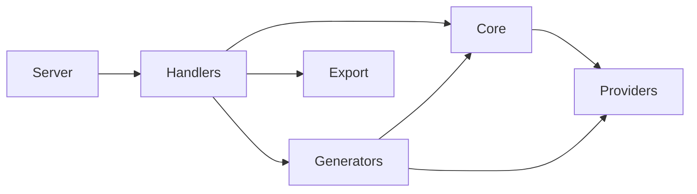
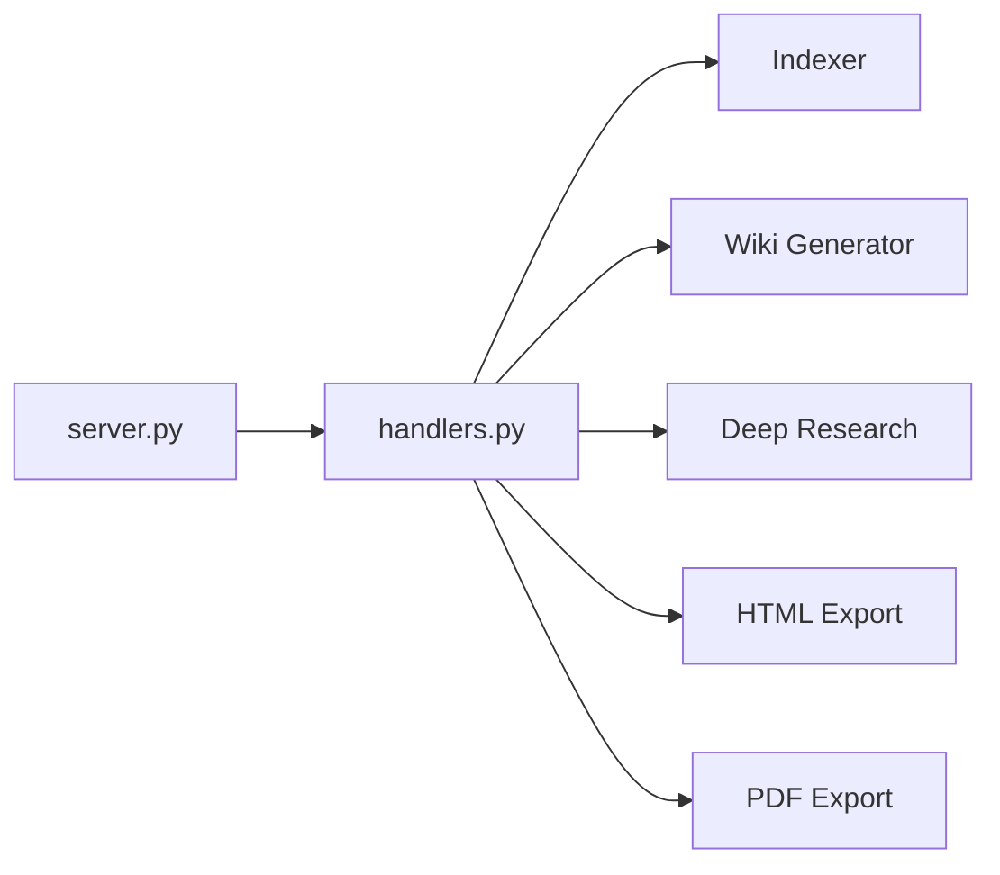
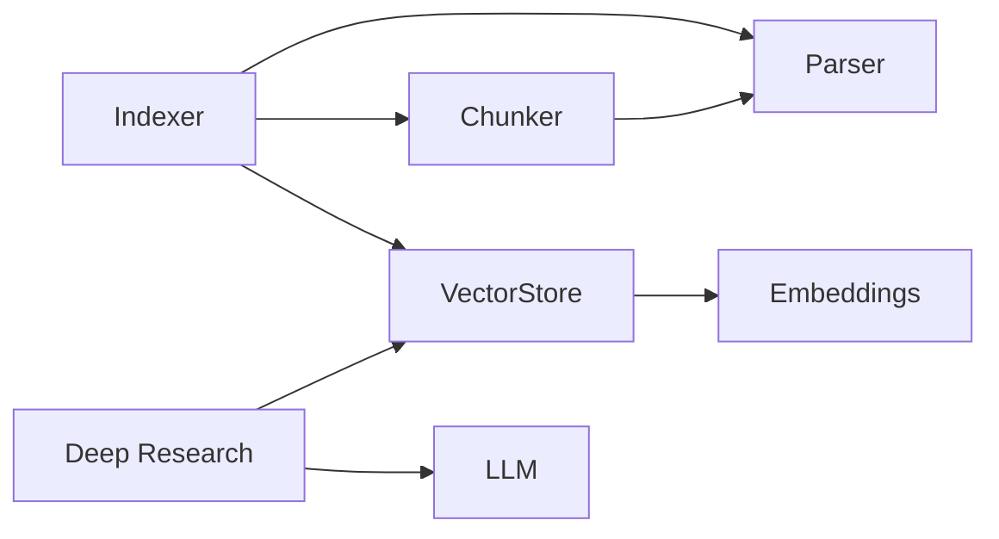
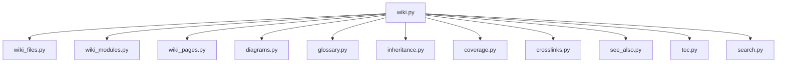
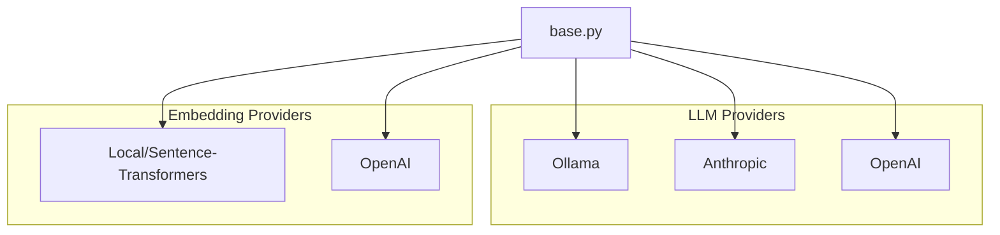

# Dependencies Overview

## External Dependencies

The project relies on several third-party libraries for different aspects of functionality:

### AI and Machine Learning
- **anthropic** (>=0.40) - Anthropic's Claude API client
- **openai** (>=1.0) - OpenAI API client for GPT models
- **ollama** (>=0.4) - Local LLM inference server client
- **sentence-transformers** (>=3.0) - Sentence embedding models for semantic search
- **mcp** (>=1.2.0) - Model Context Protocol implementation

### Data Processing and Storage
- **lancedb** (>=0.15) - Vector database for embeddings storage
- **pandas** (>=2.0) - Data manipulation and analysis
- **pydantic** (>=2.0) - Data validation and serialization

### Code Analysis
- **tree-sitter** (>=0.23) - Syntax tree parsing library
- **tree-sitter-c** (>=0.23) - C language parser
- **tree-sitter-c-sharp** (>=0.23) - C# language parser
- **tree-sitter-cpp** (>=0.23) - C++ language parser
- **tree-sitter-go** (>=0.23) - Go language parser
- **tree-sitter-java** (>=0.23) - Java language parser
- **tree-sitter-javascript** (>=0.23) - JavaScript language parser
- **tree-sitter-kotlin** (>=0.23) - Kotlin language parser
- **tree-sitter-php** (>=0.23) - PHP language parser
- **tree-sitter-python** (>=0.23) - Python language parser
- **tree-sitter-ruby** (>=0.23) - Ruby language parser
- **tree-sitter-rust** (>=0.23) - Rust language parser
- **tree-sitter-swift** (>=0.0.1) - Swift language parser
- **tree-sitter-typescript** (>=0.23) - TypeScript language parser

### Web and Export
- **flask** (>=3.0) - Web framework for server functionality
- **weasyprint** (>=62.0) - HTML to PDF conversion

### Utilities
- **markdown** (>=3.0) - Markdown processing
- **pyyaml** (>=6.0) - YAML configuration file handling
- **rich** (>=13.0) - Rich text and formatting for CLI output
- **watchdog** (>=4.0) - File system monitoring

## Dev Dependencies

Development and testing tools:

- **black** (>=24.0) - Code formatting
- **isort** (>=5.0) - Import sorting
- **mypy** (>=1.0) - Static type checking
- **pre-commit** (>=3.0) - Git pre-commit hooks
- **pytest** (>=8.0) - Testing framework
- **pytest-asyncio** (>=0.24) - Async testing support
- **types-Markdown** (>=3.0) - Type stubs for Markdown
- **types-PyYAML** (>=6.0) - Type stubs for PyYAML

## Internal Module Dependencies

Based on the import statements, the internal modules have the following dependency relationships:

### Core Dependencies
- Multiple modules depend on **models** for data structures like [CodeChunk](files/src/local_deepwiki/models.md), [WikiPage](files/src/local_deepwiki/models.md), [Language](files/src/local_deepwiki/models.md), [ChunkType](files/src/local_deepwiki/models.md), and [IndexStatus](files/src/local_deepwiki/models.md)
- The **core.parser** module ([CodeParser](files/src/local_deepwiki/core/parser.md)) is used by chunker, callgraph, and test modules
- The **core.chunker** module ([CodeChunker](files/src/local_deepwiki/core/chunker.md)) is used by various generator modules
- The **core.vectorstore** module ([VectorStore](files/src/local_deepwiki/core/vectorstore.md)) is used by the glossary generator

### Provider System
- The **providers.base** module defines [EmbeddingProvider](files/src/local_deepwiki/providers/base.md) and [LLMProvider](files/src/local_deepwiki/providers/base.md) interfaces
- The **providers.embeddings** modules implement specific embedding providers (OpenAI, local)
- The embedding providers depend on the base provider interfaces

### Generator Dependencies
- Generator modules (crosslinks, see_also, diagrams, api_docs, etc.) depend on core models and parsing functionality
- The **generators.api_docs** module includes [APIDocExtractor](files/src/local_deepwiki/generators/api_docs.md), [ClassSignature](files/src/local_deepwiki/generators/api_docs.md), and [FunctionSignature](files/src/local_deepwiki/generators/api_docs.md) classes
- The **generators.see_also** module includes [RelationshipAnalyzer](files/src/local_deepwiki/generators/see_also.md) and [FileRelationships](files/src/local_deepwiki/generators/see_also.md) classes
- The **generators.test_examples** module includes [UsageExample](files/src/local_deepwiki/generators/test_examples.md) class

### Export System
- The **export** module provides [HtmlExporter](files/src/local_deepwiki/export/html.md) and PDF export functionality
- Export modules depend on core models for data access

### Configuration and Utilities
- The **config** module provides configuration classes used by core components
- The **logging** module provides logging utilities used across the system
- The **validation** module provides validation functionality

## Module Dependency Diagrams

### High-Level Architecture

### Entry Points

The MCP server receives tool calls and dispatches to handlers.

### Core Processing

Code analysis pipeline: parse → chunk → embed → store.

### Wiki Generation

Generators produce markdown documentation from indexed code.

### Providers

Pluggable backends for LLM and embeddings.

### Module Groups

| Group | Modules | Purpose |
|-------|---------|---------|
| **Entry Points** | server, handlers | MCP server and tool dispatch |
| **Core Processing** | parser, chunker, indexer, vectorstore, deep_research, llm_cache, git_utils | Code parsing, chunking, embedding, and storage |
| **Wiki Generation** | wiki, wiki_files, wiki_modules, wiki_pages, diagrams, glossary, inheritance, coverage, crosslinks, see_also, etc. | Generate markdown documentation |
| **Providers** | LLM (ollama, anthropic, openai), Embeddings (local, openai) | Pluggable AI backends |
| **Export** | html, pdf | Static export formats |
| **Shared** | models, config, logging, validation | Common data structures and utilities |

## Relevant Source Files

The following source files were used to generate this documentation:

- [`src/local_deepwiki/generators/crosslinks.py:16-23`](files/src/local_deepwiki/generators/crosslinks.md)
- [`src/local_deepwiki/validation.py:22-42`](files/src/local_deepwiki/validation.md)
- `src/local_deepwiki/providers/__init__.py`
- [`src/local_deepwiki/generators/toc.py:10-27`](files/src/local_deepwiki/generators/toc.md)
- [`src/local_deepwiki/logging.py:18-72`](files/src/local_deepwiki/logging.md)
- [`src/local_deepwiki/generators/see_also.py:16-22`](files/src/local_deepwiki/generators/see_also.md)
- [`src/local_deepwiki/generators/diagrams.py:11-20`](files/src/local_deepwiki/generators/diagrams.md)
- [`src/local_deepwiki/generators/source_refs.py:14-53`](files/src/local_deepwiki/generators/source_refs.md)
- `src/local_deepwiki/providers/embeddings/__init__.py:7-28`
- `src/local_deepwiki/export/__init__.py:9-22`

*Showing 10 of 71 source files.*
