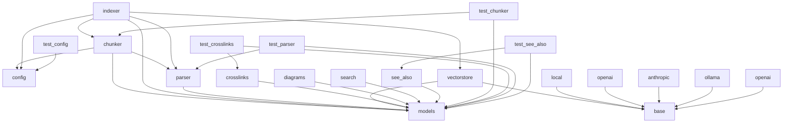

# Dependencies Overview

## External Dependencies

### Core Libraries
- `yaml` - For YAML configuration parsing
- `pydantic` - For configuration and data model validation
- `tree_sitter` - For code parsing and AST traversal
- `sentence_transformers` - For local embedding generation
- `openai` - For OpenAI API integration
- `ollama` - For Ollama LLM integration
- `anthropic` - For Anthropic Claude API integration
- `lancedb` - For vector database operations
- `pytest` - For testing framework (development dependency)

### Language Parsers
- `tree_sitter_python`
- `tree_sitter_javascript`
- `tree_sitter_typescript`
- `tree_sitter_go`
- `tree_sitter_rust`
- `tree_sitter_java`
- `tree_sitter_c`
- `tree_sitter_cpp`
- `tree_sitter_swift`

## Internal Module Dependencies

### Core Modules
- `local_deepwiki.config` - Configuration management
- `local_deepwiki.models` - Data models and enums
- `local_deepwiki.core.chunker` - Code chunking functionality
- `local_deepwiki.core.parser` - Code parsing utilities
- `local_deepwiki.core.vectorstore` - Vector database operations

### Providers
- `local_deepwiki.providers.base` - Abstract provider interfaces
- `local_deepwiki.providers.embeddings` - Embedding provider implementations
- `local_deepwiki.providers.llm` - LLM provider implementations

### Generators
- `local_deepwiki.generators.crosslinks` - Cross-link generation
- `local_deepwiki.generators.diagrams` - Diagram generation
- `local_deepwiki.generators.see_also` - "See also" section generation
- `local_deepwiki.generators.search` - Search functionality

## Notable Dependency Patterns

### Configuration Management
- Uses `pydantic` BaseModel for structured configuration
- Centralized configuration via `get_config()` function
- Configurable embedding and chunking parameters

### Provider Pattern
- Abstract base classes (`EmbeddingProvider`, `LLMProvider`) with concrete implementations
- Dependency injection through provider factories
- Support for multiple embedding backends (local, OpenAI)

### Code Parsing
- Dynamic language support via tree-sitter language parsers
- Language-specific parsing with unified interface
- AST-based code analysis and chunking

### Data Flow
- Data models defined in `models.py` used across modules
- Chunking → Parsing → Embedding → Vector Store pipeline
- Cross-module data sharing through shared models and configuration

### Testing
- Test modules follow same import patterns as source modules
- Comprehensive test coverage of core functionality
- Integration testing with actual providers and parsers

## Module Dependency Graph

The following diagram shows internal module dependencies:

