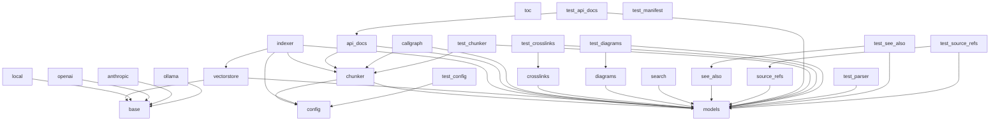

# Dependencies Overview

## External Dependencies

The following external libraries are required for the project:

- **anthropic** (>=0.40)  
  A Python client for the Anthropic API, used for interacting with Claude models.

- **flask** (>=3.0)  
  A lightweight WSGI web application framework for building web applications.

- **lancedb** (>=0.15)  
  A vector database for storing and querying embeddings.

- **markdown** (>=3.0)  
  A Python library for parsing Markdown text into HTML.

- **mcp** (>=1.2.0)  
  A library for managing model communication protocols.

- **ollama** (>=0.4)  
  A Python client for the Ollama API, used for interacting with local LLMs.

- **openai** (>=1.0)  
  A Python client for the OpenAI API, used for interacting with OpenAI models.

- **pandas** (>=2.0)  
  A powerful data manipulation and analysis library.

- **pydantic** (>=2.0)  
  A data validation and settings management library using Python type hints.

- **pyyaml** (>=6.0)  
  A YAML parser and emitter for Python.

- **rich** (>=13.0)  
  A library for rich text and beautiful formatting in the terminal.

- **sentence-transformers** (>=3.0)  
  A library for loading and using sentence transformers for embedding generation.

- **tree-sitter** (>=0.23)  
  A parser for programming languages, used for code analysis.

- **tree-sitter-c** (>=0.23)  
  Tree-sitter grammar for C language.

- **tree-sitter-cpp** (>=0.23)  
  Tree-sitter grammar for C++ language.

- **tree-sitter-go** (>=0.23)  
  Tree-sitter grammar for Go language.

- **tree-sitter-java** (>=0.23)  
  Tree-sitter grammar for Java language.

- **tree-sitter-javascript** (>=0.23)  
  Tree-sitter grammar for JavaScript language.

- **tree-sitter-kotlin** (>=0.23)  
  Tree-sitter grammar for Kotlin language.

- **tree-sitter-php** (>=0.23)  
  Tree-sitter grammar for PHP language.

- **tree-sitter-python** (>=0.23)  
  Tree-sitter grammar for Python language.

- **tree-sitter-ruby** (>=0.23)  
  Tree-sitter grammar for Ruby language.

- **tree-sitter-rust** (>=0.23)  
  Tree-sitter grammar for Rust language.

- **tree-sitter-swift** (>=0.0.1)  
  Tree-sitter grammar for Swift language.

- **tree-sitter-typescript** (>=0.23)  
  Tree-sitter grammar for TypeScript language.

- **watchdog** (>=4.0)  
  A library for monitoring file system events.

## Dev Dependencies

The following development dependencies are used for testing:

- **pytest** (>=8.0)  
  A testing framework for Python.

- **pytest-asyncio** (>=0.24)  
  A plugin for pytest to support async tests.

## Internal Module Dependencies

The following internal modules depend on each other based on import statements:

- **ChunkType** and **CodeChunk** from `local_deepwiki.models` are imported by:
  - `src/local_deepwiki/generators/crosslinks.py`
  - `src/local_deepwiki/generators/diagrams.py`
  - `src/local_deepwiki/generators/see_also.py`
  - `src/local_deepwiki/generators/callgraph.py`
  - `src/local_deepwiki/core/chunker.py`
  - `src/local_deepwiki/generators/api_docs.py`
  - `src/local_deepwiki/core/vectorstore.py`
  - `src/local_deepwiki/generators/source_refs.py`
  - `src/local_deepwiki/generators/search.py`
  - `src/local_deepwiki/models.py`

- **WikiPage** from `local_deepwiki.models` is imported by:
  - `src/local_deepwiki/generators/see_also.py`
  - `src/local_deepwiki/generators/source_refs.py`
  - `src/local_deepwiki/generators/search.py`

- **Language** from `local_deepwiki.models` is imported by:
  - `src/local_deepwiki/core/chunker.py`
  - `src/local_deepwiki/generators/callgraph.py`
  - `src/local_deepwiki/generators/api_docs.py`
  - `src/local_deepwiki/generators/diagrams.py`
  - `src/local_deepwiki/generators/see_also.py`
  - `src/local_deepwiki/generators/toc.py`
  - `src/local_deepwiki/generators/search.py`
  - `src/local_deepwiki/core/parser.py`
  - `src/local_deepwiki/models.py`

- **IndexStatus** from `local_deepwiki.models` is imported by:
  - `src/local_deepwiki/generators/diagrams.py`

- **FileInfo** from `local_deepwiki.models` is imported by:
  - `src/local_deepwiki/generators/diagrams.py`

- **EmbeddingProvider** and **LLMProvider** from `local_deepwiki.providers.base` are imported by:
  - `src/local_deepwiki/providers/__init__.py`

- **[EmbeddingConfig](files/src/local_deepwiki/config.md)** and **[get_config](files/src/local_deepwiki/config.md)** from `local_deepwiki.config` are imported by:
  - `src/local_deepwiki/providers/embeddings/__init__.py`

- **LocalEmbeddingProvider** and **OpenAIEmbeddingProvider** from `local_deepwiki.providers.embeddings.local` and `local_deepwiki.providers.embeddings.openai` respectively are imported by:
  - `src/local_deepwiki/providers/embeddings/__init__.py`

- **[CodeParser](files/src/local_deepwiki/core/parser.md)** from `local_deepwiki.core.parser` is imported by:
  - `src/local_deepwiki/generators/callgraph.py`
  - `src/local_deepwiki/generators/api_docs.py`
  - `src/local_deepwiki/core/chunker.py`
  - `src/local_deepwiki/core/parser.py`
  - `src/local_deepwiki/generators/see_also.py`

- **[ChunkingConfig](files/src/local_deepwiki/config.md)** and **[get_config](files/src/local_deepwiki/config.md)** from `local_deepwiki.config` are imported by:
  - `src/local_deepwiki/core/chunker.py`

- **SearchResult** from `local_deepwiki.models` is imported by:
  - `src/local_deepwiki/core/vectorstore.py`

- **WikiPageStatus** from `local_deepwiki.models` is imported by:
  - `src/local_deepwiki/generators/source_refs.py`

- **[Config](files/src/local_deepwiki/config.md)**, **[get_config](files/src/local_deepwiki/config.md)**, and **[set_config](files/src/local_deepwiki/config.md)** from `local_deepwiki.config` are imported by:
  - `tests/test_config.py`

- **[ProjectManifest](files/src/local_deepwiki/generators/manifest.md)**, **[get_directory_tree](files/src/local_deepwiki/generators/manifest.md)**, and **[parse_manifest](files/src/local_deepwiki/generators/manifest.md)** from `local_deepwiki.generators.manifest` are imported by:
  - `tests/test_manifest.py`

- **[APIDocExtractor](files/src/local_deepwiki/generators/api_docs.md)**, **[FunctionSignature](files/src/local_deepwiki/generators/api_docs.md)**, **[ClassSignature](files/src/local_deepwiki/generators/api_docs.md)**, **[Parameter](files/src/local_deepwiki/generators/api_docs.md)**, and related functions from `local_deepwiki.generators.api_docs` are imported by:
  - `tests/test_api_docs.py`

- **[CodeChunker](files/src/local_deepwiki/core/chunker.md)** from `local_deepwiki.core.chunker` is imported by:
  - `tests/test_chunker.py`

- **[CodeParser](files/src/local_deepwiki/core/parser.md)**, **[get_node_text](files/src/local_deepwiki/core/parser.md)**, and **[get_node_name](files/src/local_deepwiki/core/parser.md)** from `local_deepwiki.core.parser` are imported by:
  - `tests/test_parser.py`

- **[HtmlExporter](files/src/local_deepwiki/export/html.md)** and **[export_to_html](files/src/local_deepwiki/export/html.md)** from `local_deepwiki.export.html` are imported by:
  - `src/local_deepwiki/export/__init__.py`

- **[RelationshipAnalyzer](files/src/local_deepwiki/generators/see_also.md)**, **[FileRelationships](files/src/local_deepwiki/generators/see_also.md)**, **[build_file_to_wiki_map](files/src/local_deepwiki/generators/see_also.md)**, **[generate_see_also_section](files/src/local_deepwiki/generators/see_also.md)**, **[add_see_also_sections](files/src/local_deepwiki/generators/see_also.md)**, and **_relative_path** from `local_deepwiki.generators.see_also` are imported by:
  - `tests/test_see_also.py`

- **[ClassInfo](files/src/local_deepwiki/generators/diagrams.md)**, **[sanitize_mermaid_name](files/src/local_deepwiki/generators/diagrams.md)**, **[generate_class_diagram](files/src/local_deepwiki/generators/diagrams.md)**, **[generate_dependency_graph](files/src/local_deepwiki/generators/diagrams.md)**, **[generate_module_overview](files/src/local_deepwiki/generators/diagrams.md)**, **[generate_language_pie_chart](files/src/local_deepwiki/generators/diagrams.md)**, **[generate_sequence_diagram](files/src/local_deepwiki/generators/diagrams.md)**, **_extract_class_attributes**, **_extract_method_signature**, **_find_circular_dependencies**, **_path_to_module**, and **_parse_import_line** from `local_deepwiki.generators.diagrams` are imported by:
  - `tests/test_diagrams.py`

- **FUNCTION_NODE_TYPES** and **CLASS_NODE_TYPES** from `local_deepwiki.core.chunker` are imported by:
  - `src/local_deepwiki/generators/callgraph.py`
  - `src/local_deepwiki/generators/api_docs.py`

- **[find_nodes_by_type](files/src/local_deepwiki/core/parser.md)** from `local_deepwiki.core.parser` is imported by:
  - `src/local_deepwiki/generators/callgraph.py`
  - `src/local_deepwiki/generators/api_docs.py`

- **[get_node_text](files/src/local_deepwiki/core/parser.md)**, **[get_node_name](files/src/local_deepwiki/core/parser.md)**, **[get_docstring](files/src/local_deepwiki/core/parser.md)**, and **[find_nodes_by_type](files/src/local_deepwiki/core/parser.md)** from `local_deepwiki.core.parser` are imported by:
  - `src/local_deepwiki/core/chunker.py`

- **[get_node_text](files/src/local_deepwiki/core/parser.md)**, **[get_node_name](files/src/local_deepwiki/core/parser.md)**, and **[get_docstring](files/src/local_deepwiki/core/parser.md)** from `local_deepwiki.core.parser` are imported by:
  - `src/local_deepwiki/generators/see_also.py`

- **Node** and **Tree** from `local_deepwiki.core.parser` are imported by:
  - `src/local_deepwiki/generators/callgraph.py`

## Module Dependency Graph

The following diagram shows internal module dependencies:

## Relevant Source Files

The following source files were used to generate this documentation:

- `tests/test_parser.py:12-111`
- `tests/test_chunker.py:11-182`
- `tests/test_search.py:20-53`
- `tests/test_toc.py:16-44`
- [`tests/test_incremental_wiki.py:20-47`](files/tests/test_incremental_wiki.md)
- `tests/test_web.py:39-103`
- `tests/__init__.py`
- `tests/test_manifest.py:14-56`
- [`tests/test_api_docs.py:31-53`](files/tests/test_api_docs.md)
- `tests/test_see_also.py:16-177`

*Showing 10 of 52 source files.*
