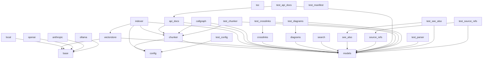

# Dependencies Overview

## External Dependencies

The following external libraries are required for the project:

- **anthropic** (>=0.40)
  A Python client for the Anthropic API, used for interacting with Claude language models.

- **flask** (>=3.0)
  A lightweight WSGI web application framework used for building web interfaces.

- **lancedb** (>=0.15)
  A vector database for building AI-powered applications, used for storing and querying embeddings.

- **markdown** (>=3.0)
  A Python library for parsing Markdown text into HTML.

- **mcp** (>=1.2.0)
  A Python client for the Model Control Protocol, used for controlling LLM interactions.

- **ollama** (>=0.4)
  A Python client for the Ollama API, used for interacting with locally hosted LLMs.

- **openai** (>=1.0)
  A Python client for the OpenAI API, used for interacting with OpenAI's language models.

- **pandas** (>=2.0)
  A powerful data manipulation and analysis library.

- **pydantic** (>=2.0)
  A data validation and settings management library based on Python type hints.

- **pyyaml** (>=6.0)
  A YAML parser and emitter for Python, used for configuration files.

- **rich** (>=13.0)
  A Python library for rich text and beautiful formatting in the terminal.

- **sentence-transformers** (>=3.0)
  A library for computing sentence and text embeddings, used for embedding generation.

- **tree-sitter** (>=0.23)
  A parser for programming languages, used for parsing code into structured data.

- **tree-sitter-c** (>=0.23)
  Tree-sitter grammar for C language.

- **tree-sitter-c-sharp** (>=0.23)
  Tree-sitter grammar for C# language.

- **tree-sitter-cpp** (>=0.23)
  Tree-sitter grammar for C++ language.

- **tree-sitter-go** (>=0.23)
  Tree-sitter grammar for Go language.

- **tree-sitter-java** (>=0.23)
  Tree-sitter grammar for Java language.

- **tree-sitter-javascript** (>=0.23)
  Tree-sitter grammar for JavaScript language.

- **tree-sitter-kotlin** (>=0.23)
  Tree-sitter grammar for Kotlin language.

- **tree-sitter-php** (>=0.23)
  Tree-sitter grammar for PHP language.

- **tree-sitter-python** (>=0.23)
  Tree-sitter grammar for Python language.

- **tree-sitter-ruby** (>=0.23)
  Tree-sitter grammar for Ruby language.

- **tree-sitter-rust** (>=0.23)
  Tree-sitter grammar for Rust language.

- **tree-sitter-swift** (>=0.0.1)
  Tree-sitter grammar for Swift language.

- **tree-sitter-typescript** (>=0.23)
  Tree-sitter grammar for TypeScript language.

- **watchdog** (>=4.0)
  A library for monitoring file system events, used for watching changes in source code.

## Dev Dependencies

The following dependencies are used for development and testing:

- **pytest** (>=8.0)
  A testing framework for Python, used for running tests.

- **pytest-asyncio** (>=0.24)
  A plugin for pytest to support asyncio testing.

## Internal Module Dependencies

The following internal modules depend on each other based on import statements:

- **[CodeChunker](files/src/local_deepwiki/core/chunker.md)** depends on **[CodeParser](files/src/local_deepwiki/core/parser.md)**, **[ChunkingConfig](files/src/local_deepwiki/config.md)**, and **[get_config](files/src/local_deepwiki/config.md)** from the **core** module.
- **[CodeParser](files/src/local_deepwiki/core/parser.md)** depends on **tree_sitter** and **[get_node_text](files/src/local_deepwiki/core/parser.md)**, **[get_node_name](files/src/local_deepwiki/core/parser.md)**, **[get_docstring](files/src/local_deepwiki/core/parser.md)**, and **[find_nodes_by_type](files/src/local_deepwiki/core/parser.md)** from the **core.parser** module.
- **EmbeddingProvider** (base class) is used by **LocalEmbeddingProvider** and **OpenAIEmbeddingProvider** in the **providers.embeddings** module.
- **[VectorStore](files/src/local_deepwiki/core/vectorstore.md)** depends on **lancedb**, **Table**, **CodeChunk**, and **SearchResult** from the **models** module, and **EmbeddingProvider** from the **providers.base** module.
- **WikiPage** and **CodeChunk** models depend on **BaseModel** from **pydantic**.
- **[Config](files/src/local_deepwiki/config.md)** depends on **yaml**, **BaseModel**, and **Field** from **pydantic**.
- **[APIDocExtractor](files/src/local_deepwiki/generators/api_docs.md)** depends on **[CodeParser](files/src/local_deepwiki/core/parser.md)**, **FUNCTION_NODE_TYPES**, **CLASS_NODE_TYPES**, and **Language** from the **core** and **models** modules.
- **[RelationshipAnalyzer](files/src/local_deepwiki/generators/see_also.md)** depends on **ChunkType**, **CodeChunk**, and **WikiPage** from the **models** module.
- **SeeAlsoGenerator** depends on **ChunkType**, **CodeChunk**, **WikiPage**, and **Language** from the **models** module.
- **CrosslinksGenerator** depends on **ChunkType**, **CodeChunk**, and **WikiPage** from the **models** module.
- **DiagramGenerator** depends on **ChunkType**, **CodeChunk**, **IndexStatus**, and **Language** from the **models** module.
- **SearchGenerator** depends on **WikiPage** from the **models** module.
- **SourceRefsGenerator** depends on **WikiPage** and **WikiPageStatus** from the **models** module.
- **ManifestGenerator** depends on **[ProjectManifest](files/src/local_deepwiki/generators/manifest.md)**, **[get_directory_tree](files/src/local_deepwiki/generators/manifest.md)**, and **[parse_manifest](files/src/local_deepwiki/generators/manifest.md)** from the **generators.manifest** module.
- **CallgraphGenerator** depends on **[CodeParser](files/src/local_deepwiki/core/parser.md)**, **[find_nodes_by_type](files/src/local_deepwiki/core/parser.md)**, **[get_node_text](files/src/local_deepwiki/core/parser.md)**, **[get_node_name](files/src/local_deepwiki/core/parser.md)**, **FUNCTION_NODE_TYPES**, **CLASS_NODE_TYPES**, and **Language** from the **core** and **models** modules.
- **[HtmlExporter](files/src/local_deepwiki/export/html.md)** depends on **WikiPage** from the **models** module.

These dependencies reflect the structure and interaction between the internal modules of the project.

## Module Dependency Graph

The following diagram shows internal module dependencies:

## Relevant Source Files

The following source files were used to generate this documentation:

- `tests/test_parser.py:12-111`
- `tests/test_chunker.py:11-182`
- `tests/test_search.py:20-53`
- `tests/test_toc.py:16-44`
- [`tests/test_incremental_wiki.py:20-47`](files/tests/test_incremental_wiki.md)
- `tests/test_web.py:39-103`
- `tests/__init__.py`
- `tests/test_manifest.py:14-56`
- [`tests/test_api_docs.py:31-53`](files/tests/test_api_docs.md)
- `tests/test_see_also.py:16-177`

*Showing 10 of 52 source files.*
