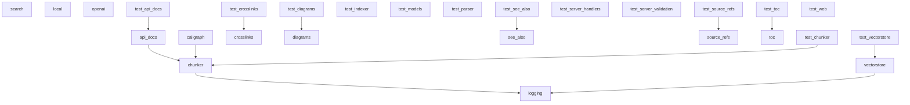

# Dependencies Overview

## External Dependencies

| Dependency                | Version   | Purpose                                                                 |
|--------------------------|-----------|-------------------------------------------------------------------------|
| anthropic                | >=0.40    | Provides access to Anthropic's AI models, used for language processing. |
| flask                    | >=3.0     | Web framework for building the application's HTTP server.               |
| lancedb                  | >=0.15    | Vector database for storing and querying embeddings.                    |
| markdown                 | >=3.0     | Library for parsing and rendering Markdown text.                        |
| mcp                      | >=1.2.0   | Provides tools for managing and processing code.                        |
| ollama                   | >=0.4     | Interface for running local LLMs via Ollama.                            |
| openai                   | >=1.0     | Client library for interacting with OpenAI's API.                       |
| pandas                   | >=2.0     | Data manipulation and analysis library.                                 |
| pydantic                 | >=2.0     | Data validation and settings management using Python type annotations.  |
| pyyaml                   | >=6.0     | YAML parsing and emitting library.                                      |
| rich                     | >=13.0    | Library for rich text and beautiful formatting in the terminal.         |
| sentence-transformers    | >=3.0     | Provides state-of-the-art sentence embeddings.                          |
| tree-sitter              | >=0.23    | Parsing library for code analysis.                                      |
| tree-sitter-c            | >=0.23    | Tree-sitter parser for C language.                                      |
| tree-sitter-c-sharp      | >=0.23    | Tree-sitter parser for C# language.                                     |
| tree-sitter-cpp          | >=0.23    | Tree-sitter parser for C++ language.                                    |
| tree-sitter-go           | >=0.23    | Tree-sitter parser for Go language.                                     |
| tree-sitter-java         | >=0.23    | Tree-sitter parser for Java language.                                   |
| tree-sitter-javascript   | >=0.23    | Tree-sitter parser for JavaScript language.                             |
| tree-sitter-kotlin       | >=0.23    | Tree-sitter parser for Kotlin language.                                 |
| tree-sitter-php          | >=0.23    | Tree-sitter parser for PHP language.                                    |
| tree-sitter-python       | >=0.23    | Tree-sitter parser for Python language.                                 |
| tree-sitter-ruby         | >=0.23    | Tree-sitter parser for Ruby language.                                   |
| tree-sitter-rust         | >=0.23    | Tree-sitter parser for Rust language.                                   |
| tree-sitter-swift        | >=0.0.1   | Tree-sitter parser for Swift language.                                  |
| tree-sitter-typescript   | >=0.23    | Tree-sitter parser for TypeScript language.                             |
| watchdog                 | >=4.0     | File system monitoring library for watching file changes.               |

## Dev Dependencies

| Dependency           | Version  | Purpose                                                  |
|----------------------|----------|----------------------------------------------------------|
| black                | >=24.0   | Code formatter to enforce consistent code style.         |
| isort                | >=5.0    | Tool to sort and organize import statements.             |
| mypy                 | >=1.0    | Static type checker for Python code.                     |
| pre-commit           | >=3.0    | Framework for managing and maintaining pre-commit hooks. |
| pytest               | >=8.0    | Testing framework for running tests.                     |
| pytest-asyncio       | >=0.24   | Plugin for pytest to support async testing.              |

## Internal Module Dependencies

The internal modules have the following dependencies based on import statements:

- `local_deepwiki.generators.crosslinks` depends on:
  - `local_deepwiki.models` (ChunkType, CodeChunk, WikiPage)
- `local_deepwiki.generators.diagrams` depends on:
  - `local_deepwiki.models` (ChunkType, CodeChunk, IndexStatus)
- `local_deepwiki.providers` depends on:
  - `local_deepwiki.providers.base` (EmbeddingProvider, LLMProvider)
- `local_deepwiki.generators.toc` depends on:
  - No direct dependencies beyond standard library.
- `local_deepwiki.generators.see_also` depends on:
  - `local_deepwiki.models` (ChunkType, CodeChunk, WikiPage)
- `local_deepwiki.export` depends on:
  - `local_deepwiki.export.html` (HtmlExporter, export_to_html)
- `local_deepwiki.generators.api_docs` depends on:
  - `local_deepwiki.core.chunker` (CLASS_NODE_TYPES, FUNCTION_NODE_TYPES)
  - `local_deepwiki.core.parser` ([CodeParser](files/src/local_deepwiki/core/parser.md), [find_nodes_by_type](files/src/local_deepwiki/core/parser.md), [get_node_name](files/src/local_deepwiki/core/parser.md), [get_node_text](files/src/local_deepwiki/core/parser.md))
  - `local_deepwiki.models` (Language)
- `local_deepwiki.generators.source_refs` depends on:
  - `local_deepwiki.models` (WikiPage, WikiPageStatus)
- `local_deepwiki.providers.embeddings.local` depends on:
  - `sentence_transformers` (SentenceTransformer)
  - `local_deepwiki.providers.base` (EmbeddingProvider)
- `local_deepwiki.providers.embeddings.openai` depends on:
  - `openai` (AsyncOpenAI)
  - `local_deepwiki.providers.base` (EmbeddingProvider)
- `local_deepwiki.generators.search` depends on:
  - `local_deepwiki.models` (WikiPage)
- `local_deepwiki.generators.callgraph` depends on:
  - `local_deepwiki.core.chunker` (CLASS_NODE_TYPES, FUNCTION_NODE_TYPES)
  - `local_deepwiki.core.parser` ([CodeParser](files/src/local_deepwiki/core/parser.md), [find_nodes_by_type](files/src/local_deepwiki/core/parser.md), [get_node_name](files/src/local_deepwiki/core/parser.md), [get_node_text](files/src/local_deepwiki/core/parser.md))
  - `local_deepwiki.models` (Language)
- `local_deepwiki.core.chunker` depends on:
  - `local_deepwiki.config` ([ChunkingConfig](files/src/local_deepwiki/config.md), [get_config](files/src/local_deepwiki/config.md))
  - `local_deepwiki.core.parser` ([CodeParser](files/src/local_deepwiki/core/parser.md), [find_nodes_by_type](files/src/local_deepwiki/core/parser.md), [get_docstring](files/src/local_deepwiki/core/parser.md), [get_node_name](files/src/local_deepwiki/core/parser.md), [get_node_text](files/src/local_deepwiki/core/parser.md))
  - `local_deepwiki.logging` (get_logger)
  - `local_deepwiki.models` (ChunkType, CodeChunk, Language)
- `local_deepwiki.providers.embeddings` depends on:
  - `local_deepwiki.config` ([EmbeddingConfig](files/src/local_deepwiki/config.md), [get_config](files/src/local_deepwiki/config.md))
  - `local_deepwiki.providers.base` (EmbeddingProvider)
  - `local_deepwiki.providers.embeddings.local` (LocalEmbeddingProvider)
  - `local_deepwiki.providers.embeddings.openai` (OpenAIEmbeddingProvider)
- `local_deepwiki.core.indexer` depends on:
  - `local_deepwiki.config` ([ChunkingConfig](files/src/local_deepwiki/config.md), [Config](files/src/local_deepwiki/config.md))
  - `local_deepwiki.models` (CodeChunk, IndexStatus, Language, ChunkType)
- `local_deepwiki.core.vectorstore` depends on:
  - `local_deepwiki.models` (ChunkType, CodeChunk, Language)
  - `local_deepwiki.providers.base` (EmbeddingProvider)
- `local_deepwiki.server` depends on:
  - `local_deepwiki.generators.crosslinks` ([CrossLinker](files/src/local_deepwiki/generators/crosslinks.md), [EntityRegistry](files/src/local_deepwiki/generators/crosslinks.md), [add_cross_links](files/src/local_deepwiki/generators/crosslinks.md), [camel_to_spaced](files/src/local_deepwiki/generators/crosslinks.md))
  - `local_deepwiki.generators.diagrams` ([ClassInfo](files/src/local_deepwiki/generators/diagrams.md), _extract_class_attributes, _extract_method_signature, _find_circular_dependencies, _parse_import_line, _path_to_module, [generate_class_diagram](files/src/local_deepwiki/generators/diagrams.md), [generate_dependency_graph](files/src/local_deepwiki/generators/diagrams.md), [generate_language_pie_chart](files/src/local_deepwiki/generators/diagrams.md), [generate_module_overview](files/src/local_deepwiki/generators/diagrams.md), [generate_sequence_diagram](files/src/local_deepwiki/generators/diagrams.md), [sanitize_mermaid_name](files/src/local_deepwiki/generators/diagrams.md))
  - `local_deepwiki.generators.see_also` (FileRelationships, RelationshipAnalyzer, _relative_path, add_see_also_sections, build_file_to_wiki_map, generate_see_also_section)
  - `local_deepwiki.generators.api_docs` ([APIDocExtractor](files/src/local_deepwiki/generators/api_docs.md), Class, Method, [get_node_name](files/src/local_deepwiki/core/parser.md), [get_node_text](files/src/local_deepwiki/core/parser.md), [find_nodes_by_type](files/src/local_deepwiki/core/parser.md))
  - `local_deepwiki.generators.source_refs` (_format_file_entry, _relative_path, add_source_refs_sections, build_file_to_wiki_map, generate_source_refs_section)
  - `local_deepwiki.models` (WikiPage, WikiPageStatus)
  - `local_deepwiki.core.indexer` (RepositoryIndexer, _migrate_status, _needs_migration)
  - `local_deepwiki.core.chunker` (CLASS_NODE_TYPES, FUNCTION_NODE_TYPES)
  - `local_deepwiki.core.parser` ([CodeParser](files/src/local_deepwiki/core/parser.md), [find_nodes_by_type](files/src/local_deepwiki/core/parser.md), [get_docstring](files/src/local_deepwiki/core/parser.md), [get_node_name](files/src/local_deepwiki/core/parser.md), [get_node_text](files/src/local_deepwiki/core/parser.md))
  - `local_deepwiki.providers.embeddings` (EmbeddingProvider)
  - `local_deepwiki.providers.embeddings.local` (LocalEmbeddingProvider)
  - `local_deepwiki.providers.embeddings.openai` (OpenAIEmbeddingProvider)
  - `local_deepwiki.generators.callgraph` (generate_callgraph)
  - `local_deepwiki.generators.search` (search)
  - `local_deepwiki.generators.toc` (generate_toc)
  - `local_deepwiki.export` (export_to_html)
  - `local_deepwiki.config` ([Config](files/src/local_deepwiki/config.md))
  - `local_deepwiki.logging` (get_logger)

## Module Dependency Graph

The following diagram shows internal module dependencies:

## Relevant Source Files

The following source files were used to generate this documentation:

- [`tests/test_parser.py:24-123`](files/tests/test_parser.md)
- [`tests/test_retry.py:8-144`](files/tests/test_retry.md)
- `tests/test_ollama_health.py:13-32`
- `tests/test_server_handlers.py:15-69`
- `tests/test_chunker.py:11-182`
- [`tests/test_vectorstore.py:9-28`](files/tests/test_vectorstore.md)
- `tests/test_search.py:20-53`
- `tests/test_toc.py:17-43`
- [`tests/test_incremental_wiki.py:20-47`](files/tests/test_incremental_wiki.md)
- `tests/test_web.py:40-104`

*Showing 10 of 61 source files.*
