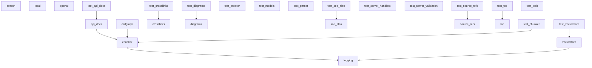

# Dependencies Overview

## External Dependencies

The project relies on the following third-party libraries:

### AI and Language Processing
- **anthropic** (>=0.40) - Anthropic's Claude API client for AI language model interactions
- **openai** (>=1.0) - OpenAI API client for GPT models and embeddings
- **ollama** (>=0.4) - Local LLM inference server client
- **sentence-transformers** (>=3.0) - Pre-trained models for generating text embeddings
- **mcp** (>=1.2.0) - Model Context Protocol for AI model communication

### Code Analysis and Parsing
- **tree-sitter** (>=0.23) - Incremental parsing library for syntax trees
- **tree-sitter-c** (>=0.23) - C language grammar for tree-sitter
- **tree-sitter-c-sharp** (>=0.23) - C# language grammar
- **tree-sitter-cpp** (>=0.23) - C++ language grammar
- **tree-sitter-go** (>=0.23) - Go language grammar
- **tree-sitter-java** (>=0.23) - Java language grammar
- **tree-sitter-javascript** (>=0.23) - JavaScript language grammar
- **tree-sitter-kotlin** (>=0.23) - Kotlin language grammar
- **tree-sitter-php** (>=0.23) - PHP language grammar
- **tree-sitter-python** (>=0.23) - Python language grammar
- **tree-sitter-ruby** (>=0.23) - Ruby language grammar
- **tree-sitter-rust** (>=0.23) - Rust language grammar
- **tree-sitter-swift** (>=0.0.1) - Swift language grammar
- **tree-sitter-typescript** (>=0.23) - TypeScript language grammar

### Data Storage and Processing
- **lancedb** (>=0.15) - Vector database for embeddings storage and similarity search
- **pandas** (>=2.0) - Data manipulation and analysis library

### Web and Document Generation
- **flask** (>=3.0) - Web framework for server functionality
- **markdown** (>=3.0) - Markdown to HTML conversion
- **weasyprint** (>=62.0) - HTML/CSS to PDF rendering

### Utilities
- **pydantic** (>=2.0) - Data validation and settings management
- **pyyaml** (>=6.0) - YAML file parsing and generation
- **rich** (>=13.0) - Rich text and beautiful formatting in terminal
- **watchdog** (>=4.0) - File system event monitoring

## Dev Dependencies

Development and testing tools:

- **black** (>=24.0) - Python code formatter
- **isort** (>=5.0) - Import statement organizer
- **mypy** (>=1.0) - Static type checker
- **pre-commit** (>=3.0) - Git pre-commit hooks framework
- **pytest** (>=8.0) - Testing framework
- **pytest-asyncio** (>=0.24) - Async testing support for pytest

## Internal Module Dependencies

Based on the import statements, the internal module structure shows these key relationships:

### Core Modules
- **CodeChunker** depends on [CodeParser](files/src/local_deepwiki/core/parser.md) for parsing functionality and uses models like ChunkType, CodeChunk, and Language
- **[CodeParser](files/src/local_deepwiki/core/parser.md)** provides parsing utilities used by multiple generators and the chunker
- **[VectorStore](files/src/local_deepwiki/core/vectorstore.md)** works with embedding providers and code chunks for similarity search
- **RepositoryIndexer** coordinates chunking, parsing, and indexing operations

### Generator Modules
- **[CrossLinker](files/src/local_deepwiki/generators/crosslinks.md)** and [EntityRegistry](files/src/local_deepwiki/generators/crosslinks.md) work with WikiPage and CodeChunk models to create cross-references
- **[APIDocExtractor](files/src/local_deepwiki/generators/api_docs.md)** uses [CodeParser](files/src/local_deepwiki/core/parser.md) to extract API documentation from code
- **RelationshipAnalyzer** and FileRelationships analyze code relationships for "See Also" sections
- Multiple generators (diagrams, search, source refs, TOC) depend on core models and parsing functionality

### Provider System
- **EmbeddingProvider** and **LLMProvider** serve as base classes for AI service integrations
- **LocalEmbeddingProvider** uses sentence-transformers for local embeddings
- **OpenAIEmbeddingProvider** integrates with OpenAI's embedding API

### Server Components
- Server handlers coordinate various generators and core functionality for web API endpoints

The architecture follows a layered approach where core parsing and chunking functionality supports multiple specialized generators, all coordinated through a provider system for AI services and a web server for user interaction.

## Module Dependency Graph

The following diagram shows internal module dependencies:

## Relevant Source Files

The following source files were used to generate this documentation:

- [`tests/test_parser.py:24-123`](files/tests/test_parser.md)
- [`tests/test_retry.py:8-144`](files/tests/test_retry.md)
- `tests/test_ollama_health.py:13-32`
- `tests/test_server_handlers.py:15-69`
- `tests/test_chunker.py:11-182`
- [`tests/test_vectorstore.py:9-28`](files/tests/test_vectorstore.md)
- [`tests/test_pdf_export.py:21-80`](files/tests/test_pdf_export.md)
- `tests/test_search.py:20-53`
- `tests/test_toc.py:17-43`
- `tests/test_incremental_wiki.py:20-47`

*Showing 10 of 63 source files.*
