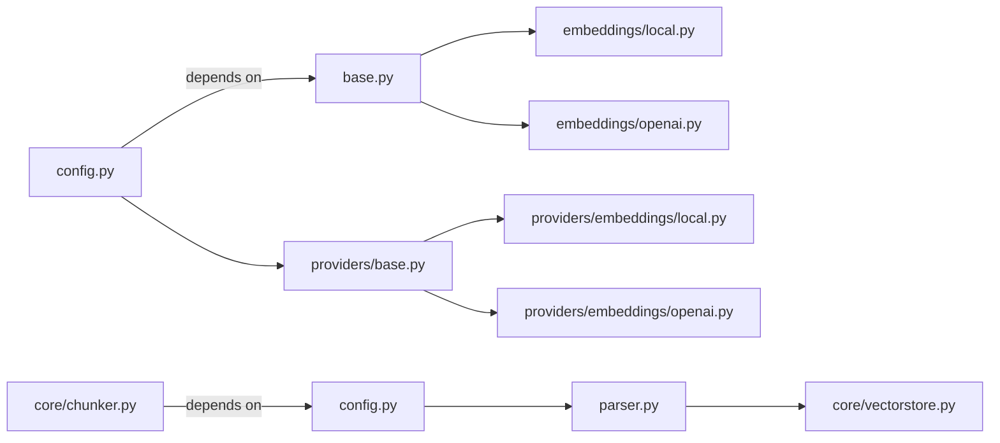

**Dependencies Overview**
==========================

### External Dependencies

The following libraries and packages are used by the project:

* `sentence-transformers`: used for sentence embeddings
* `openai`: used for OpenAI API interactions
* `lancedb`: used for vector store operations
* `tree_sitter_python`, `tree_sitter_javascript`, `tree_sitter_typescript`, etc.: used for code parsing and syntax analysis

### Internal Module Dependencies

The following modules depend on the project's internal dependencies:

| Module | Depends On |
| --- | --- |
| `config.py` | `base.py`, `embeddings/local.py`, `embeddings/openai.py`, `models.py` |
| `providers/base.py` | - |
| `providers/embeddings/local.py` | `base.py` |
| `providers/embeddings/openai.py` | `base.py` |
| `core/chunker.py` | `config.py`, `parser.py` |
| `core/parser.py` | `config.py` |
| `core/vectorstore.py` | `base.py` |

### Mermaid Diagram

Note: The Mermaid diagram shows the dependencies between modules. It may not be exhaustive, but it should give a general idea of how the project's internal dependencies are structured.

### Notable Dependency Patterns

* The `providers` module has two sub-modules: `embeddings/local.py` and `embeddings/openai.py`. This suggests that the project is using multiple embedding providers.
* The `core/chunker.py` module depends on both `config.py` and `parser.py`, indicating that it uses configuration settings to determine how to parse code chunks.
* The `core/vectorstore.py` module depends on `base.py`, which suggests that it uses a base class or interface for vector store operations.