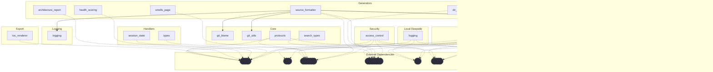

# Dependencies Overview

## External Dependencies

The following external libraries are required for the project:

- **anthropic** (>=0.40,<1.0.0)  
  Provides access to Anthropic's AI models, particularly Claude, for natural language processing tasks.

- **flask** (>=3.0,<4.0.0)  
  A lightweight web framework used for building web applications and APIs.

- **LanceDB** (>=0.15,<1.0.0)  
  A vector database for storing and querying embeddings, used for semantic search capabilities.

- **markdown** (>=3.0,<4.0.0)  
  Library for parsing and rendering Markdown text into HTML.

- **mcp** (>=1.2.0,<2.0.0)  
  Likely used for managing model communication protocols, possibly in LLM interactions.

- **nh3** (>=0.2.14,<1.0.0)  
  A fast HTML sanitization library used to clean and validate HTML content.

- **ollama** (>=0.4,<1.0.0)  
  Provides access to local AI models via the Ollama API for on-device inference.

- **openai** (>=1.0,<2.0.0)  
  Official Python client for OpenAI's API, used for integrating with OpenAI's language models.

- **pandas** (>=2.0,<3.0.0)  
  Data manipulation and analysis library, used for handling structured data.

- **psutil** (>=5.0,<6.0.0)  
  Cross-platform library for retrieving system and process information.

- **pydantic** (>=2.0,<3.0.0)  
  Data validation and settings management using Python type annotations.

- **pyyaml** (>=6.0,<7.0.0)  
  YAML parser and emitter for configuration files and data serialization.

- **rapidfuzz** (>=3.0,<4.0.0)  
  Fast fuzzy string matching library for similarity comparisons.

- **rich** (>=13.0,<14.0.0)  
  Library for rich text and beautiful formatting in the terminal.

- **sentence-transformers** (>=3.0,<4.0.0)  
  Provides pre-trained models for generating sentence embeddings.

- **tree-sitter** (>=0.23)  
  A parser for programming languages used for syntax analysis.

- **tree-sitter-c** (>=0.23)  
  Tree-sitter parser for the C programming language.

- **tree-sitter-c-sharp** (>=0.23)  
  Tree-sitter parser for C#.

- **tree-sitter-cpp** (>=0.23)  
  Tree-sitter parser for C++.

- **tree-sitter-go** (>=0.23)  
  Tree-sitter parser for Go.

- **tree-sitter-java** (>=0.23)  
  Tree-sitter parser for Java.

- **tree-sitter-javascript** (>=0.23)  
  Tree-sitter parser for JavaScript.

- **tree-sitter-kotlin** (>=0.23)  
  Tree-sitter parser for Kotlin.

- **tree-sitter-objc** (>=3.0)  
  Tree-sitter parser for Objective-C.

- **tree-sitter-php** (>=0.23)  
  Tree-sitter parser for PHP.

- **tree-sitter-python** (>=0.23)  
  Tree-sitter parser for Python.

- **tree-sitter-ruby** (>=0.23)  
  Tree-sitter parser for Ruby.

- **tree-sitter-rust** (>=0.23)  
  Tree-sitter parser for Rust.

- **tree-sitter-swift** (>=0.0.1)  
  Tree-sitter parser for Swift.

- **tree-sitter-typescript** (>=0.23)  
  Tree-sitter parser for TypeScript.

## Dev Dependencies

The following development dependencies are used for development and testing:

- **black** (>=24.0)  
  Code formatter for Python to enforce consistent code style.

- **isort** (>=5.0)  
  Tool for sorting and organizing imports in Python files.

- **local-deepwiki ([all])**  
  Development package for local development of the `local_deepwiki` module.

- **mypy** (>=1.0)  
  Static type checker for Python.

- **pip-audit** (>=2.0)  
  Security audit tool for Python package dependencies.

- **pre-commit** (>=3.0)  
  Framework for managing pre-commit hooks to automate code quality checks.

- **pypdf** (>=6.6.1)  
  Library for working with PDF files.

- **pytest** (>=8.0)  
  Testing framework for Python.

- **pytest-asyncio** (>=0.24,<1.0.0)  
  [Plugin](files/src/local_deepwiki/plugins/base.md) for pytest to support asynchronous testing.

- **types-Markdown** (>=3.0)  
  Type stubs for the `markdown` library.

- **types-PyYAML** (>=6.0)  
  Type stubs for the `pyyaml` library.

- **weasyprint** (>=68.0,<69.0.0)  
  Library for converting HTML to PDF.

## Internal Module Dependencies

Based on the import statements, the following internal module dependencies exist:

- **CLI modules** depend on:
  - `rich` for rich terminal output
  - `importlib` for dynamic imports
  - `local_deepwiki.config` and `local_deepwiki.config.models` for configuration handling

- **Security modules** depend on:
  - `asyncio` for asynchronous operations
  - `collections.abc` for abstract base classes
  - `contextvars` for context management
  - `dataclasses` for data class definitions
  - `enum` for `StrEnum`
  - `functools` for `wraps`
  - `typing` for type hints

- **Logging module** depends on:
  - `logging` for logging functionality
  - `os` and `sys` for system-level operations

- **Core protocols** depend on:
  - `collections.abc` for abstract base classes
  - `pathlib` for path handling
  - `typing` for type hints and `Protocol`

- **Generator modules** depend on:
  - `dataclasses` for data class definitions
  - `pathlib` for path handling
  - `local_deepwiki.core.git_blame`, `local_deepwiki.core.git_utils`, `local_deepwiki.logging`, `local_deepwiki.models` for code analysis and formatting

- **Vector store mixins** depend on:
  - `dataclasses` for data class definitions
  - `local_deepwiki.core.vectorstore.schema` for schema definitions

- **Handlers** depend on:
  - `typing` for type hints
  - `local_deepwiki.models.provider_types` for provider types

- **Models** depend on:
  - `enum` for `StrEnum`
  - `typing` for type hints

- **Providers** depend on:
  - `typing` for type hints
  - `local_deepwiki.providers.base` for base provider types

- **Export modules** depend on:
  - `typing` for type hints

- **Test helpers** depend on:
  - `collections.abc` for `AsyncIterator`
  - `pathlib` for path handling
  - `typing` for type hints
  - `local_deepwiki.providers.base` for base provider types

- **Fixtures** depend on:
  - `typing` for type hints
  - `src.models` for model definitions
  - `json` and `pathlib` for file handling

- **Test files** depend on:
  - `pytest` for testing
  - `src.models` for model definitions
  - `src.parser` for parsing logic

- **Wiki generators** depend on:
  - `typing` for type hints
  - `collections.defaultdict` for default dictionary behavior

- **Analysis generators** depend on:
  - `typing` for type hints

- **Session state handlers** depend on:
  - `typing` for type hints

- **Architecture report generators** depend on:
  - `typing` for type hints

- **Health scoring generators** depend on:
  - `typing` for type hints

- **Smells page generators** depend on:
  - `collections.defaultdict` for default dictionary behavior
  - `typing` for type hints

- **TOC renderer** depends on:
  - `typing` for type hints

- **Init CLI** depends on:
  - `argparse` for command-line argument parsing
  - `os` and `sys` for system-level operations
  - `urllib.request` for URL handling
  - `collections.Counter` for counting
  - `dataclasses` for data class definitions
  - `pathlib` for path handling
  - `typing` for type hints
  - `yaml` for YAML handling
  - `rich` for rich terminal output
  - `local_deepwiki.config` and `local_deepwiki.config.models` for configuration handling

- **Source formatter** depends on:
  - `collections.abc` for `Callable`
  - `dataclasses` for data class definitions
  - `operator` for `attrgetter`
  - `pathlib` for path handling
  - `local_deepwiki.core.git_blame`, `local_deepwiki.core.git_utils`, `local_deepwiki.logging`, `local_deepwiki.models` for code analysis and formatting

- **Directory tree generator** depends on:
  - `dataclasses` for data class definitions
  - `pathlib` for path handling
  - `subprocess` for running system commands

- **Term validator** depends on:
  - `re` for regular expressions

- **Credentials provider** depends on:
  - `os` for environment variable handling

- **Version provider** depends on:
  - `importlib.metadata` for version information

- **CLI main** depends on:
  - `sys` for system-level operations
  - `rich.console` and `rich.table` for rich terminal output
  - `importlib` for dynamic imports

- **Type definitions** depend on:
  - `typing` for `TypedDict` and type hints

- **Configuration models** depend on:
  - `dataclasses` for data class definitions
  - `typing` for type hints

- **Git blame utilities** depend on:
  - `local_deepwiki.logging` for logging
  - `local_deepwiki.models` for model definitions

- **Git utilities** depend on:
  - `local_deepwiki.models` for model definitions

- **Git repo info** depends on:
  - `local_deepwiki.models` for model definitions

- **Search types** depend on:
  - `dataclasses` for data class definitions
  - `local_deepwiki.core.vectorstore.schema` for schema definitions

## Module Dependency Graph

The following diagram shows module dependencies. Click on a module to view its documentation. External dependencies are shown with dashed borders.

```mermaid
flowchart TD
    subgraph cli[Cli]
        M0[init_cli]
        M1[main]
    end
    subgraph config[Config]
        M2[config]
        M3[models]
    end
    subgraph core[Core]
        M4[git_blame]
        M5[git_utils]
        M6[protocols]
        M7[search_types]
    end
    subgraph export[Export]
        M8[toc_renderer]
    end
    subgraph generators[Generators]
        M9[architecture_report]
        M10[health_scoring]
        M11[smells_page]
        M12[dir_tree]
        M13[source_formatter]
        M14[term_validator]
    end
    subgraph handlers[Handlers]
        M15[session_state]
        M16[types]
    end
    subgraph local_deepwiki[Local Deepwiki]
        M17[logging]
    end
    subgraph logging[Logging]
        M18[logging]
    end
    subgraph models[Models]
        M19[models]
        M20[provider_types]
    end
    subgraph providers[Providers]
        M21[credentials]
    end
    subgraph security[Security]
        M22[access_control]
    end
    subgraph external[External Dependencies]
        E0([typing]):::external
        E1([rich]):::external
        E2([collections]):::external
        E3([dataclasses]):::external
        E4([os]):::external
        E5([pathlib]):::external
        E6([sys]):::external
        E7([enum]):::external
        E8([re]):::external
        E9([importlib]):::external
    end
    M0 --> M2
    M0 --> M3
    M13 --> M4
    M13 --> M5
    M13 --> M18
    M13 --> M19
    M0 -.-> E2
    M0 -.-> E3
    M0 -.-> E4
    M0 -.-> E5
    M0 -.-> E1
    M0 -.-> E6
    M0 -.-> E0
    M1 -.-> E9
    M1 -.-> E1
    M1 -.-> E6
    M6 -.-> E2
    M6 -.-> E5
    M6 -.-> E0
    M7 -.-> E3
    M8 -.-> E0
    M9 -.-> E0
    M10 -.-> E0
    M11 -.-> E2
    M12 -.-> E3
    M12 -.-> E5
    M13 -.-> E2
    M13 -.-> E3
    M13 -.-> E5
    M14 -.-> E8
    M15 -.-> E0
    M16 -.-> E0
    M17 -.-> E4
    M17 -.-> E6
    M17 -.-> E0
    M20 -.-> E7
    M21 -.-> E4
    M22 -.-> E2
    M22 -.-> E3
    M22 -.-> E7
    M22 -.-> E4
    M22 -.-> E0
    click M0 "files/src/local_deepwiki/cli/init_cli.md"
    click M1 "files/src/local_deepwiki/cli/main.md"
    click M2 "files/src/local_deepwiki/config.md"
    click M3 "files/src/local_deepwiki/config/models.md"
    click M4 "files/src/local_deepwiki/core/git_blame.md"
    click M5 "files/src/local_deepwiki/core/git_utils.md"
    click M6 "files/src/local_deepwiki/core/protocols.md"
    click M7 "files/src/local_deepwiki/core/vectorstore/mixins/search_types.md"
    click M8 "files/src/local_deepwiki/export/toc_renderer.md"
    click M9 "files/src/local_deepwiki/generators/analysis/architecture_report.md"
    click M10 "files/src/local_deepwiki/generators/analysis/health_scoring.md"
    click M11 "files/src/local_deepwiki/generators/analysis/smells_page.md"
    click M12 "files/src/local_deepwiki/generators/dir_tree.md"
    click M13 "files/src/local_deepwiki/generators/wiki/source_formatter.md"
    click M14 "files/src/local_deepwiki/generators/wiki/term_validator.md"
    click M15 "files/src/local_deepwiki/handlers/session_state.md"
    click M16 "files/src/local_deepwiki/handlers/types.md"
    click M17 "files/src/local_deepwiki/local_deepwiki/logging.md"
    click M18 "files/src/local_deepwiki/logging.md"
    click M19 "files/src/local_deepwiki/models.md"
    click M20 "files/src/local_deepwiki/models/provider_types.md"
    click M21 "files/src/local_deepwiki/providers/credentials.md"
    click M22 "files/src/local_deepwiki/security/access_control.md"
    classDef external fill:#2d2d3d,stroke:#666,stroke-dasharray: 5 5
```

## Relevant Source Files

The following source files were used to generate this documentation:

- [`src/local_deepwiki/providers/credentials.py:12-80`](files/src/local_deepwiki/providers/credentials.md)
- [`src/local_deepwiki/generators/wiki/term_validator.py:43-82`](files/src/local_deepwiki/generators/wiki/term_validator.md)
- `src/local_deepwiki/__init__.py`
- [`src/local_deepwiki/generators/analysis/architecture_report.py:15-36`](files/src/local_deepwiki/generators/analysis/architecture_report.md)
- [`src/local_deepwiki/handlers/session_state.py:20-27`](files/src/local_deepwiki/handlers/session_state.md)
- [`src/local_deepwiki/generators/analysis/health_scoring.py:34-39`](files/src/local_deepwiki/generators/analysis/health_scoring.md)
- [`src/local_deepwiki/export/toc_renderer.py:8-17`](files/src/local_deepwiki/export/toc_renderer.md)
- [`src/local_deepwiki/generators/analysis/smells_page.py:25-31`](files/src/local_deepwiki/generators/analysis/smells_page.md)
- [`src/local_deepwiki/cli/main.py:57-90`](files/src/local_deepwiki/cli/main.md)
- [`src/local_deepwiki/models/provider_types.py:8-13`](files/src/local_deepwiki/models/provider_types.md)

*Showing 10 of 18 source files.*
